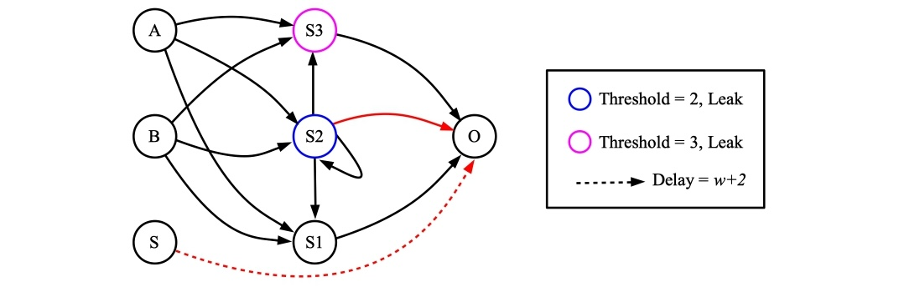
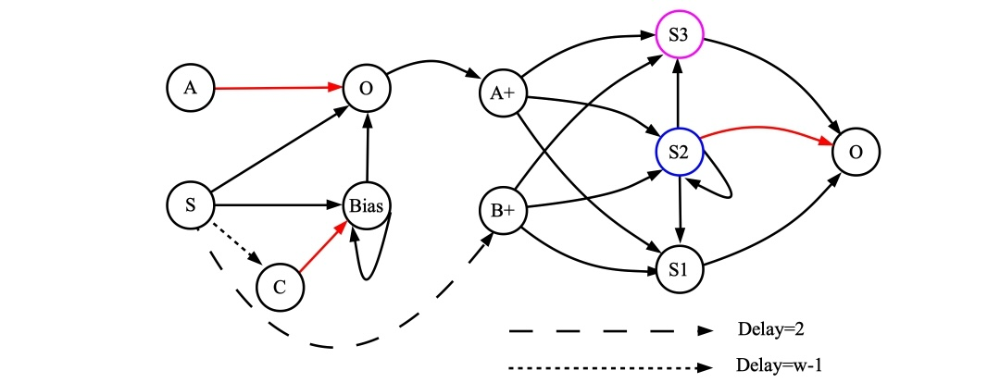
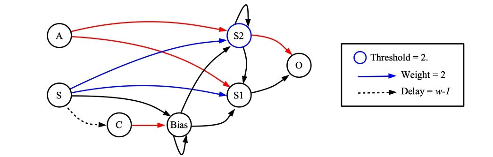
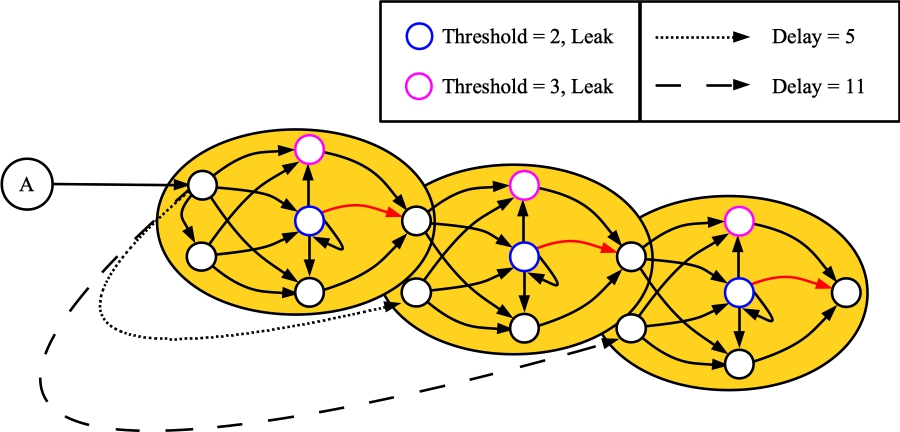
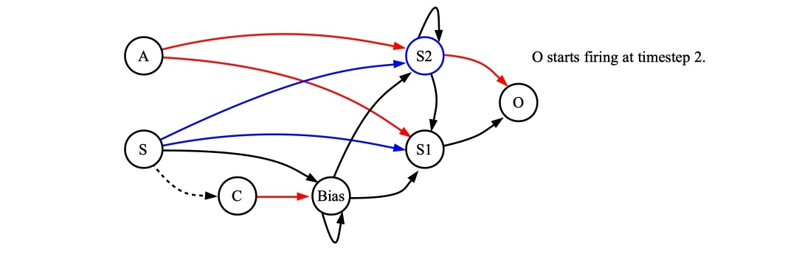
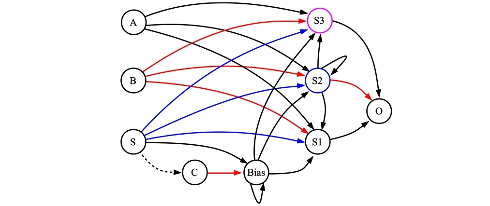

# Streaming Arithmetic on Little-Endian, Two's Complement Spike Trains

James S. Plank

## Introduction

In 2021, James B. Aimone, Aaron J. Hill, William M. Severa, & Craig M. Vineyard published
a wonderful paper in the *IEEE International Conference on Rebooting Computing*, entitled
"Spiking Neural Streaming Binary Arithmetic" [AHSV2021].  In this paper, the authors demonstrated 
how to perform the following operations using spiking neural networks:

- Addition
- Inversion
- Comparison
- Maximum
- Subtraction
- Multiplication by a constant

You can get the paper from [https://www.computer.org/csdl/proceedings-article/icrc/2021/233200a079/1CbZFjqAqju](https://www.computer.org/csdl/proceedings-article/icrc/2021/233200a079/1CbZFjqAqju), (or on arXiv).

In the TENNLab open-source framework, we have written shell scripts to create networks
that perform each of these operations, plus two's complement negation and integer division
by a power of two.  We also have shell scripts to run each of these networks and corroborate
the results.

------------------------------------------------------------
## Including the number of bits

In [AHSV2021], the authors use unbounded streams of spikes to represent numbers.
While this is both cool and elegant, when our research group set about composing these networks
for mathematical operations, we realized the value of defining the number of bits in each
numbers' representation.  So the networks that we present here require the user to define
the value *w*, which is the number of bits/spikes in the representation of the numbers.

Each of our networks also has a *starting* neuron *S*, which must be spiked at timestep 0
in order for the network to work.  

------------------------------------------------------------
## Two's Complement, Little Endian

To be precise, each number is represented by a train of *w* spikes.  If you represent no
spike on a timestep by 0, and a spike by 1, then the stream of 0's and 1's that result from
a stream of spikes represents the number in two's complement, little endian.
Therefore, if there is a spike on the last timestep (timestep *w-1$), the number is negative,
and if there is no spike, then the number is positive.

Here are example of mapping spike trains to numbers:

- *w = 4*, spike train 1010 represents 5.
- *w = 4*, spike train 1011 represents -3.
- *w = 5*, spike train 10110 represents 13.
- *w = 8*, spike train 11111111 represents -1.

There are two shell scripts to help you out with converting numbers to spike trains and
back again:

- `scripts/val_to_tcle.sh` converts a value and a number of bits to its corresponding spike train.
- `scripts/tcle_toLval.sh` converts a spike train to a v value.  It is assumed that the length of the spike train equals the number of bits.

So:

```
UNIX> sh scripts/val_to_tcle.sh 
usage: sh val_to_tcle.sh val w
UNIX> sh scripts/val_to_tcle.sh 5 4
1010
UNIX> sh scripts/val_to_tcle.sh -3 4
1011
UNIX> sh scripts/val_to_tcle.sh 13 5
10110
UNIX> sh scripts/val_to_tcle.sh -1 8
11111111
UNIX> sh scripts/tcle_to_val.sh
usage: sh tcle_to_val.sh spike-raster
UNIX> sh scripts/tcle_to_val.sh 1010
5
UNIX> sh scripts/tcle_to_val.sh 1011
-3
UNIX> sh scripts/tcle_to_val.sh 10110
13
UNIX> sh scripts/tcle_to_val.sh 11111111
-1
UNIX> 
```

----------------------------------------
## Two shell scripts for each operation

For each arithmetic operation *xxx*, we provide two shell scripts:

- `xxx_network.sh` - Prints a RISP network implementing the operation on standard output.
- `xxx_run.sh` - Takes input values, creates the network, runs the network, interprets the output, and confirms correctness.

In the `xxx_network.sh` scripts, there is a file `tmp_info.txt` that is created, that contains
information about the networks.  Let me give you an example.  Suppose you create an adder
for 8-bit numbers:

```
UNIX> sh scripts/adder_network.sh 
usage: sh scripts/aimone_adder.sh w os_framework
UNIX> sh scripts/adder_network.sh 8 . > tmp_adder.txt
UNIX> cat tmp_info.txt
INPUT V0 0 TC_LE 8 0
INPUT V1 1 TC_LE 8 0
INPUT S 2 Spike 1 0
OUTPUT SUM 6 TC_LE 8 2
RUN 11
UNIX> 
```

You get the following information from `tmp_info.txt`:

- The first input, *V0* is named "V0" in the network, and its neuron number is 0.  It represents
  its values with two's complement, little-endian, and it expects a train of 8 spikes starting
  at timestep 0.
- The second input, *V1* is named "V1" in the network, and its neuron number is 1.  Its other
  details are just like *V0$.
- The third input, *S* is a single spike at timestep 0.
- The network should run for 11 timesteps.
- The output neuron is named "SUM" and is neuron number 6.  Its output is two's complement,
  little-endian, and it is a train of 8 spikes starting at timestep 2.

This information is there to help you compose and use these networks.
The `xxx_run.sh` shell scripts make use of this information, and perhaps we'll be able to use
it to automate composition, but we're not at that point yet.  We're still learning, and
composing networks by hand.

----------------------------------------
# Addition

We use the following network for addition.  It is the network presented in [AHSV2021], but
we've added a neuron and synapse to deal with the fixed bit width:

(In all of these network drawings,
if unlabeled, neuron thresholds are one, synapse weights are 1, and synapse delays are 1.
Red synapses, if unlabeled, have weights of -1.).



Let's test it out with `scripts/adder_run.sh`.  The output is pretty self-explanatory, but
I've put a few comments in:

```
UNIX> sh scripts/adder_run.sh 
usage: sh scripts/adder_run.sh v0 v1 w os_framework
UNIX> sh scripts/adder_run.sh 44 80 8 .
V0: 44
V1: 80
W:  8
Top:  128
V0-SR: 00110100
V1-SR: 00001010
Output-Neuron: 6
Output-Starting-Timestep: 2
Output-Num-Timesteps: 8
Output-On-Output-Neuron: 000011111                  # This is all of the timesteps of the output.
Stripped-Output: 00111110                           # Here, we've stripped out the 8 spikes starting at timestep 2.
Sum: 124
Computed-Sum: 124
Overflow: 0
Underflow: 0

The network is in tmp_adder.txt
Its info is in tmp_info.txt
Input for the processor_tool to run this test is in tmp_pt_input.txt
Output of the processor_tool on this input is in tmp_pt_output.txt
UNIX> 
```

You can run this yourself:

```
UNIX> cat tmp_pt_input.txt
ML tmp_adder.txt
ASR 0 00110100
ASR 1 00001010
AS 2 0 1
RUN 11
GSR
UNIX> bin/processor_tool_risp < tmp_pt_input.txt
0(V0)  INPUT  : 001101000
1(V1)  INPUT  : 000010100
2(S)   INPUT  : 100000000
3(S1)  HIDDEN : 000111110
4(S2)  HIDDEN : 000000000       # The GSR command stops printing timesteps when there are no more
5(S3)  HIDDEN : 000000000       # spikes, so even though we run for 11 timesteps, its only prints
6(SUM) OUTPUT : 000011111       # nine timesteps.  The last two have no spikes on any neuron.
UNIX> 
```

We can try this with negative numbers and it works fine:

```
UNIX> sh scripts/val_to_tcle.sh 25 8               # Get the spike rasters for 25 and -100
10011000
UNIX> sh scripts/val_to_tcle.sh -100 8
00111001
UNIX> bin/processor_tool_risp                      # Run the processor_tool, and:
ML tmp_adder.txt                                   # Load the network.
ASR 0 10011000                                     # Input the spike raster for 25.
ASR 1 00111001                                     # Input the spike raster for -100.
AS 2 0 1                                           # Apply the starting spike to the S neuron.
RUN 11                                             # Run it for 11 timesteps.
GSR                                                # Print the spike raster.
0(V0)  INPUT  : 1001100000
1(V1)  INPUT  : 0011100100
2(S)   INPUT  : 1000000000
3(S1)  HIDDEN : 0101111010
4(S2)  HIDDEN : 0000110000
5(S3)  HIDDEN : 0000010000
6(SUM) OUTPUT : 0010101101                          # We want the output starting at timestep 2,
Q                                                   # which is 10101101.
UNIX> sh scripts/tcle_to_val.sh 10101101            # That equals -75, so our addition worked!
-75
UNIX> 
```

----------------------------------------
# Inversion 

It is unfortunate that RISP does not implement the features required by [AHSV2021] to
implement a simple streaming inverter.  Instead, we set up a simple inversion network that
employs a starting spike at time zero to set up a bias that fires every timestep, and stops
after *w* timesteps.

This network simply flips the bits of its input -- it is not a two's complement inverter.
That's next.


The script `scripts/inversion_network.sh` prints an inversion network on
standard output, and the script `scripts/inversion_run.sh
The shell script `scripts/inversion.sh` inverts a number using this network:

```
UNIX> sh scripts/inversion_run.sh
usage: sh scripts/inversion_run.sh v w os_framework
UNIX> sh scripts/inversion_run.sh 0100111110 4 .
V's length (10) is not equal to w (4)
UNIX> sh scripts/inversion_run.sh 0100111110 10 .
V0: 0100111110
W: 10
Output-Neuron: 4
Output-Starting-Timestep: 1
Output-Num-Timesteps: 10
Output-On-Output-Neuron: 01011000001
Stripped-Output: 1011000001
Input-Inverted: 1011000001
Correct: 1

The network is in tmp_inversion.txt
Its info is in tmp_info.txt
Input for the processor_tool to run this test is in tmp_pt_input.txt
Output of the processor_tool on this input is in tmp_pt_output.txt
UNIX> 
```

----------------------------------------
# Two's Complement Inversion

To perform two's complement inversion of a number, the algorithm is to flip the 
number's bits, and then add one to it.  Therefore, we may compose the two networks
above to perform the inversion:



When you reason a little about the network, you realize first that S3 never fires.
You can also coalesce A and A+, and S/Bias /B+, resulting in the following, smaller
network:



You can use `scripts/twos_comp_network.sh` to create one of these networks, and
`scripts/twos_comp_run.sh` to demonstrate how it works:

```
UNIX> sh scripts/twos_comp_run.sh 
usage: sh scripts/inversion_run.sh v w os_framework
UNIX> sh scripts/twos_comp_run.sh 14 8 .
V0: 14
W: 8
V0-Spike-Raster: 01110000
Output-Neuron: 6
Output-Starting-Timestep: 2
Output-Num-Timesteps: 8
Output-On-Output-Neuron: 0001001111
Stripped-Output: 01001111
Input-Inverted: -14
Inverted-Spike-Raster: 01001111
Correct: 1

The network is in tmp_twos_comp.txt
Its info is in tmp_info.txt
Input for the processor_tool to run this test is in tmp_pt_input.txt
Output of the processor_tool on this input is in tmp_pt_output.txt
UNIX> sh scripts/twos_comp_run.sh -14 8 . | grep Spike
V0-Spike-Raster: 01001111
Inverted-Spike-Raster: 01110000
UNIX> 
```


----------------------------------------
# Multiplication of a number by a constant

This is performed by cascading adder networks, and forwarding the number being multiplied
to each adder's inputs with the proper delay, so that the number, multiplied by the proper
factor of two, is added into the product.

It's best illustrated by a simple example.  Suppose we want to multiply by 556.  You'll
note that in binary, 556 = 0x22c = 1000101100.  Since there are four one bits set in 556,
you can multiply *a* by 556 by doing: *4a+8a+32a+512a*.  This is probably easier to see in
binary.  Suppose *a* is 87 = 0x57 = 1010111.  Then we have:

```
   4a        101011100   
   8a       1010111000  
            ----------
           10000010100 -- 4*87 + 8*87 = 1044
  32a     101011100000
          ------------
          111011110100 -- 4*87 + 8*87 + 32*87 = 3828
 512a 1010111000000000
      ----------------
      1011110011110100 --  4*87 + 8*87 + 32*87 + 512*87 = 48372
```

Rendering this with a spiking neural network, we cascade three adders, so that:

- *A* of the first adder is *a* delayed by two timesteps (*4a*).
- *B* of the first adder is *a* delayed by three timesteps (*8a*).
- *A* of the second adder is the output of the first adder (*4a+8a*).
- *B* of the second adder is *a* delayed by five timesteps (*32a*).
- *A* of the third adder is the output of the second adder (*4a+8a+32a*).
- *B* of the third adder is *a* delayed by nine timesteps (*512a*).
- The output of the third added is our desired product:  (*4a+8a+32a+512a = 556a*).

Here's a picture:



If you delve into the detail, you may be a little confused by the delays -- they work, and
I'll explain them later.  For now, just trust me.

The shell script `scripts/aimone_mult_const.sh` takes a constant and a value, and creates
a network for multiplying any value by the constant.  It then turns the value into a 
binary spike train, and applies it to the network, printing out the product.

Here's an example where the constant is 556, and the value is 87 (0x57 = 01010111).
For reference, 556*87 = 48,372:

```
UNIX> sh scripts/aimone_mult_const.sh 
usage: sh scripts/aimone_adder.sh const val os_framework
UNIX> sh scripts/aimone_mult_const.sh 556 87 .
max 15
Const in little endian: 0011010001
V in little endian: 1110101
Timestep that output begins: 6               # The input, 1010111, is applied to neuron 16 in little endian.
0(A)        INPUT  : 0011101010000000000000      
1(B)        INPUT  : 0001110101000000000000
2(S1)       HIDDEN : 0001111111110000000000
3(S2)       HIDDEN : 0000111111100000000000
4(S3)       HIDDEN : 0000010000000000000000
5(O/3_A)    INPUT  : 0000101000001000000000
6(3_B)      INPUT  : 0000000111010100000000
7(3_S1)     HIDDEN : 0000010111101110000000
8(3_S2)     HIDDEN : 0000000000000000000000
9(3_S3)     HIDDEN : 0000000000000000000000
10(3_O/2_A) INPUT  : 0000001011110111000000
11(3_2_B)   INPUT  : 0000000000000111010100
12(3_2_S1)  HIDDEN : 0000000101111011111010
13(3_2_S2)  HIDDEN : 0000000000000011100000
14(3_2_S3)  HIDDEN : 0000000000000001100000
15(3_2_O)   OUTPUT : 0000000010111100111101  # The product starts at timestep 6.
16          INPUT  : 1110101000000000000000
Product in Little Endian: 0010111100111101
Product in Decimal: 48372
UNIX> 
```

After running the script, the network is in `tmp_network.txt`.

----------------------------------------
# Two's Complement

In order to do subtraction, you need to do two's complement.  It's a simple composition of
an inversion network and an adder -- you invert the input and then add one to it.  However,
once you compose those networks, you can do quite a bit of optimization, resulting in
this network:



If you want to see the derivation, take a look at [the following picture](../img_two_c_derivation.jpg).

The script is `scripts/twos_complement_w.sh`

Here are a few examples -- see the inline comments:

```
UNIX> sh scripts/twos_complement_w.sh 5 8 .             # The inverse of 00000101 is 11111010.  Add one to get 11111011
Input in little endian: 101 
bits: 3
0(A)    INPUT  : 1010000000
1(S)    INPUT  : 1000000000
2(C)    HIDDEN : 0000000100
3(Bias) HIDDEN : 0111111100
4(S1)   HIDDEN : 0110111110
5(S2)   HIDDEN : 0000000000
6(O)    OUTPUT : 0011011111
Answer in Little Endian: 11011111                        # Here's the answer.  Remember, it's in little endian.

UNIX> sh scripts/twos_complement_w.sh 1 8 .              # Two's complement of 1 is 11111111
Input in little endian: 1 
bits: 1
0(A)    INPUT  : 1000000000
1(S)    INPUT  : 1000000000
2(C)    HIDDEN : 0000000100
3(Bias) HIDDEN : 0111111100
4(S1)   HIDDEN : 0111111110
5(S2)   HIDDEN : 0000000000
6(O)    OUTPUT : 0011111111
Answer in Little Endian: 11111111
UNIX> sh scripts/twos_complement_w.sh 255 8 .            # And Two's complement of 11111111 is 1.
Input in little endian: 11111111 
bits: 8
0(A)    INPUT  : 11111111
1(S)    INPUT  : 10000000
2(C)    HIDDEN : 00000001
3(Bias) HIDDEN : 01111111
4(S1)   HIDDEN : 01000000
5(S2)   HIDDEN : 00000000
6(O)    OUTPUT : 00100000
Answer in Little Endian: 10000000
UNIX> sh scripts/twos_complement_w.sh 0 8 .               # Finally, two's complement of 0 is 0.
Input in little endian:  
bits: 0
0(A)    INPUT  : 0000000000
1(S)    INPUT  : 1000000000
2(C)    HIDDEN : 0000000100
3(Bias) HIDDEN : 0111111100
4(S1)   HIDDEN : 0111111111
5(S2)   HIDDEN : 0111111110
6(O)    OUTPUT : 0000000000
Answer in Little Endian: 00000000
UNIX> 
```

As always, the network is in `tmp_network.txt`


----------------------------------------
# Subtraction

For subtraction, we can compose a two's complement network and an adder, but as above,
you can do some optimization.  Here's the network I came up with:



Like the adder, you start getting output at timestep 2.  This network also builds in the
number of bits, like the two's complement network above.

There is a subtle issue here, which is handled by that synapse from *C* to *O* in the 
network.  Consider the example where you subtract 5 from 7 when *w=5*:

- In little endian 5-bit binary, 7 is 11100.  In big endian, it's 00111.
- In little endian 5-bit binary, 5 is 10100.  In big endian, it's 00101.
- In little endian 5-bit two's complement binary, -5 is 11011.  In big endian, it's also 11011.
- So, we add 7 and -5, which, when you do it by hand, makes more sense in big endian:

```
 00111
 11011
------
100010
```

See that extra bit, caused by the last carry?  We truncate it, so the answer is 2, which is
what we want, but when we're having the spiking neural network perform the calculation, it's
going to generate that last spike, and although we can ignore it, I don't like it.  For that
reason, we have the synapse from *C* to *O*, which kills that last spike if it happens.
You need to remember it though, if you're using the network repeatedly -- you need to run
the network for *w+3* timesteps, and consider the output starting at timestep 2.  You can
ignore the output on timestep *w+2$ (the last one) or not -- it won't spike.

The script `scripts/subtraction.sh` builds and runs a network:

```
UNIX> sh scripts/subtraction.sh 16 9 8 .        # 16-9 = 7.  There would be a spike at timestep
Input 1 in little endian: 00001                 # 10 if we didn't have the synapse from C to O.
Input 2 in little endian: 1001 
0(A)    INPUT  : 0000100000
1(B)    INPUT  : 1001000000
2(S)    INPUT  : 1000000000
3(C)    HIDDEN : 0000000100
4(Bias) HIDDEN : 0111111100
5(S1)   HIDDEN : 0111011111
6(S2)   HIDDEN : 0000011110
7(S3)   HIDDEN : 0000000000
8(O)    OUTPUT : 0011100000
Answer in Little Endian: 11100000
Answer Corroborated
UNIX> sh scripts/subtraction.sh 9 16 8 .         # 9 - 16 = -7.
Input 1 in little endian: 1001 
Input 2 in little endian: 00001 
0(A)    INPUT  : 1001000000
1(B)    INPUT  : 0000100000
2(S)    INPUT  : 1000000000
3(C)    HIDDEN : 0000000100
4(Bias) HIDDEN : 0111111100
5(S1)   HIDDEN : 0111111110
6(S2)   HIDDEN : 0111100000
7(S3)   HIDDEN : 0100100000
8(O)    OUTPUT : 0010011111
Answer in Little Endian: 10011111
Answer Corroborated
UNIX> sh scripts/subtraction.sh 9 9 8 .          # 9 - 9 = 0.
Input 1 in little endian: 1001 
Input 2 in little endian: 1001 
0(A)    INPUT  : 1001000000
1(B)    INPUT  : 1001000000
2(S)    INPUT  : 1000000000
3(C)    HIDDEN : 0000000100
4(Bias) HIDDEN : 0111111100
5(S1)   HIDDEN : 0111111111
6(S2)   HIDDEN : 0111111110
7(S3)   HIDDEN : 0000000000
8(O)    OUTPUT : 0000000000
Answer in Little Endian: 00000000
Answer Corroborated
UNIX> 
```

--------------
# References

- [ASV2019]: 
J. B. Aimone, W. Severa and C. M. Vineyard, <i>"Composing neural
algorithms with Fugu,"</i> <b>International Conference on
Neuromorphic Computing Systems (ICONS)</b>, ACM,
https://dl.acm.org/doi/10.1145/3354265.3354268, 2019, pp. 1-8.

- [AHSV2021]: J. B. Aimone, A. J. Hill, W. M. Severa and C. M. Vineyard,
<i>"Spiking Neural Streaming Binary Arithmetic,"</i> <b>IEEE
International Conference on Rebooting Computing (ICRC)</b>,
https://www.computer.org/csdl/proceedings-article/icrc/2021/233200a079/1CbZFjqAqju, 2021.
