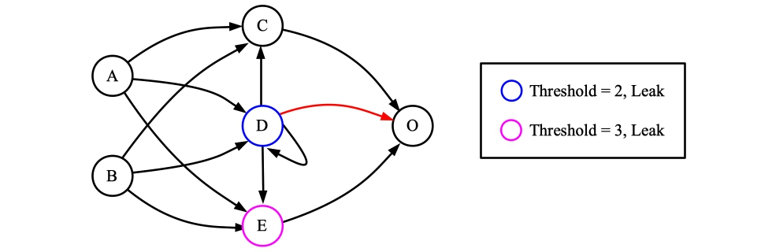
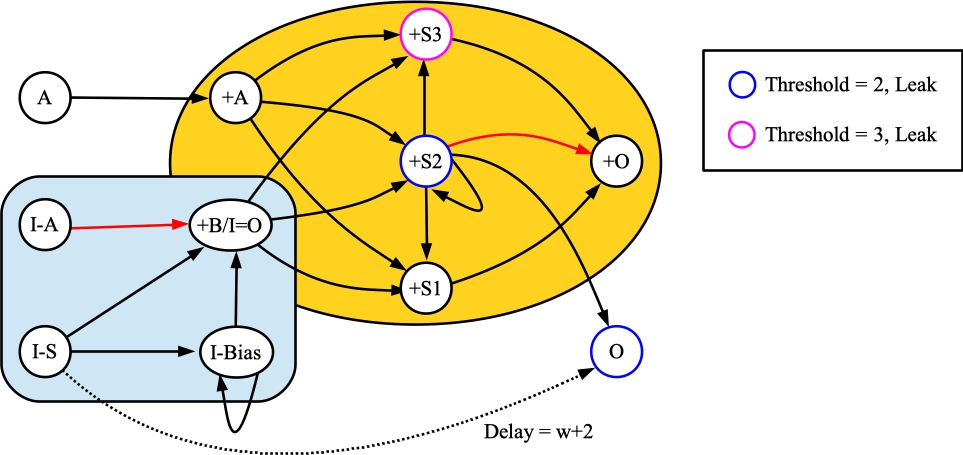

# Arithmetic Networks from Aimone, Hill, Severa and Vineyard, 2021.

James S. Plank

In this markdown file, we go over scripts to implement arithmetic using
the networks defined in the paper [AHSV2021]: "Spiking Neural Streaming Binary Arithmetic",
by James B. Aimone, Aaron J. Hill, William M. Severa, & Craig M. Vineyard, 
*IEEE International Conference on Rebooting Computing*, 2021.
You can get the paper from [https://www.computer.org/csdl/proceedings-article/icrc/2021/233200a079/1CbZFjqAqju](https://www.computer.org/csdl/proceedings-article/icrc/2021/233200a079/1CbZFjqAqju), (or on arXiv).

----------------------------------------
# Addition of two numbers.

The following network, from [AHSV2021], adds two numbers when they are streamed in little-endian.
(As always, if unlabeled, neuron thresholds are one, synapse weights are 1, and synapse delays or 1.
Red synapses have weights of -1.).



Now, let's construct a network and test it out.  The shell script
[scripts/aimone_adder.sh](../scripts/aimone_adder.sh) does all of the work for you:

```
UNIX> sh scripts/aimone_adder.sh 
usage: sh scripts/aimone_adder.sh v1 v2 os_framework
UNIX> sh scripts/aimone_adder.sh 15 85 .
Inputs in little endian: 1111000 1010101
w: 7
Time  0(A)  1(B) 2(S1) 3(S2) 4(S3)  5(O) |  0(A)  1(B) 2(S1) 3(S2) 4(S3)  5(O)
   0     *     *     -     -     -     - |     0     0     0     0     0     0
   1     *     -     *     *     -     - |     0     0     0     0     0     0
   2     *     *     *     *     -     - |     0     0     0     0     0     0
   3     *     -     *     *     *     - |     0     0     0     0     0     0
   4     -     *     *     *     -     * |     0     0     0     0     0     0
   5     -     -     *     *     -     - |     0     0     0     0     0     0
   6     -     *     *     -     -     - |     0     0     0     0     0     0
   7     -     -     *     -     -     * |     0     0     0     0     0     0
   8     -     -     -     -     -     * |     0     0     0     0     0     0
   9     -     -     -     -     -     - |     0     0     0     0     0     0
Sum in Little Endian: 00100110
Sum in Decimal: 100
UNIX> 
```

In the shell script, I convert the two values to binary, little endian.  So 15 becomes
1111000 and 85 becomes 1010101.  You can see above how the network computes the sum,
whose little endian starts at timestep 2: 00100110.  that equals 100 in decimal,
which of course is correct.

In this script and the others in this markdown writeup, when you're done running
it, it creates the following files:

- `tmp_network.txt` - The RISP network.
- `tmp_network_tool.txt` - The `network_tool` commands to create the network.
- `tmp_pt_input.txt` - The input to `processor_tool_risp` that gives the output above.
- `tmp_pt_output.txt` - The output of `processor_tool_risp` on the input.
- `tmp_empty.txt` - The "empty" RISP network that the `network_tool` uses as a starting 
   network.
- `tmp_risp.txt` - The RISP JSON to create the empty network.  

You'll note that since this network requires leak, the RISP settings make sure that the
neurons leak their charge at every timestep.

```
UNIX> cat tmp_pt_input.txt
ML tmp_network.txt
ASR 0 1111000
ASR 1 1010101
RSC 10
UNIX> bin/processor_tool_risp < tmp_pt_input.txt
Time  0(A)  1(B) 2(S1) 3(S2) 4(S3)  5(O) |  0(A)  1(B) 2(S1) 3(S2) 4(S3)  5(O)
   0     *     *     -     -     -     - |     0     0     0     0     0     0
   1     *     -     *     *     -     - |     0     0     0     0     0     0
   2     *     *     *     *     -     - |     0     0     0     0     0     0
   3     *     -     *     *     *     - |     0     0     0     0     0     0
   4     -     *     *     *     -     * |     0     0     0     0     0     0
   5     -     -     *     *     -     - |     0     0     0     0     0     0
   6     -     *     *     -     -     - |     0     0     0     0     0     0
   7     -     -     *     -     -     * |     0     0     0     0     0     0
   8     -     -     -     -     -     * |     0     0     0     0     0     0
   9     -     -     -     -     -     - |     0     0     0     0     0     0
UNIX> ( echo FJ tmp_network.txt ; echo INFO ) | bin/network_tool
Nodes:          6
Edges:         12
Inputs:         2
Outputs:        1

Input nodes:  0(A) 1(B) 
Hidden nodes: 4(S3) 2(S1) 3(S2) 
Output nodes: 5(O) 
UNIX> 
```
----------------------------------------
# Inversion

It is unfortunate that RISP does not implement the features required by [AHSV2021] to
implement a simple streaming inverter.  Instead, we set up a simple inversion network that
employs a starting spike at time zero to set up a bias that fires every timestep:


The shell script `scripts/inversion.sh` inverts a number using this network:

```
UNIX> sh scripts/inversion.sh 
usage: sh scripts/inversion.sh v1 bits os_framework
UNIX> sh scripts/inversion.sh 13 4 .
Input in little endian: 1011 
bits: 4
Time    0(A)    1(S)    2(O) 3(Bias) |    0(A)    1(S)    2(O) 3(Bias)
   0       *       *       -       - |       0       0       0       0
   1       -       -       -       * |       0       0       0       0
   2       *       -       *       * |       0       0       0       0
   3       *       -       -       * |       0       0       0       0
   4       -       -       -       * |       0       0       0       0
Answer in Little Endian: 0100
UNIX> cat tmp_pt_input.txt 
ML tmp_network.txt
ASR 0 1011
AS 1 0 1
RSC 5
UNIX> 
```

If we wanted to, we could use an extra neuron to turn the bias neuron off after the proper
number of timesteps.  We don't do that here, but it may become necessary later.

----------------------------------------
# Comparison

In figure 2 of [AHSV2021], they give a network for performing the comparison of two numbers,
*A* and *B*.  They do this by first inverting *B*, and then adding it to *A*.  If *B > A*,
then the result is a negative number, which means that the carry bit (neuron S2) fires on
the last bit.  The following network implements this in RISP:



As denoted by the colors, we create this network by composing an addition network and
an inversion network, and then adding two extra neurons:

1. An input neuron *A* that has a synapse to *A* in the addition network.   This causes
   each *A* bit to reach the addition network at the same time as the corresponding bit
   from the inverted *B*.

2. An output neuron *O* that is set to fire if the last bit of *S2* fires.  Here, *w* is
   the number of bits of the two numbers, and must be precalculated.  Alternatively, you
   can just set *w* to be a suitably large value -- this is one of the nice things about
   the streaming little-endian representation.  

When we run it, the shell script shows the spike-raster output of the neurons.  The last
bit of the *O* neuron determines the comparison.  Below, I'll do *V1 > V2*, 
*V1 < V2* and *V1 == V2*.  The shell script calculates *w* and then runs the network
for the appropriate number of timesteps:

```
UNIX> sh scripts/aimone_comparison.sh 13 5 .             # V1 > V2 - O should spike.
Inputs in little endian: 1011 1010
w: 4
0(+A)     INPUT  : 0101100
1(+B/I-O) INPUT  : 0010111
2(+S1)    HIDDEN : 0011111
3(+S2)    HIDDEN : 0000011
4(+S3)    HIDDEN : 0000000
5(+O)     OUTPUT : 0001110
6(I-A)    INPUT  : 1010000
7(I-S)    INPUT  : 1000000
8(I-Bias) HIDDEN : 0111111
9(A)      INPUT  : 1011000
10(O)     OUTPUT : 0000001
OK -- v1: 13, v2: 5, last spike of O: 1
UNIX> sh scripts/aimone_comparison.sh 45 129 .           # V1 < V2 - O should not spike,
Inputs in little endian: 10110100 10000001               # and since w is bigger, it runs for more timesteps.
w: 8
0(+A)     INPUT  : 01011010000
1(+B/I-O) INPUT  : 00111111011
2(+S1)    HIDDEN : 00111111111
3(+S2)    HIDDEN : 00001111100
4(+S3)    HIDDEN : 00000101000
5(+O)     OUTPUT : 00011010101
6(I-A)    INPUT  : 10000001000
7(I-S)    INPUT  : 10000000000
8(I-Bias) HIDDEN : 01111111111
9(A)      INPUT  : 10110100000
10(O)     OUTPUT : 00000000000
OK -- v1: 45, v2: 129, last spike of O: 0
                                                         # V1 == V2, and I make them really big.
UNIX> sh scripts/aimone_comparison.sh 123456789 123456789 .
Inputs in little endian: 101010001011001111011010111 101010001011001111011010111
w: 27
0(+A)     INPUT  : 010101000101100111101101011100
1(+B/I-O) INPUT  : 001010111010011000010010100011
2(+S1)    HIDDEN : 001111111111111111111111111111
3(+S2)    HIDDEN : 000000000000000000000000000000
4(+S3)    HIDDEN : 000000000000000000000000000000
5(+O)     OUTPUT : 000111111111111111111111111111
6(I-A)    INPUT  : 101010001011001111011010111000
7(I-S)    INPUT  : 100000000000000000000000000000
8(I-Bias) HIDDEN : 011111111111111111111111111111
9(A)      INPUT  : 101010001011001111011010111000
10(O)     OUTPUT : 000000000000000000000000000000
OK -- v1: 123456789, v2: 123456789, last spike of O: 0
UNIX> 
```

The network composition uses the `bin/compose_networks` program.  I'll admit that the
shell script is Byzantine, and that `bin/compose_networks` is pretty primitive.  I'm sure
this is easier in Fugu [ASV2019], and maybe when we have the two projects interact, we'll be able
to use Fugu with RISP.  Until then, we'll use `bin/compose_networks` and our prowess
at writing shell scripts.

--------------
# References

- [ASV2019]: 
J. B. Aimone, W. Severa and C. M. Vineyard, <i>"Composing neural
algorithms with Fugu,"</i> <b>International Conference on
Neuromorphic Computing Systems (ICONS)</b>, ACM,
https://dl.acm.org/doi/10.1145/3354265.3354268, 2019, pp. 1-8.

- [AHSV2021]: J. B. Aimone, A. J. Hill, W. M. Severa and C. M. Vineyard,
<i>"Spiking Neural Streaming Binary Arithmetic,"</i> <b>IEEE
International Conference on Rebooting Computing (ICRC)</b>,
https://www.computer.org/csdl/proceedings-article/icrc/2021/233200a079/1CbZFjqAqju, 2021.
