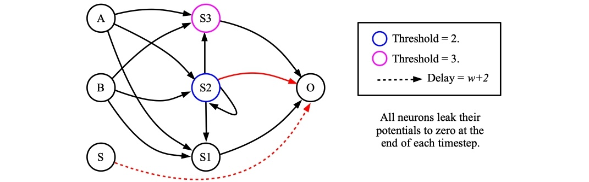

# Streaming Arithmetic on Little-Endian, Two's Complement Spike Trains

James S. Plank

## Introduction

In 2021, James B. Aimone, Aaron J. Hill, William M. Severa, & Craig M. Vineyard published
a wonderful paper in the *IEEE International Conference on Rebooting Computing*, entitled
"Spiking Neural Streaming Binary Arithmetic" [AHSV2021].  In this paper, the authors demonstrated 
how to perform the following operations using spiking neural networks:

- Addition
- Inversion
- Comparison
- Maximum
- Subtraction
- Multiplication by a constant

You can get the paper from [https://www.computer.org/csdl/proceedings-article/icrc/2021/233200a079/1CbZFjqAqju](https://www.computer.org/csdl/proceedings-article/icrc/2021/233200a079/1CbZFjqAqju), (or on arXiv).

In the TENNLab open-source framework, we have written shell scripts to create networks
that perform each of these operations, plus two's complement negation and integer division
by a power of two.  We also have shell scripts to run each of these networks and corroborate
the results.

------------------------------------------------------------
## Including the number of bits

In [AHSV2021], the authors use unbounded streams of spikes to represent numbers.
While this is both cool and elegant, when our research group set about composing these networks
for mathematical operations, we realized the value of defining the number of bits in each
number's representation.  So the networks that we present here require the user to define
the value *w*, which is the number of bits/spikes in the representation of the numbers.

Each of our networks also has a *starting* neuron *S*, which must be spiked at timestep 0
in order for the network to work.  

------------------------------------------------------------
## Two's Complement, Little Endian

To be precise, each number is represented by a train of *w* spikes.  If you represent no
spike on a timestep by 0, and a spike by 1, then the stream of 0's and 1's that result from
a stream of spikes represents the number in two's complement, little endian.
Therefore, if there is a spike on the last timestep (timestep *w-1*), the number is negative,
and if there is no spike, then the number is positive.

Here are example of mapping spike trains to numbers:

- *w = 4*, spike train 1010 represents 5.
- *w = 4*, spike train 1011 represents -3.
- *w = 5*, spike train 10110 represents 13.
- *w = 8*, spike train 11111111 represents -1.

There are two shell scripts to help you out with converting numbers to spike trains and
back again:

- `scripts/val_to_tcle.sh` converts a value and a number of bits to its corresponding spike train.
- `scripts/tcle_toLval.sh` converts a spike train to a v value.  It is assumed that the length of the spike train equals the number of bits.

So:

```
UNIX> sh scripts/val_to_tcle.sh 
usage: sh val_to_tcle.sh val w
UNIX> sh scripts/val_to_tcle.sh 5 4
1010
UNIX> sh scripts/val_to_tcle.sh -3 4
1011
UNIX> sh scripts/val_to_tcle.sh 13 5
10110
UNIX> sh scripts/val_to_tcle.sh -1 8
11111111
UNIX> sh scripts/tcle_to_val.sh
usage: sh tcle_to_val.sh spike-raster
UNIX> sh scripts/tcle_to_val.sh 1010
5
UNIX> sh scripts/tcle_to_val.sh 1011
-3
UNIX> sh scripts/tcle_to_val.sh 10110
13
UNIX> sh scripts/tcle_to_val.sh 11111111
-1
UNIX> 
```

----------------------------------------
## Two shell scripts for each operation, and tmp-info.txt

For each arithmetic operation *xxx*, we provide two shell scripts:

- `xxx_network.sh` - Prints a RISP network implementing the operation on standard output.
- `xxx_run.sh` - Takes input values, creates the network, runs the network, interprets the output, and confirms correctness.

In the `xxx_network.sh` scripts, there is a file `tmp_info.txt` that is created, that contains
information about the networks.  Let me give you an example.  Suppose you create an adder
for 8-bit numbers:

```
UNIX> sh scripts/adder_network.sh 
usage: sh scripts/aimone_adder.sh w os_framework
UNIX> sh scripts/adder_network.sh 8 . > tmp_adder.txt
UNIX> cat tmp_info.txt
INPUT V0 0 TC_LE 8 0
INPUT V1 1 TC_LE 8 0
INPUT S 2 Spike 1 0
OUTPUT SUM 6 TC_LE 8 2
RUN 11
UNIX> 
```

You get the following information from `tmp_info.txt`:

- The first input, *V0* is named "V0" in the network, and its neuron number is 0.  It represents
  its values with two's complement, little-endian, and it expects a train of 8 spikes starting
  at timestep 0.
- The second input, *V1* is named "V1" in the network, and its neuron number is 1.  Its other
  details are just like *V0$.
- The third input, *S* is a single spike at timestep 0.
- The network should run for 11 timesteps.
- The output neuron is named "SUM" and is neuron number 6.  Its output is two's complement,
  little-endian, and it is a train of 8 spikes starting at timestep 2.

This information is there to help you compose and use these networks.
The `xxx_run.sh` shell scripts make use of this information, and perhaps we'll be able to use
it to automate composition, but we're not at that point yet.  We're still learning, and
composing networks by hand.

----------------------------------------
# Addition

We use the following network for addition.  It is the network presented in [AHSV2021], but
we've added a neuron and synapse to deal with the fixed bit width:

(In all of these network drawings,
if unlabeled, neuron thresholds are one, synapse weights are 1, and synapse delays are 1.
Red synapses, if unlabeled, have weights of -1.).



Let's test it out with `scripts/adder_run.sh`.  The output is pretty self-explanatory, but
I've put a few comments in:

```
UNIX> sh scripts/adder_run.sh 
usage: sh scripts/adder_run.sh v0 v1 w os_framework
UNIX> sh scripts/adder_run.sh 44 80 8 .
V0: 44
V1: 80
W:  8
Top:  128
V0-SR: 00110100
V1-SR: 00001010
Output-Neuron: 6
Output-Starting-Timestep: 2
Output-Num-Timesteps: 8
Output-On-Output-Neuron: 000011111                  # This is all of the timesteps of the output.
Stripped-Output: 00111110                           # Here, we've stripped out the 8 spikes starting at timestep 2.
Sum: 124
Computed-Sum: 124
Overflow: 0
Underflow: 0

The network is in tmp_adder.txt
Its info is in tmp_info.txt
Input for the processor_tool to run this test is in tmp_pt_input.txt
Output of the processor_tool on this input is in tmp_pt_output.txt
UNIX> 
```

You can run this yourself:

```
UNIX> cat tmp_pt_input.txt
ML tmp_adder.txt
ASR 0 00110100
ASR 1 00001010
AS 2 0 1
RUN 11
GSR
UNIX> bin/processor_tool_risp < tmp_pt_input.txt
0(V0)  INPUT  : 001101000
1(V1)  INPUT  : 000010100
2(S)   INPUT  : 100000000
3(S1)  HIDDEN : 000111110
4(S2)  HIDDEN : 000000000       # The GSR command stops printing timesteps when there are no more
5(S3)  HIDDEN : 000000000       # spikes, so even though we run for 11 timesteps, its only prints
6(SUM) OUTPUT : 000011111       # nine timesteps.  The last two have no spikes on any neuron.
UNIX> 
```

We can try this with negative numbers and it works fine:

```
UNIX> sh scripts/val_to_tcle.sh 25 8               # Get the spike rasters for 25 and -100
10011000
UNIX> sh scripts/val_to_tcle.sh -100 8
00111001
UNIX> bin/processor_tool_risp                      # Run the processor_tool, and:
ML tmp_adder.txt                                   # Load the network.
ASR 0 10011000                                     # Input the spike raster for 25.
ASR 1 00111001                                     # Input the spike raster for -100.
AS 2 0 1                                           # Apply the starting spike to the S neuron.
RUN 11                                             # Run it for 11 timesteps.
GSR                                                # Print the spike raster.
0(V0)  INPUT  : 1001100000
1(V1)  INPUT  : 0011100100
2(S)   INPUT  : 1000000000
3(S1)  HIDDEN : 0101111010
4(S2)  HIDDEN : 0000110000
5(S3)  HIDDEN : 0000010000
6(SUM) OUTPUT : 0010101101                          # We want the output starting at timestep 2,
Q                                                   # which is 10101101.
UNIX> sh scripts/tcle_to_val.sh 10101101            # That equals -75, so our addition worked!
-75
UNIX> 
```

If you call `scripts/adder_network.sh` and set *w* to 0, then it emits the original adder
from [AHXV2021], without the *S* neuron.  We use this network as a building block for 
multiplication below.

----------------------------------------
# Inversion 

It is unfortunate that RISP does not implement the features required by [AHSV2021] to
implement a simple streaming inverter.  Instead, we set up a simple inversion network that
employs a starting spike at time zero to set up a bias that fires every timestep, and stops
after *w* timesteps.

This network simply flips the bits of its input -- it is not a two's complement inverter.
That's next.


The script `scripts/inversion_network.sh` prints an inversion network on
standard output, and the script `scripts/inversion_run.sh`
inverts a number using this network:

```
UNIX> sh scripts/inversion_run.sh
usage: sh scripts/inversion_run.sh v w os_framework
UNIX> sh scripts/inversion_run.sh 0100111110 4 .
V's length (10) is not equal to w (4)
UNIX> sh scripts/inversion_run.sh 0100111110 10 .
V0: 0100111110
W: 10
Output-Neuron: 4
Output-Starting-Timestep: 1
Output-Num-Timesteps: 10
Output-On-Output-Neuron: 01011000001
Stripped-Output: 1011000001
Input-Inverted: 1011000001
Correct: 1

The network is in tmp_inversion.txt
Its info is in tmp_info.txt
Input for the processor_tool to run this test is in tmp_pt_input.txt
Output of the processor_tool on this input is in tmp_pt_output.txt
UNIX> 
```

----------------------------------------
# Two's Complement Inversion

To perform two's complement inversion of a number, the algorithm is to flip the 
number's bits, and then add one to it.  Therefore, we may compose the two networks
above to perform the inversion:


When you reason a little about the network, you realize first that S3 never fires.
You can also coalesce A and A+, and S/Bias /B+, resulting in the following, smaller
network:


You can use `scripts/twos_comp_network.sh` to create one of these networks, and
`scripts/twos_comp_run.sh` to demonstrate how it works:

```
UNIX> sh scripts/twos_comp_run.sh 
usage: sh scripts/inversion_run.sh v w os_framework
UNIX> sh scripts/twos_comp_run.sh 14 8 .
V0: 14
W: 8
V0-Spike-Raster: 01110000
Output-Neuron: 6
Output-Starting-Timestep: 2
Output-Num-Timesteps: 8
Output-On-Output-Neuron: 0001001111
Stripped-Output: 01001111
Input-Inverted: -14
Inverted-Spike-Raster: 01001111
Correct: 1

The network is in tmp_twos_comp.txt
Its info is in tmp_info.txt
Input for the processor_tool to run this test is in tmp_pt_input.txt
Output of the processor_tool on this input is in tmp_pt_output.txt
UNIX> sh scripts/twos_comp_run.sh -14 8 . | grep Spike
V0-Spike-Raster: 01001111
Inverted-Spike-Raster: 01110000
UNIX> 
```

----------------------------------------
# Multiplication of a number by a constant

This is performed by cascading adder networks, and forwarding the number being multiplied
to each adder's inputs with the proper delay, so that the number, multiplied by the proper
factor of two, is added into the product.

It's best illustrated by a simple example.  Suppose we want to multiply by 556.  You'll
note that in binary (big-endian), 556 = 0x22c = 1000101100.  Since there are four one bits set 
in 556, you can multiply *x* by 556 by doing: *4x+8x+32x+512x*.  This is probably easier to see in
binary.  Suppose *x* is 87 = 0x57 = 1010111.  Then we have:

```
   4x        101011100   
   8x       1010111000  
            ----------
           10000010100 -- 4*87 + 8*87 = 1044
  32x     101011100000
          ------------
          111011110100 -- 4*87 + 8*87 + 32*87 = 3828
 512x 1010111000000000
      ----------------
      1011110011110100 --  4*87 + 8*87 + 32*87 + 512*87 = 48372
```

Rendering this with a spiking neural network, we are going to compose three
adders as follows:

- The first adder will add *4x* and *8x*.
- The second adder will add the sum of the first adder and *32x*.
- The third adder will add the sum of the second adder and *512x*.

Here's a picture:


I know you may be confused by this picture, so I'm going to walk you through it slowly.

1. The first (leftmost) adder adds *4x* and *8x*.   The delay of 3 from *A* is what performs the
multiplication by four.  To be precise, the edge from *A* to *a* must have a delay of
*y+1*, where *y* is the number of leading zeros in the little-endian representation of the
constant.  Here, the constant is 556, which is 0011010001 in little-endian.  There are two
leading zero's, so *y=2* and the delay of the synapse from *A* to *a* *2+1=3*.

You'll note that the synase from *a* to *b* has a delay of one.  That is because we multiply
*4x* by 2 to get *8x*.  To be precise, if there are *y* zeros between the first 1 and the second
1 in the little-endian representation of our constant, then the weight of the synapse from
*a* to *b* is *y+1*.

2. The second (middle) adder adds *(4x+8x)* and *32x*.  First, you'll note that*4x* and *8x*
arrive at *a* and *b* respectively at timestep 1.  That might be confusing, but think about
when, say, *x* is three = 11.  Then *4x* is 0011 (little endian) and *8x* is 00011.  Because of
the delay from *A*, neuron *a's* spike raster, starting at timestep 1 is 00011, and neuron *b's$
is 000011.  Thus, *4x*, which is 0011, starts at timestep 1 on neuron *a* and *8x*, which is 00011,
also starts at timestep 1 on neuron *b*.

The upshot of this is that *(4x+8x)* starts spiking on neuron *f* at timestep 3.  That means
we have to arrange for *32x* to start spiking on neuron *g* at timestep 3.  The delay of 4 makes
that happen -- three units of delay from *A* to *a*, one from *a* to *b*, four from *b* to *g*.
That means *x* starts spiking at timestep 8, which is what we want -- 5 timesteps after timestep
three, since 32 = 2^5.

3. Similarly, the third (rightmost) adder adds *(4x+8x+32x)* and *512x*.  *(4x+8x+32x)* 
is calculated on neuron *k* at timestep 5, so we need *512x* to start spiking on neuron *l*
at timestep 5.  The delay of 6 makes that happen -- *x* starts spiking on *g* at timestep 8,
so it starts spiking on *l* at timestep 14.  512 = 2^9, so that means *512x* starts on *g*
at timestep 5, which is what we want!

4. The final product starts spiking on *p* at timestep 7.  Given that this product can be
roughly *2w* bits, and we only want to keep *w* of them, we set up *C* and the *Bias* to 
spike exactly *w* times into the *Prod* neuron, starting at timestep 8.  That achieves our
goal.

The script `scripts/aimone_mult_network.sh` makes the network, and `scripts/aimone_mult_run.sh`
runs it.  Let's see what happens when we multiply 556 and 87.  We'll set *w* to 20, since that
stores 556*87 comfortably in two's complement:

```
UNIX> sh scripts/aimone_mult_run.sh  556 87 20 .
V0: 87
W: 20
Top: 524288
V0-SR: 11101010000000000000
Output-Neuron: 4
Output-Starting-Timestep: 8
Output-Num-Timesteps: 20
Output-On-Output-Neuron: 000000000010111100111101
Stripped-Output: 00101111001111010000
Product: 48372
Computed-Product: 48372
Correct: 1
Overflow: 0
Underflow: 0

The network is in tmp_adder.txt
Its info is in tmp_info.txt
Input for the processor_tool to run this test is in tmp_pt_input.txt
Output of the processor_tool on this input is in tmp_pt_output.txt
UNIX> 
```

Let's probe this a little.  Here's `tmp_info.txt`:

```
UNIX> cat tmp_info.txt
INPUT V0 0 TC_LE 20 0
INPUT S 1 Spike 1 0
OUTPUT Prod 4 TC_LE 20 8
RUN 48
UNIX> 
```

That means that we'll spike in 87 on neuron 0 starting at timestep 0, and spike neuron 1
(S) once at time 0.  The output will be on neuron 4, and it will be 20 timesteps starting
at timestep 8.  You need to run the network for 48 timesteps.  (That's a little overkill,
but whatever...)

Let's start with the input, S and Prod neurons:

```
UNIX> grep '^[014](' tmp_pt_output.txt
0(V0)           INPUT  : 111010100000000000000000          # Here's 87 = 101101010000...
1(Start)        INPUT  : 100000000000000000000000          # The single spike on S.
4(Prod/A)       OUTPUT : 000000000010111100111101          # The product starts at timestep 8.
                                 ^^^^^^^^^^^^^^^^          # The carats start at timestep 8.
UNIX> 
```

Let's look at neurons *a*, *b*, *g* and *l* from the picture.  These are named AV0, AV1,
A3_V1 and A3_2_V1 in the network:

```
UNIX> egrep '(AV0)|(AV1)|(A3_V1)|(A3_2_V1)' tmp_pt_output.txt
5(AV0)          INPUT  : 000111010100000000000000          # 4*87 starts at timestep 1
                          ^^^^^^^^^^^^^^^^^^^^
6(AV1)          INPUT  : 000011101010000000000000          # 8*87 starts at timestep 1
                          ^^^^^^^^^^^^^^^^^^^^
11(A3_V1)       INPUT  : 000000001110101000000000          # 32*87 starts at timestep 3
                            ^^^^^^^^^^^^^^^^^^^^
16(A3_2_V1)     INPUT  : 000000000000001110101000          # 512*87 starts at timestep 5
                              ^^^^^^^^^^^^^^^^^^^ 
UNIX> 
```

This works with positive and negative numbers:

```
UNIX> sh scripts/aimone_mult_run.sh  -3 -11 16 . | egrep 'Stripped|Product'
Stripped-Output: 1000010000000000
Product: 33
Computed-Product: 33
UNIX> sh scripts/aimone_mult_run.sh  -3 11 16 . | egrep 'Stripped|Product'
Stripped-Output: 1111101111111111
Product: -33
Computed-Product: -33
UNIX> sh scripts/aimone_mult_run.sh  3 -11 16 . | egrep 'Stripped|Product'
Stripped-Output: 1111101111111111
Product: -33
Computed-Product: -33
UNIX> 
```

One thing you need to consider very seriously when you're using these networks is overflow.
You need w to have enough bits to store the product in two's complement, which means positive
numbers need to end with 0, and negative numbers need to end with 1.  Fortunately, you can
make w really big, and it shouldn't affect performance too much.  

Here's an example of w too small:

```
UNIX> sh scripts/val_to_tcle.sh 99 5             # You can't store 99 in 5 bits.
Value 99 is too big -- must be < 32
UNIX> sh scripts/val_to_tcle.sh 99 8             # But you can in 8 bits.
11000110
UNIX> sh scripts/aimone_mult_run.sh 9 11 5 .     # Here 5 bits is not enough to store the product.
V0: 11
W: 5
Top: 16
V0-SR: 11010
Output-Neuron: 4
Output-Starting-Timestep: 4
Output-Num-Timesteps: 5
Output-On-Output-Neuron: 0000110000
Stripped-Output: 11000
Product: 99
Computed-Product: 3
Correct: 0
Overflow: 1
Underflow: 0

The network is in tmp_adder.txt
Its info is in tmp_info.txt
Input for the processor_tool to run this test is in tmp_pt_input.txt
Output of the processor_tool on this input is in tmp_pt_output.txt
UNIX> sh scripts/aimone_mult_run.sh 9 11 8 . | grep Correct              # 8 bits is enough.
Correct: 1
UNIX> 
```

----------------------------------------
# Subtraction

For subtraction, we can compose a two's complement network and an adder, but as above,
you can do some optimization.  Here's the network I came up with:


Like the adder, you start getting output at timestep 2, and the number of bits is built into
the network, so it won't spike after the w bits of output (the synapse from S to O is what
insures that).

By now, you should know the drill with `scripts/subtraction_network.sh` and
`scripts/subtraction_run.sh`:

```
UNIX> sh scripts/subtraction_run.sh 10 4 8 .             # Subtract 4 from 10 with 8 bits.
V0: 10
V1: 4
W: 8
Top: 128
V0-SR: 01010000
V1-SR: 00100000
Output-Neuron: 8
Output-Starting-Timestep: 2
Output-Num-Timesteps: 8
Output-On-Output-Neuron: 0001100000
Stripped-Output: 01100000
Difference: 6
Computed-Difference: 6
Correct: 1
Overflow: 0
Underflow: 0

The network is in tmp_subtraction.txt
Its info is in tmp_info.txt
Input for the processor_tool to run this test is in tmp_pt_input.txt
Output of the processor_tool on this input is in tmp_pt_output.txt
UNIX> sh scripts/subtraction_run.sh 4 10 8 .             # Subtract 10 from 4 with 8 bits.
V0: 4
V1: 10
W: 8
Top: 128
V0-SR: 00100000
V1-SR: 01010000
Output-Neuron: 8
Output-Starting-Timestep: 2
Output-Num-Timesteps: 8
Output-On-Output-Neuron: 0001011111
Stripped-Output: 01011111
Difference: -6
Computed-Difference: -6
Correct: 1
Overflow: 0
Underflow: 0

The network is in tmp_subtraction.txt
Its info is in tmp_info.txt
Input for the processor_tool to run this test is in tmp_pt_input.txt
Output of the processor_tool on this input is in tmp_pt_output.txt
UNIX> 
```

--------------
# References

- [ASV2019]: 
J. B. Aimone, W. Severa and C. M. Vineyard, <i>"Composing neural
algorithms with Fugu,"</i> <b>International Conference on
Neuromorphic Computing Systems (ICONS)</b>, ACM,
https://dl.acm.org/doi/10.1145/3354265.3354268, 2019, pp. 1-8.

- [AHSV2021]: J. B. Aimone, A. J. Hill, W. M. Severa and C. M. Vineyard,
<i>"Spiking Neural Streaming Binary Arithmetic,"</i> <b>IEEE
International Conference on Rebooting Computing (ICRC)</b>,
https://www.computer.org/csdl/proceedings-article/icrc/2021/233200a079/1CbZFjqAqju, 2021.
