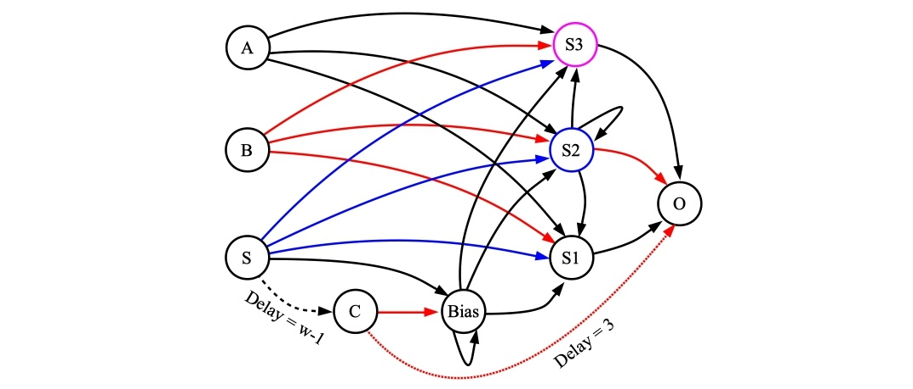

# Streaming Arithmetic on Little-Endian, Two's Complement Spike Trains

James S. Plank

## Introduction

In 2021, James B. Aimone, Aaron J. Hill, William M. Severa, & Craig M. Vineyard published
a wonderful paper in the *IEEE International Conference on Rebooting Computing*, entitled
"Spiking Neural Streaming Binary Arithmetic" [AHSV2021].  In this paper, the authors demonstrated how
to perform the following operations using spiking neural networks:

- Addition
- Inversion
- Comparison
- Maximum
- Subtraction
- Multiplication by a constant

You can get the paper from [https://www.computer.org/csdl/proceedings-article/icrc/2021/233200a079/1CbZFjqAqju](https://www.computer.org/csdl/proceedings-article/icrc/2021/233200a079/1CbZFjqAqju), (or on arXiv).

In the TENNLab open-source framework, we have written shell scripts to create networks
that perform each of these operations, plus two's complement negation and integer division
by a power of two.  We also have shell scripts to run each of these networks and corroborate
the results.

------------------------------------------------------------
## Including the number of bits

In [AHSV2021], the authors use unbounded streams of spikes to represent numbers.
While this is both cool and elegant, when our research group set about composing these networks
for mathematical operations, we realized the value of defining the number of bits in each
numbers' representation.  So the networks that we present here require the user to define
the value *w*, which is the number of bits/spikes in the representation of the numbers.

Each of our networks also has a *starting* neuron *S*, which must be spiked at timestep 0
in order for the network to work.  

------------------------------------------------------------
## Two's Complement, Little Endian

To be precise, each number is represented by a train of *w* spikes.  If you represent no
spike on a timestep by 0, and a spike by 1, then the stream of 0's and 1's that result from
a stream of spikes represents the number in two's complement, little endian.
Therefore, if there is a spike on the last timestep (timestep *w-1$), the number is negative,
and if there is no spike, then the number is positive.

Here are example of mapping spike trains to numbers:

- *w = 4*, spike train 1010 represents 5.
- *w = 4*, spike train 1011 represents -3.
- *w = 5*, spike train 10110 represents 13.
- *w = 8*, spike train 11111111 represents -1.

There are two shell scripts to help you out with converting numbers to spike trains and
back again:

- `scripts/val_to_tcle.sh` converts a value and a number of bits to its corresponding spike train.
- `scripts/tcle_toLval.sh` converts a spike train to a v value.  It is assumed that the length of the spike train equals the number of bits.

So:

```
UNIX> sh scripts/val_to_tcle.sh 
usage: sh val_to_tcle.sh val w
UNIX> sh scripts/val_to_tcle.sh 5 4
1010
UNIX> sh scripts/val_to_tcle.sh -3 4
1011
UNIX> sh scripts/val_to_tcle.sh 13 5
10110
UNIX> sh scripts/val_to_tcle.sh -1 8
11111111
UNIX> sh scripts/tcle_to_val.sh
usage: sh tcle_to_val.sh spike-raster
UNIX> sh scripts/tcle_to_val.sh 1010
5
UNIX> sh scripts/tcle_to_val.sh 1011
-3
UNIX> sh scripts/tcle_to_val.sh 10110
13
UNIX> sh scripts/tcle_to_val.sh 11111111
-1
UNIX> 
```

----------------------------------------
## Two shell scripts for each operation

For each arithmetic operation *xxx*, we provide two shell scripts:

- `*xxx*_network.sh` - Prints a RISP network implementing the operation on standard output.
- `*xxx*_run.sh` - Takes input values, creates the network, runs the network, interprets the output, and confirms correctness.

----------------------------------------
# HERE in rewrite. Addition of two numbers.

The following network, from [AHSV2021], adds two numbers when they are streamed in little-endian.
(As always, if unlabeled, neuron thresholds are one, synapse weights are 1, and synapse delays or 1.
Red synapses have weights of -1.).


Now, let's construct a network and test it out.  The shell script
[scripts/aimone_adder.sh](../scripts/aimone_adder.sh) does all of the work for you:

```
UNIX> sh scripts/aimone_adder.sh 
usage: sh scripts/aimone_adder.sh v1 v2 os_framework
UNIX> sh scripts/aimone_adder.sh 15 85 .
Inputs in little endian: 1111000 1010101
w: 7
Time  0(A)  1(B) 2(S1) 3(S2) 4(S3)  5(O) |  0(A)  1(B) 2(S1) 3(S2) 4(S3)  5(O)
   0     *     *     -     -     -     - |     0     0     0     0     0     0
   1     *     -     *     *     -     - |     0     0     0     0     0     0
   2     *     *     *     *     -     - |     0     0     0     0     0     0
   3     *     -     *     *     *     - |     0     0     0     0     0     0
   4     -     *     *     *     -     * |     0     0     0     0     0     0
   5     -     -     *     *     -     - |     0     0     0     0     0     0
   6     -     *     *     -     -     - |     0     0     0     0     0     0
   7     -     -     *     -     -     * |     0     0     0     0     0     0
   8     -     -     -     -     -     * |     0     0     0     0     0     0
   9     -     -     -     -     -     - |     0     0     0     0     0     0
Sum in Little Endian: 00100110
Sum in Decimal: 100
UNIX> 
```

In the shell script, I convert the two values to binary, little endian.  So 15 becomes
1111000 and 85 becomes 1010101.  You can see above how the network computes the sum,
whose little endian starts at timestep 2: 00100110.  that equals 100 in decimal,
which of course is correct.

In this script and the others in this markdown writeup, when you're done running
it, it creates the following files:

- `tmp_network.txt` - The RISP network.
- `tmp_network_tool.txt` - The `network_tool` commands to create the network.
- `tmp_pt_input.txt` - The input to `processor_tool_risp` that gives the output above.
- `tmp_pt_output.txt` - The output of `processor_tool_risp` on the input.
- `tmp_empty.txt` - The "empty" RISP network that the `network_tool` uses as a starting 
   network.
- `tmp_risp.txt` - The RISP JSON to create the empty network.  

You'll note that since this network requires leak, the RISP settings make sure that the
neurons leak their charge at every timestep.

```
UNIX> cat tmp_pt_input.txt
ML tmp_network.txt
ASR 0 1111000
ASR 1 1010101
RSC 10
UNIX> bin/processor_tool_risp < tmp_pt_input.txt
Time  0(A)  1(B) 2(S1) 3(S2) 4(S3)  5(O) |  0(A)  1(B) 2(S1) 3(S2) 4(S3)  5(O)
   0     *     *     -     -     -     - |     0     0     0     0     0     0
   1     *     -     *     *     -     - |     0     0     0     0     0     0
   2     *     *     *     *     -     - |     0     0     0     0     0     0
   3     *     -     *     *     *     - |     0     0     0     0     0     0
   4     -     *     *     *     -     * |     0     0     0     0     0     0
   5     -     -     *     *     -     - |     0     0     0     0     0     0
   6     -     *     *     -     -     - |     0     0     0     0     0     0
   7     -     -     *     -     -     * |     0     0     0     0     0     0
   8     -     -     -     -     -     * |     0     0     0     0     0     0
   9     -     -     -     -     -     - |     0     0     0     0     0     0
UNIX> ( echo FJ tmp_network.txt ; echo INFO ) | bin/network_tool
Nodes:          6
Edges:         12
Inputs:         2
Outputs:        1

Input nodes:  0(A) 1(B) 
Hidden nodes: 4(S3) 2(S1) 3(S2) 
Output nodes: 5(O) 
UNIX> 
```
----------------------------------------
# Inversion

It is unfortunate that RISP does not implement the features required by [AHSV2021] to
implement a simple streaming inverter.  Instead, we set up a simple inversion network that
employs a starting spike at time zero to set up a bias that fires every timestep:


The shell script `scripts/inversion.sh` inverts a number using this network:

```
UNIX> sh scripts/inversion.sh 
usage: sh scripts/inversion.sh v1 bits os_framework
UNIX> sh scripts/inversion.sh 13 4 .
Input in little endian: 1011 
bits: 4
Time    0(A)    1(S)    2(O) 3(Bias) |    0(A)    1(S)    2(O) 3(Bias)
   0       *       *       -       - |       0       0       0       0
   1       -       -       -       * |       0       0       0       0
   2       *       -       *       * |       0       0       0       0
   3       *       -       -       * |       0       0       0       0
   4       -       -       -       * |       0       0       0       0
Answer in Little Endian: 0100
UNIX> cat tmp_pt_input.txt 
ML tmp_network.txt
ASR 0 1011
AS 1 0 1
RSC 5
UNIX> 
```

There's a second script, `scripts/inversion_w.sh` that turns the bias off, so that
it only spikes *bits-1* times.  Since there is an extra spike from *S* to *O*, that
means that *O* gets *bits* spikes overall.  This is useful, because the bias doesn't
just keep spiking, which sometimes makes it confusing to figure out values.


Here, the output starts at timestep 1, and finishes at timestep *bits*.  After that,
the network is ready to go again.

```
UNIX> sh scripts/inversion_w.sh 14 6 .
Input in little endian: 011100 
bits: 6
Time    0(A)    1(S)    2(O) 3(Bias)    4(C) |    0(A)    1(S)    2(O) 3(Bias)    4(C)
   0       -       *       -       -       - |       0       0       0       0       0
   1       *       -       *       *       - |       0       0       0       0       0
   2       *       -       -       *       - |       0       0       0       0       0
   3       *       -       -       *       - |       0       0       0       0       0
   4       -       -       -       *       - |       0       0       0       0       0
   5       -       -       *       *       * |       0       0       0       0       0
   6       -       -       *       -       - |       0       0       0       0       0
Answer in Little Endian: 100011
UNIX> 
```

----------------------------------------
# Comparison

In figure 2 of [AHSV2021], they give a network for performing the comparison of two numbers,
*A* and *B*.  They do this by first inverting *B*, and then adding it to *A*.  If *B > A*,
then the result is a negative number, which means that the carry bit (neuron S2) fires on
the last bit.  The following network implements this in RISP:


As denoted by the colors, we create this network by composing an addition network and
an inversion network, and then adding two extra neurons:

1. An input neuron *A* that has a synapse to *A* in the addition network.   This causes
   each *A* bit to reach the addition network at the same time as the corresponding bit
   from the inverted *B*.

2. An output neuron *O* that is set to fire if the last bit of *S2* fires.  Here, *w* is
   the number of bits of the two numbers, and must be precalculated.  Alternatively, you
   can just set *w* to be a suitably large value -- this is one of the nice things about
   the streaming little-endian representation.  

When we run it, the shell script shows the spike-raster output of the neurons.  The last
bit of the *O* neuron determines the comparison.  Below, I'll do *V1 > V2*, 
*V1 < V2* and *V1 == V2*.  The shell script calculates *w* and then runs the network
for the appropriate number of timesteps:

```
UNIX> sh scripts/aimone_comparison.sh 13 5 .             # V1 > V2 - O should spike.
Inputs in little endian: 1011 1010
w: 4
0(+A)     INPUT  : 0101100
1(+B/I-O) INPUT  : 0010111
2(+S1)    HIDDEN : 0011111
3(+S2)    HIDDEN : 0000011
4(+S3)    HIDDEN : 0000000
5(+O)     OUTPUT : 0001110
6(I-A)    INPUT  : 1010000
7(I-S)    INPUT  : 1000000
8(I-Bias) HIDDEN : 0111111
9(A)      INPUT  : 1011000
10(O)     OUTPUT : 0000001
OK -- v1: 13, v2: 5, last spike of O: 1
UNIX> sh scripts/aimone_comparison.sh 45 129 .           # V1 < V2 - O should not spike,
Inputs in little endian: 10110100 10000001               # and since w is bigger, it runs for more timesteps.
w: 8
0(+A)     INPUT  : 01011010000
1(+B/I-O) INPUT  : 00111111011
2(+S1)    HIDDEN : 00111111111
3(+S2)    HIDDEN : 00001111100
4(+S3)    HIDDEN : 00000101000
5(+O)     OUTPUT : 00011010101
6(I-A)    INPUT  : 10000001000
7(I-S)    INPUT  : 10000000000
8(I-Bias) HIDDEN : 01111111111
9(A)      INPUT  : 10110100000
10(O)     OUTPUT : 00000000000
OK -- v1: 45, v2: 129, last spike of O: 0
                                                         # V1 == V2, and I make them really big.
UNIX> sh scripts/aimone_comparison.sh 123456789 123456789 .
Inputs in little endian: 101010001011001111011010111 101010001011001111011010111
w: 27
0(+A)     INPUT  : 010101000101100111101101011100
1(+B/I-O) INPUT  : 001010111010011000010010100011
2(+S1)    HIDDEN : 001111111111111111111111111111
3(+S2)    HIDDEN : 000000000000000000000000000000
4(+S3)    HIDDEN : 000000000000000000000000000000
5(+O)     OUTPUT : 000111111111111111111111111111
6(I-A)    INPUT  : 101010001011001111011010111000
7(I-S)    INPUT  : 100000000000000000000000000000
8(I-Bias) HIDDEN : 011111111111111111111111111111
9(A)      INPUT  : 101010001011001111011010111000
10(O)     OUTPUT : 000000000000000000000000000000
OK -- v1: 123456789, v2: 123456789, last spike of O: 0
UNIX> 
```

The network composition uses the `bin/compose_networks` program.  I'll admit that the
shell script is Byzantine, and that `bin/compose_networks` is pretty primitive.  I'm sure
this is easier in Fugu [ASV2019], and maybe when we have the two projects interact, we'll be able
to use Fugu with RISP.  Until then, we'll use `bin/compose_networks` and our prowess
at writing shell scripts.

----------------------------------------
# Multiplication of a number by a constant

This is performed by cascading adder networks, and forwarding the number being multiplied
to each adder's inputs with the proper delay, so that the number, multiplied by the proper
factor of two, is added into the product.

It's best illustrated by a simple example.  Suppose we want to multiply by 556.  You'll
note that in binary, 556 = 0x22c = 1000101100.  Since there are four one bits set in 556,
you can multiply *a* by 556 by doing: *4a+8a+32a+512a*.  This is probably easier to see in
binary.  Suppose *a* is 87 = 0x57 = 1010111.  Then we have:

```
   4a        101011100   
   8a       1010111000  
            ----------
           10000010100 -- 4*87 + 8*87 = 1044
  32a     101011100000
          ------------
          111011110100 -- 4*87 + 8*87 + 32*87 = 3828
 512a 1010111000000000
      ----------------
      1011110011110100 --  4*87 + 8*87 + 32*87 + 512*87 = 48372
```

Rendering this with a spiking neural network, we cascade three adders, so that:

- *A* of the first adder is *a* delayed by two timesteps (*4a*).
- *B* of the first adder is *a* delayed by three timesteps (*8a*).
- *A* of the second adder is the output of the first adder (*4a+8a*).
- *B* of the second adder is *a* delayed by five timesteps (*32a*).
- *A* of the third adder is the output of the second adder (*4a+8a+32a*).
- *B* of the third adder is *a* delayed by nine timesteps (*512a*).
- The output of the third added is our desired product:  (*4a+8a+32a+512a = 556a*).

Here's a picture:


If you delve into the detail, you may be a little confused by the delays -- they work, and
I'll explain them later.  For now, just trust me.

The shell script `scripts/aimone_mult_const.sh` takes a constant and a value, and creates
a network for multiplying any value by the constant.  It then turns the value into a 
binary spike train, and applies it to the network, printing out the product.

Here's an example where the constant is 556, and the value is 87 (0x57 = 01010111).
For reference, 556*87 = 48,372:

```
UNIX> sh scripts/aimone_mult_const.sh 
usage: sh scripts/aimone_adder.sh const val os_framework
UNIX> sh scripts/aimone_mult_const.sh 556 87 .
max 15
Const in little endian: 0011010001
V in little endian: 1110101
Timestep that output begins: 6               # The input, 1010111, is applied to neuron 16 in little endian.
0(A)        INPUT  : 0011101010000000000000      
1(B)        INPUT  : 0001110101000000000000
2(S1)       HIDDEN : 0001111111110000000000
3(S2)       HIDDEN : 0000111111100000000000
4(S3)       HIDDEN : 0000010000000000000000
5(O/3_A)    INPUT  : 0000101000001000000000
6(3_B)      INPUT  : 0000000111010100000000
7(3_S1)     HIDDEN : 0000010111101110000000
8(3_S2)     HIDDEN : 0000000000000000000000
9(3_S3)     HIDDEN : 0000000000000000000000
10(3_O/2_A) INPUT  : 0000001011110111000000
11(3_2_B)   INPUT  : 0000000000000111010100
12(3_2_S1)  HIDDEN : 0000000101111011111010
13(3_2_S2)  HIDDEN : 0000000000000011100000
14(3_2_S3)  HIDDEN : 0000000000000001100000
15(3_2_O)   OUTPUT : 0000000010111100111101  # The product starts at timestep 6.
16          INPUT  : 1110101000000000000000
Product in Little Endian: 0010111100111101
Product in Decimal: 48372
UNIX> 
```

After running the script, the network is in `tmp_network.txt`.

----------------------------------------
# Two's Complement

In order to do subtraction, you need to do two's complement.  It's a simple composition of
an inversion network and an adder -- you invert the input and then add one to it.  However,
once you compose those networks, you can do quite a bit of optimization, resulting in
this network:


If you want to see the derivation, take a look at [the following picture](../img_two_c_derivation.jpg).

The script is `scripts/twos_complement_w.sh`

Here are a few examples -- see the inline comments:

```
UNIX> sh scripts/twos_complement_w.sh 5 8 .             # The inverse of 00000101 is 11111010.  Add one to get 11111011
Input in little endian: 101 
bits: 3
0(A)    INPUT  : 1010000000
1(S)    INPUT  : 1000000000
2(C)    HIDDEN : 0000000100
3(Bias) HIDDEN : 0111111100
4(S1)   HIDDEN : 0110111110
5(S2)   HIDDEN : 0000000000
6(O)    OUTPUT : 0011011111
Answer in Little Endian: 11011111                        # Here's the answer.  Remember, it's in little endian.

UNIX> sh scripts/twos_complement_w.sh 1 8 .              # Two's complement of 1 is 11111111
Input in little endian: 1 
bits: 1
0(A)    INPUT  : 1000000000
1(S)    INPUT  : 1000000000
2(C)    HIDDEN : 0000000100
3(Bias) HIDDEN : 0111111100
4(S1)   HIDDEN : 0111111110
5(S2)   HIDDEN : 0000000000
6(O)    OUTPUT : 0011111111
Answer in Little Endian: 11111111
UNIX> sh scripts/twos_complement_w.sh 255 8 .            # And Two's complement of 11111111 is 1.
Input in little endian: 11111111 
bits: 8
0(A)    INPUT  : 11111111
1(S)    INPUT  : 10000000
2(C)    HIDDEN : 00000001
3(Bias) HIDDEN : 01111111
4(S1)   HIDDEN : 01000000
5(S2)   HIDDEN : 00000000
6(O)    OUTPUT : 00100000
Answer in Little Endian: 10000000
UNIX> sh scripts/twos_complement_w.sh 0 8 .               # Finally, two's complement of 0 is 0.
Input in little endian:  
bits: 0
0(A)    INPUT  : 0000000000
1(S)    INPUT  : 1000000000
2(C)    HIDDEN : 0000000100
3(Bias) HIDDEN : 0111111100
4(S1)   HIDDEN : 0111111111
5(S2)   HIDDEN : 0111111110
6(O)    OUTPUT : 0000000000
Answer in Little Endian: 00000000
UNIX> 
```

As always, the network is in `tmp_network.txt`


----------------------------------------
# Subtraction

For subtraction, we can compose a two's complement network and an adder, but as above,
you can do some optimization.  Here's the network I came up with:



Like the adder, you start getting output at timestep 2.  This network also builds in the
number of bits, like the two's complement network above.

There is a subtle issue here, which is handled by that synapse from *C* to *O* in the 
network.  Consider the example where you subtract 5 from 7 when *w=5*:

- In little endian 5-bit binary, 7 is 11100.  In big endian, it's 00111.
- In little endian 5-bit binary, 5 is 10100.  In big endian, it's 00101.
- In little endian 5-bit two's complement binary, -5 is 11011.  In big endian, it's also 11011.
- So, we add 7 and -5, which, when you do it by hand, makes more sense in big endian:

```
 00111
 11011
------
100010
```

See that extra bit, caused by the last carry?  We truncate it, so the answer is 2, which is
what we want, but when we're having the spiking neural network perform the calculation, it's
going to generate that last spike, and although we can ignore it, I don't like it.  For that
reason, we have the synapse from *C* to *O*, which kills that last spike if it happens.
You need to remember it though, if you're using the network repeatedly -- you need to run
the network for *w+3* timesteps, and consider the output starting at timestep 2.  You can
ignore the output on timestep *w+2$ (the last one) or not -- it won't spike.

The script `scripts/subtraction.sh` builds and runs a network:

```
UNIX> sh scripts/subtraction.sh 16 9 8 .        # 16-9 = 7.  There would be a spike at timestep
Input 1 in little endian: 00001                 # 10 if we didn't have the synapse from C to O.
Input 2 in little endian: 1001 
0(A)    INPUT  : 0000100000
1(B)    INPUT  : 1001000000
2(S)    INPUT  : 1000000000
3(C)    HIDDEN : 0000000100
4(Bias) HIDDEN : 0111111100
5(S1)   HIDDEN : 0111011111
6(S2)   HIDDEN : 0000011110
7(S3)   HIDDEN : 0000000000
8(O)    OUTPUT : 0011100000
Answer in Little Endian: 11100000
Answer Corroborated
UNIX> sh scripts/subtraction.sh 9 16 8 .         # 9 - 16 = -7.
Input 1 in little endian: 1001 
Input 2 in little endian: 00001 
0(A)    INPUT  : 1001000000
1(B)    INPUT  : 0000100000
2(S)    INPUT  : 1000000000
3(C)    HIDDEN : 0000000100
4(Bias) HIDDEN : 0111111100
5(S1)   HIDDEN : 0111111110
6(S2)   HIDDEN : 0111100000
7(S3)   HIDDEN : 0100100000
8(O)    OUTPUT : 0010011111
Answer in Little Endian: 10011111
Answer Corroborated
UNIX> sh scripts/subtraction.sh 9 9 8 .          # 9 - 9 = 0.
Input 1 in little endian: 1001 
Input 2 in little endian: 1001 
0(A)    INPUT  : 1001000000
1(B)    INPUT  : 1001000000
2(S)    INPUT  : 1000000000
3(C)    HIDDEN : 0000000100
4(Bias) HIDDEN : 0111111100
5(S1)   HIDDEN : 0111111111
6(S2)   HIDDEN : 0111111110
7(S3)   HIDDEN : 0000000000
8(O)    OUTPUT : 0000000000
Answer in Little Endian: 00000000
Answer Corroborated
UNIX> 
```

--------------
# References

- [ASV2019]: 
J. B. Aimone, W. Severa and C. M. Vineyard, <i>"Composing neural
algorithms with Fugu,"</i> <b>International Conference on
Neuromorphic Computing Systems (ICONS)</b>, ACM,
https://dl.acm.org/doi/10.1145/3354265.3354268, 2019, pp. 1-8.

- [AHSV2021]: J. B. Aimone, A. J. Hill, W. M. Severa and C. M. Vineyard,
<i>"Spiking Neural Streaming Binary Arithmetic,"</i> <b>IEEE
International Conference on Rebooting Computing (ICRC)</b>,
https://www.computer.org/csdl/proceedings-article/icrc/2021/233200a079/1CbZFjqAqju, 2021.
