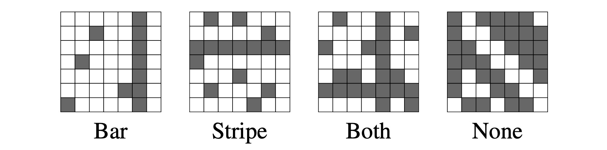

# The Bars and Stripes problem, and a RISP solution

This problem comes from the paper "An FPGA-Based Neuromorphic Processor with All-to-All
Connectivity" [Maheshwari23].  You are given an input of *r x c$ black or white pixels,
and you wnat to determine whether the input has at least one vertical bar or horizontal
stripe.  Here are four examples:

## Reference

[Maheshwari23] D. Maheshwari, A. Young, P. Date, S. Kulkarni, B.  Witherspoon and N. R. Miniskar, "An FPGA-Based Neuromorphic Processor with All-to-All Connectivity," IEEE International Conference on Rebooting Computing (ICRC), 10.1109/ICRC60800.2023.10386808, 2023, pp. 1-5.

