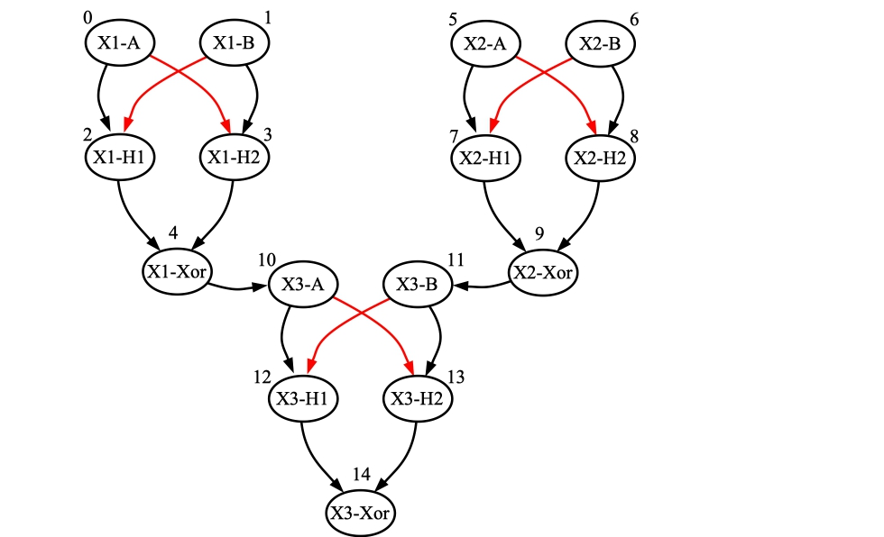
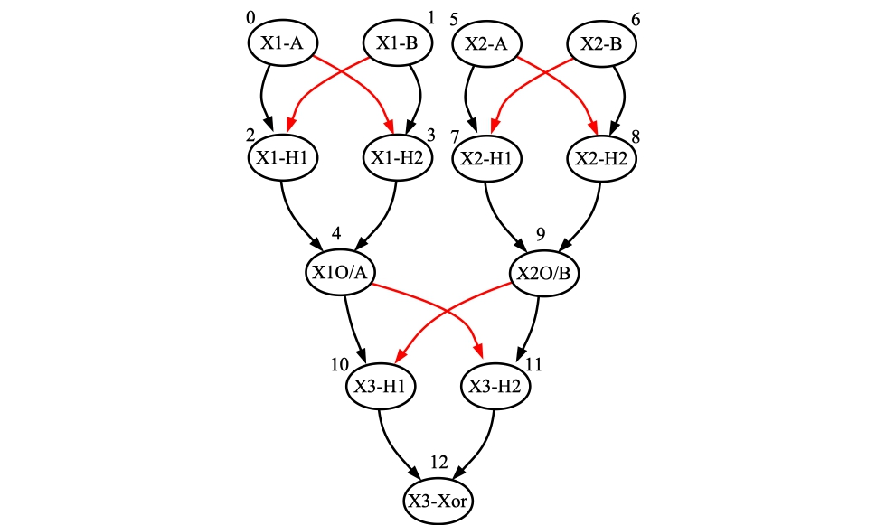

---------
# src/compose_networks.cpp

James S. Plank

This reads two or more networks, let's call them *n1*, *n2*, *n3*..., and composes them
into one network, which is prints on standard output.  This is very useful when you 
want to build bigger networks from smaller networks.

You can specify ways to connect the networks, specify inputs and outputs, 
plus add neurons or synapses.  I'll go through examples.

You specify the networks on the command line:

```
bin/compose_networks n1 n2 n3 ....
```

And you specify all of the modifiers on standard input.  I'll go through examples.

--------------

# Simple composition without any modifiers.

Recall the XOR network from [Plank2021] when networks leak their potentials at every
timestep


Let's create this network using the testing scripts:

```
UNIX> sh scripts/test_risp.sh 3 yes
Passed Test 03 - XOR network from [Plank2021], Figure 3.
UNIX> ( echo FJ tmp_network.txt ; echo INFO ) | bin/network_tool
Nodes:          5
Edges:          6
Inputs:         2
Outputs:        1

Input nodes:  0(A) 1(B) 
Hidden nodes: 2(H_A&~B) 3(H_B&~A) 
Output nodes: 4(A^B) 
UNIX> 
```

And let's rename neurons 2, 3 and 4 so that they match the picture above.  We'll store
the network into tmp_xor.txt:

```
UNIX> ( echo FJ tmp_network.txt
        echo SETNAME 2 H1
        echo SETNAME 3 H2
        echo SETNAME 4 Xor
        echo TJ tmp_xor.txt ) | bin/network_tool
UNIX> ( echo FJ tmp_xor.txt ; echo INFO ) | bin/network_tool
Nodes:          5
Edges:          6
Inputs:         2
Outputs:        1

Input nodes:  0(A) 1(B) 
Hidden nodes: 2(H1) 3(H2) 
Output nodes: 4(Xor) 
UNIX> 
```

To test this network, we send single spikes to neurons 0 and 1 when A/B have values of 1
respectively.  We run the network for three timesteps, and two timesteps after the input,
the output will reflect the xor.  So, let's do (0,0), (0,1), (1,1) and (1,0):

```
UNIX> ( echo ML tmp_xor.txt
        echo ASR 0 0011
        echo ASR 1 0110
        echo RUN 6
        echo GSR ) | bin/processor_tool_risp 
0(A)   INPUT  : 001100  #     Input starting at timestep 0:  0, 0, 1, 1 for A
1(B)   INPUT  : 011000  #     Input starting at timestep 0:  0, 1, 1, 0 for B
2(H1)  HIDDEN : 000010
3(H2)  HIDDEN : 001000
4(Xor) OUTPUT : 000101  # Output starts at timestep 2: Xor = 0, 1, 0, 1, 
UNIX> 
```

Now, let's use `compose_networks` to create two XOR networks instead of one:

```
UNIX> echo "" | bin/compose_networks tmp_xor.txt tmp_xor.txt > tmp_network.txt
UNIX> ( echo FJ tmp_network.txt ; echo INFO ; echo SORT Q ; echo NODES) | bin/network_tool
Nodes:         10
Edges:         12
Inputs:         4
Outputs:        2

Input nodes:  0(A) 1(B) 5(A) 6(B) 
Hidden nodes: 8(H2) 7(H1) 2(H1) 3(H2) 
Output nodes: 4(Xor) 9(Xor) 
[ {"id":0,"name":"A","values":[1.0]},
  {"id":1,"name":"B","values":[1.0]},
  {"id":2,"name":"H1","values":[1.0]},
  {"id":3,"name":"H2","values":[1.0]},
  {"id":4,"name":"Xor","values":[1.0]},
  {"id":5,"name":"A","values":[1.0]},
  {"id":6,"name":"B","values":[1.0]},
  {"id":7,"name":"H1","values":[1.0]},
  {"id":8,"name":"H2","values":[1.0]},
  {"id":9,"name":"Xor","values":[1.0]} ]
UNIX> 
```

As you can see, there are two XOR networks now -- one with nodes 0-4 and one with nodes 5-9.
The names have simply been copied, which can be confusing.  To help disambiguate, you
can use the `TAG` modified to prepend tags to each node.  Here, we'll use "X1-" for the 
first network and "X2-" for the second:

```
UNIX> echo TAG 0 X1- 1 X2- | bin/compose_networks tmp_xor.txt tmp_xor.txt > tmp_network.txt
UNIX> ( echo FJ tmp_network.txt ; echo SORT Q ; echo NODES) | bin/network_tool
[ {"id":0,"name":"X1-A","values":[1.0]},
  {"id":1,"name":"X1-B","values":[1.0]},
  {"id":2,"name":"X1-H1","values":[1.0]},
  {"id":3,"name":"X1-H2","values":[1.0]},
  {"id":4,"name":"X1-Xor","values":[1.0]},
  {"id":5,"name":"X2-A","values":[1.0]},
  {"id":6,"name":"X2-B","values":[1.0]},
  {"id":7,"name":"X2-H1","values":[1.0]},
  {"id":8,"name":"X2-H2","values":[1.0]},
  {"id":9,"name":"X2-Xor","values":[1.0]} ]
UNIX> 
```

Here's what the new network looks like:


Let's test it to make sure it works:

```
UNIX> ( echo ML tmp_network.txt
  echo ASR 0 0011
  echo ASR 1 0110
  echo ASR 5 0011
  echo ASR 6 1001
  echo RUN 6
  echo GSR ) | bin/processor_tool_risp 
0(X1-A)   INPUT  : 001100       # Input:  0011 to X1-A
1(X1-B)   INPUT  : 011000       # Input:  0110 to X1-B
2(X1-H1)  HIDDEN : 000010
3(X1-H2)  HIDDEN : 001000
4(X1-Xor) OUTPUT : 000101       # Output: 0101 from X1-Xor
5(X2-A)   INPUT  : 001100       # Input:  0011 to X2-A
6(X2-B)   INPUT  : 100100       # Input:  1001 to X2-B
7(X2-H1)  HIDDEN : 000100
8(X2-H2)  HIDDEN : 010000
9(X2-Xor) OUTPUT : 001010       # Output: 1010 from X2-Xor
UNIX> 
```

You'll note -- the inputs and outputs were copied from the two networks.  You can 
change that if you want -- we'll show it below.

------------------------------------------
# Adding an extra neuron and some synapses

You can specify to add extra neurons to one of the input networks, by putting
the following on standard input:

```
NEURON network-num neuron-id [ NAME name ] [ property-name property-value ]
```

It will create the neuron, add it to the input network, and then when you do the composition,
it will be added to the composed network.  For example, suppose we want to do an AND on the
results of those two XOR networks.  The first thing we'll do is add a neuron to the
first XOR network, name it "AND" and set its threshold to two:

```
UNIX> ( echo TAG 0 X1- 1 X2-
        echo NEURON 0 10 NAME AND Threshold 2 ) |
        bin/compose_networks tmp_xor.txt tmp_xor.txt > tmp_network.txt
```

You can see that the new neuron has been added to the composed network as "X1-AND".
It has an id number of 6 rather than 10.  That's because the composition tool renumbers the neurons:

```
UNIX> ( echo FJ tmp_network.txt ; echo INFO ) | bin/network_tool
Nodes:         11
Edges:         12
Inputs:         4
Outputs:        2

Input nodes:  0(X1-A) 1(X1-B) 6(X2-A) 7(X2-B) 
Hidden nodes: 8(X2-H1) 2(X1-H1) 3(X1-H2) 9(X2-H2) 5(X1-AND) 
Output nodes: 4(X1-Xor) 10(X2-Xor) 
UNIX> 
```

Let's set up synapses to this new neuron.  You can use the `SYNAPSE` command to 
add a synapse between two nodes, even when they started on different networks.  The
command is:

```
SYNAPSE from-network from-id to-network to-id [ Property_name Property_value ]
```

So, we want one synpase from X1-Xor and one from X2-Xor,
each with a delay of 1 and a weight of 1:

```
UNIX> ( echo TAG 0 X1- 1 X2-
        echo NEURON 0 10 NAME AND Threshold 2 
        echo SYNAPSE 0 4  0 10  Weight 1 Delay 1
        echo SYNAPSE 1 4  0 10  Weight 1 Delay 1 ) | 
      bin/compose_networks tmp_xor.txt tmp_xor.txt > tmp_network.txt
UNIX> ( echo FJ tmp_network.txt ; echo INFO ; echo EDGES ) | bin/network_tool
Nodes:         11
Edges:         14
Inputs:         4
Outputs:        2

Input nodes:  0(X1-A) 1(X1-B) 6(X2-A) 7(X2-B) 
Hidden nodes: 8(X2-H1) 2(X1-H1) 3(X1-H2) 9(X2-H2) 5(X1-AND) 
Output nodes: 4(X1-Xor) 10(X2-Xor) 
[ {"from":8,"to":10,"values":[1.0,1.0]},
  {"from":1,"to":3,"values":[1.0,1.0]},
  {"from":1,"to":2,"values":[-1.0,1.0]},
  {"from":7,"to":8,"values":[-1.0,1.0]},
  {"from":6,"to":8,"values":[1.0,1.0]},
  {"from":10,"to":5,"values":[1.0,1.0]},        # Here is a new edge
  {"from":4,"to":5,"values":[1.0,1.0]},         # Here is another new edge
  {"from":2,"to":4,"values":[1.0,1.0]},
  {"from":0,"to":2,"values":[1.0,1.0]},
  {"from":0,"to":3,"values":[-1.0,1.0]},
  {"from":6,"to":9,"values":[-1.0,1.0]},
  {"from":3,"to":4,"values":[1.0,1.0]},
  {"from":7,"to":9,"values":[1.0,1.0]},
  {"from":9,"to":10,"values":[1.0,1.0]} ]
UNIX> 
```

We're almost there.  There's a final issue that this new neuron is not an output
neuron.  By default, `compose_networks` uses all of the inputs and outputs from the
original networks.  Since that might not be what you want, you can specify individual
neurons as inputs or outputs, or all of a network's inputs/outputs as inputs/outputs.
Here, we'll specify to use all of the inputs, but only the new neuron as an output:

```
UNIX> ( echo TAG 0 X1- 1 X2-
        echo NEURON 0 10 NAME AND Threshold 2
        echo SYNAPSE 0 4  0 10  Weight 1 Delay 1
        echo SYNAPSE 1 4  0 10  Weight 1 Delay 1 
        echo INPUT 0 ALL 1 ALL
        echo OUTPUT 0 10 )  |
      bin/compose_networks tmp_xor.txt tmp_xor.txt > tmp_network.txt
Mac:framework-open: ( echo FJ tmp_network.txt ; echo INFO ) | bin/network_tool
Nodes:         11
Edges:         14
Inputs:         4
Outputs:        1

Input nodes:  0(X1-A) 1(X1-B) 6(X2-A) 7(X2-B) 
Hidden nodes: 8(X2-H1) 2(X1-H1) 3(X1-H2) 9(X2-H2) 4(X1-Xor) 10(X2-Xor) 
Output nodes: 5(X1-AND) 
UNIX> 
```

As you can see, only `X1-AND` is an output neuron now.  BTW, you didn't need to do that
specification for the inputs -- if you don't specify anything, it will use all of the inputs
from the input networks.   

Let's run it on the same input as before, but for another timestep, since the new neuron
will calculate its AND one timestep after the XOR's:

```
UNIX> ( echo ML tmp_network.txt
        echo ASR 0 0011
        echo ASR 1 0110
        echo ASR 6 0011
        echo ASR 7 1001
        echo RUN 7
        echo GSR ) | bin/processor_tool_risp
0(X1-A)    INPUT  : 001100      # X1-A's input is 0011
1(X1-B)    INPUT  : 011000      # X1-B's input is 0110
2(X1-H1)   HIDDEN : 000010
3(X1-H2)   HIDDEN : 001000
4(X1-Xor)  HIDDEN : 000101
5(X1-AND)  OUTPUT : 000000      # The two Xor neurons never fire at the same time, so this neuron never fires.
6(X2-A)    INPUT  : 001100      # X2-A's input is 0011
7(X2-B)    INPUT  : 100100      # X2-B's input is 1001
8(X2-H1)   HIDDEN : 000100
9(X2-H2)   HIDDEN : 010000
10(X2-Xor) HIDDEN : 001010
UNIX> 
```

----------------------
# Creating a 4-way parity network by adding synapses to three networks

Let's now compose three XOR networks so that we're calculating the 4-way parity of
the four inputs.  Here's the network that we'll create:



This is a simple matter of composing the three networks, adding two synapses that
connect the outputs of X1 and X2 to the inputs of X3, and fixing the inputs/outputs:

```
UNIX> ( echo TAG 0 X1- 1 X2- 2 X3-
    echo SYNAPSE 0 4  2 0  Weight 1 Delay 1
    echo SYNAPSE 1 4  2 1  Weight 1 Delay 1 
    echo INPUT 0 ALL 1 ALL
    echo OUTPUT 2 4 )  |
  bin/compose_networks tmp_xor.txt tmp_xor.txt tmp_xor.txt > tmp_network.txt
UNIX> ( echo FJ tmp_network.txt ; echo INFO ) | bin/network_tool
Nodes:         15
Edges:         20
Inputs:         4
Outputs:        1

Input nodes:  0(X1-A) 1(X1-B) 5(X2-A) 6(X2-B) 
Hidden nodes: 13(X3-H2) 12(X3-H1) 8(X2-H2) 7(X2-H1) 11(X3-B) 2(X1-H1) 3(X1-H2) 9(X2-Xor) 4(X1-Xor) 10(X3-A) 
Output nodes: 14(X3-Xor) 
UNIX> ( echo ML tmp_network.txt
        echo ASR 0 0011
        echo ASR 1 0110
        echo ASR 5 0011
        echo ASR 6 1001
        echo RUN 9
        echo GSR ) | bin/processor_tool_risp
0(X1-A)    INPUT  : 001100000
1(X1-B)    INPUT  : 011000000
2(X1-H1)   HIDDEN : 000010000
3(X1-H2)   HIDDEN : 001000000
4(X1-Xor)  HIDDEN : 000101000     # The outputs of X1 are 0101, starting at timestep 2.
5(X2-A)    INPUT  : 001100000
6(X2-B)    INPUT  : 100100000
7(X2-H1)   HIDDEN : 000100000
8(X2-H2)   HIDDEN : 010000000
9(X2-Xor)  HIDDEN : 001010000     # The outputs of X1 are 1010, starting at timestep 2.
10(X3-A)   HIDDEN : 000010100     # The input to X3-A is 0101, starting at timestep 3.
11(X3-B)   HIDDEN : 000101000     # The input to X3-B is 1010, starting at timestep 3.
12(X3-H1)  HIDDEN : 000001010
13(X3-H2)  HIDDEN : 000010100
14(X3-Xor) OUTPUT : 000001111     # The output, starting at timestep 5, is 1111.
UNIX>
```	

----------------------
# Conflating nodes 

The last feature of `compose_networks` is the ability to "conflate" nodes -- in other words
to make two nodes equivalent.  For example, you may have noticed that instead of adding
synapses to the third XOR network above, if we make the output of X1 be the same node as input
A of X3, and the output of X2 be the same node as input B of X3, then we can perform the 
same calculation with one fewer timestep.  Here's the network we're going for:



To do this, you can use the `CONFLATE` command to specify that two (or more) nodes are
equivalent.   Here's how you create the network above.

```
UNIX> ( echo TAG 0 X1- 1 X2- 2 X3-
        echo CONFLATE 0 4 2 0
        echo CONFLATE 1 4 2 1
        echo INPUT 0 ALL 1 ALL
        echo OUTPUT 2 4 )  |
      bin/compose_networks tmp_xor.txt tmp_xor.txt tmp_xor.txt > tmp_network.txt
UNIX> ( echo FJ tmp_network.txt ; echo INFO ) | bin/network_tool
Nodes:         13
Edges:         18
Inputs:         4
Outputs:        1

Input nodes:  0(X1-A) 1(X1-B) 5(X2-A) 6(X2-B) 
Hidden nodes: 8(X2-H2) 7(X2-H1) 11(X3-H2) 2(X1-H1) 3(X1-H2) 9(X2-Xor/X3-B) 4(X1-Xor/X3-A) 10(X3-H1) 
Output nodes: 12(X3-Xor) 
UNIX> 
```

You'll note that the output of X1 and input A of X3 are the same node, named "X1-Xor/X3-A".
Similarly, the output of X2 and input B of X3 are also the same node, names "X2-Xor/X3-B".
Let's run the network using the same inputs as above -- we'll see the same output, but you
can run the network for one fewer timestep:

```
UNIX> ( echo ML tmp_network.txt
        echo ASR 0 0011
        echo ASR 1 0110
        echo ASR 5 0011
        echo ASR 6 1001
        echo RUN 8 
        echo GSR ) | bin/processor_tool_risp
0(X1-A)        INPUT  : 00110000      # Input A of X1: 0011
1(X1-B)        INPUT  : 01100000      # Input B of X1: 0110
2(X1-H1)       HIDDEN : 00001000
3(X1-H2)       HIDDEN : 00100000
4(X1-Xor/X3-A) HIDDEN : 00010100      # The output of X1 and input A of X3: 0101
5(X2-A)        INPUT  : 00110000      # Input A of X2: 0011
6(X2-B)        INPUT  : 10010000      # Input A of X2: 1001
7(X2-H1)       HIDDEN : 00010000
8(X2-H2)       HIDDEN : 01000000
9(X2-Xor/X3-B) HIDDEN : 00101000      # The output of X2 and input B of X3: 1010
10(X3-H1)      HIDDEN : 00001010
11(X3-H2)      HIDDEN : 00010100
12(X3-Xor)     OUTPUT : 00001111      # The output of X3: 1111
UNIX> 
```

