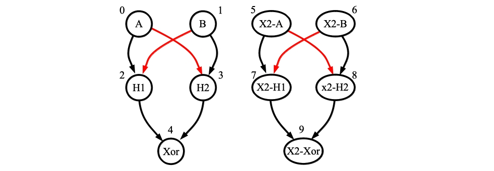
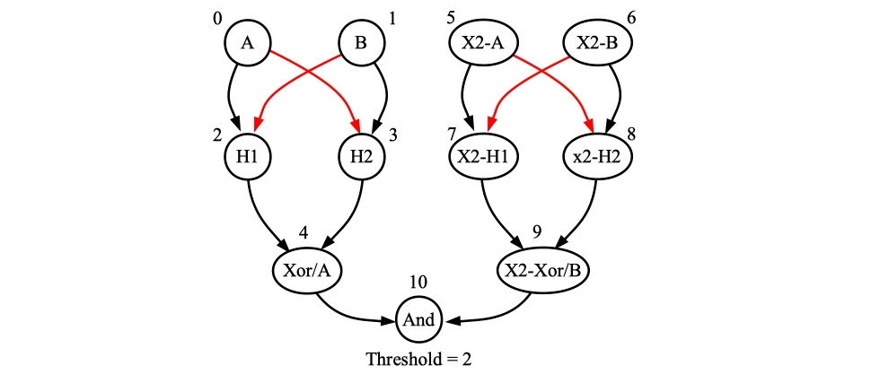
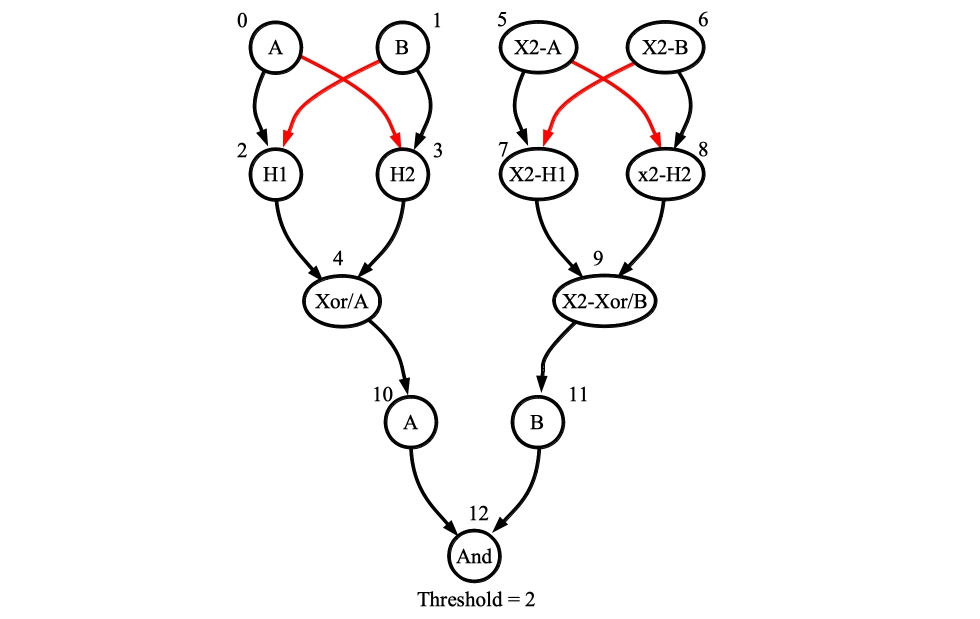

---------
# src/compose_networks.cpp

James S. Plank

This reads two networks, let's call them *n1* and *n2*, and composes them, printing the
composed network on standard output.  You call it with three arguments on the command
line, and `CONFLATE` or `SYNAPSE` lines on standard input.

The arguments are:

```
bin/compose_networks n1 n2 tag
```

The `tag` string is prepended to the name of the neurons on `n2`.  This can be helpful
when you want to differentiate neurons in the final network.

The lines on standard input must be in one of two forms:

```
CONFLATE n1 n2
```

This says that in the final network, there will be just one neuron that is both *n1*
in the first network and *n2* in the second network.  It takes its `values` from the
second network.

```
SYNAPSE from to v0 v1 ...
```

This says to put a synapse from *from* in the first network to *to* in the second network,
and then to set its values to those specified by *v0*, *v1*, etc.   The order of the
values should be the same as defined by the property pack.

------------------------------------------------------------
## Examples 

We're going to compose some XOR, AND and OR networks.  We'll have three examples.

### Example 1 -- Two independent XOR networks.

Let's recall what an XOR network looks like, from [Plank2021]:


Neurons leak their potentials back to zero at the end of every timestep, and the red
synapses have -1 weight.  If you apply inputs at timestep *x*, then the output neuron
outputs the XOR at timestep *x+2*, and you can start a new calculation every timestep.

Let's create one of these networks using the network and processor tools.  We'll use
the RISP-7 setting of RISP, but add leak to it:

```
UNIX> sed s/none/all/ < params/risp_7.txt > tmp_risp_leak.txt
```

Now we'll create an empty network with those settings, and then use the network tool
to create the network:

```
UNIX> ( echo M risp tmp_risp_leak.txt ; echo EMPTYNET tmp_empty.txt ) | bin/processor_tool_risp 
UNIX> bin/network_tool -
- FJ tmp_empty.txt
- AN 0 1 2 3 4                   # Create the neurons and set their names.
- SETNAME 0 A
- SETNAME 1 B
- SETNAME 2 H1
- SETNAME 3 H2
- SETNAME 4 Xor
- AI 0 1                         # Set inputs and outputs
- AO 4
- SNP_ALL Threshold 1            # Set all thresholds to one.

- AE 0 2  0 3   1 2   1 3   2 4   3 4          # Create the synapes and set the delays/weights.
- SEP_ALL Delay 1
- SEP_ALL Weight 1
- SEP 0 3 Weight -1
- SEP 1 2 Weight -1
- SORT
0 1 2 3 4
- TJ tmp_xor.txt                 # Save it and take a quick look to make sure it looks ok.
- INFO
Nodes:          5
Edges:          6
Inputs:         2
Outputs:        1

Input nodes:  0(A) 1(B) 
Hidden nodes: 2(H1) 3(H2) 
Output nodes: 4(Xor) 
- TJ tmp_xor.txt
- Q
UNIX> 
```

Let's confirm to ourselves that it works.  The output comes two timesteps after the inputs,
so if we give it A=11001100 and B=01010101, then the output should be 10011001:

```
UNIX> bin/processor_tool_risp -
- ML tmp_xor.txt
- ASR 0 11001100
- ASR 1 01010101
- RUN 10
- GSR
0(A)   INPUT  : 1100110000
1(B)   INPUT  : 0101010100
2(H1)  HIDDEN : 0100010000
3(H2)  HIDDEN : 0000100010
4(Xor) OUTPUT : 0010011001     # The output - 10011001 starts at timestep 2.
- Q
UNIX> 
```

Now, let's use `compose_networks` to simply make two of these that execute in parallel:

```
UNIX> echo "" | bin/compose_networks tmp_xor.txt tmp_xor.txt X2- > tmp_two_xors.txt
UNIX> ( echo FJ tmp_two_xors.txt ; echo INFO ) | bin/network_tool
Nodes:         10
Edges:         12
Inputs:         4
Outputs:        2

Input nodes:  0(A) 1(B) 5(X2-A) 6(X2-B) 
Hidden nodes: 8(X2-H2) 7(X2-H1) 2(H1) 3(H2) 
Output nodes: 4(Xor) 9(X2-Xor) 
UNIX>
```

The network will look like the following:



You'll note that the "Tag" has renamed the neurons in the second network, so that they
start with "X2".    Let's run it.  We'll put "11001100" into A and X2-B, and we'll
put "01010101" into B and X2-A.  The output on both Xor and X2-Xor will be the same:
"10011001" starting on timestep 2:

```
UNIX> bin/processor_tool_risp -
- ML tmp_two_xors.txt
- ASR 0 11001100
- ASR 1 01010101
- ASR 5 01010101
- ASR 6 11001100
- RUN 10
- GSR
0(A)      INPUT  : 1100110000
1(B)      INPUT  : 0101010100
2(H1)     HIDDEN : 0100010000
3(H2)     HIDDEN : 0000100010
4(Xor)    OUTPUT : 0010011001        # The output is correct: 10011001 starting on timestep 2.
5(X2-A)   INPUT  : 0101010100
6(X2-B)   INPUT  : 1100110000
7(X2-H1)  HIDDEN : 0000100010
8(X2-H2)  HIDDEN : 0100010000
9(X2-Xor) OUTPUT : 0010011001        # Ditto
- Q
UNIX> 
```


------------------------------------------------------------
### Example 2 -- Two XORs going into an AND:

We're going to compose the two XOR networks in the previous example and an AND network
from [Plank2021] so that the outputs of the XOR's are inputs to the AND.  First, here's
an AND network (again, neurons leak their charge to zero at every timestep for this
network to work):


Let's create this by hand with the network tool:

```
UNIX> bin/network_tool 
- FJ tmp_empty.txt
- AN 0 1 2
- AI 0 1
- AO 2
- SETNAME 0 A
- SETNAME 1 B
- SETNAME 2 And
- SNP_ALL Threshold 1
- SNP 2 Threshold 2
- AE 0 2   1 2
- SEP_ALL Delay 1
- SEP_All Weight 1
- SORT
0 1 2
- INFO
Nodes:          3
Edges:          2
Inputs:         2
Outputs:        1

Input nodes:  0(A) 1(B) 
Hidden nodes: 
Output nodes: 2(And) 
- TJ tmp_and.txt
- Q
UNIX> 
```

Confirm that it works:

```
UNIX> bin/processor_tool_risp -
- ML tmp_and.txt
- ASR 0 00110011
- ASR 1 01010101
- RUN 9
- GSR
0(A)   INPUT  : 001100110
1(B)   INPUT  : 010101010
2(And) OUTPUT : 000010001       # Output is 00010001, starting at timestep 1.
- Q
UNIX> 
```

When we compose the two-xor network and the and network, this is what the network will
look like:



Here's the command -- we're going to "conflate" the first output (neuron 4) of the two-xor
network with the first input (neuron 0) of the AND network.  And also the
second output (neuron 9) of the two-xor
network with the second input (neuron 1) of the AND network.

```
UNIX> ( echo "CONFLATE 4 0" ; echo "CONFLATE 9 1" ) | bin/compose_networks tmp_two_xors.txt tmp_and.txt "" > tmp_xor_xor_and.txt
UNIX> ( echo FJ tmp_xor_xor_and.txt ; echo INFO ) | bin/network_tool
Nodes:         11
Edges:         14
Inputs:         6
Outputs:        3

Input nodes:  0(A) 1(B) 5(X2-A) 6(X2-B) 4(Xor/A) 9(X2-Xor/B) 
Hidden nodes: 8(X2-H2) 7(X2-H1) 2(H1) 3(H2) 
Output nodes: 4(Xor/A) 9(X2-Xor/B) 10(And) 
UNIX> 
```

To test this, let's put the following inputs:

- To A: 11001100
- To B: 01010101
- To X2-A: 11110101
- To X2-B: 11111010

You'll note, that the XOR of A and B is 10011001, and the XOR of X2-A and X2-B is 00001111
Therefore, the final result will be 00001001.  So let's try it:

```
UNIX> bin/processor_tool_risp -
- ML tmp_xor_xor_and.txt
- ASR 0 11001100
- ASR 1 01010101
- ASR 5 11110101
- ASR 6 11111010
- RUN 11
- GSR
0(A)        INPUT  : 11001100000
1(B)        INPUT  : 01010101000
2(H1)       HIDDEN : 01000100000
3(H2)       HIDDEN : 00001000100
4(Xor/A)    INPUT  : 00100110010
5(X2-A)     INPUT  : 11110101000
6(X2-B)     INPUT  : 11111010000
7(X2-H1)    HIDDEN : 00000010100
8(X2-H2)    HIDDEN : 00000101000
9(X2-Xor/B) INPUT  : 00000011110
10(And)     OUTPUT : 00000001001    # There it is: 00001001, starting at timestep 3.
- Q
UNIX> 
```


------------------------------------------------------------
### Example 3 -- Having the outputs of the two XORs go as inputs to an AND network and to an OR network

In our last example, we're going to use an OR network, which is the simplest of the three:


We'll make this in `tmp_or.txt`:

```
UNIX> bin/network_tool -
- FJ tmp_empty.txt
- AN 0 1 2
- SETNAME 0 A
- SETNAME 1 B
- SETNAME 2 Or
- AI 0 1
- AO 2
- SNP_ALL Threshold 1
- AE 0 2    1 2
- SEP_ALL Weight 1
- SEP_ALL Delay 1
- SORT
0 1 2
- TJ tmp_or.txt
- Q
UNIX> 
```

Test it:

```
UNIX> bin/processor_tool_risp -
- ML tmp_or.txt
- ASR 0 00110011
- ASR 1 01010101
- RUN 9
- GSR
0(A)  INPUT  : 001100110
1(B)  INPUT  : 010101010
2(Or) OUTPUT : 001110111
- Q
UNIX> 
```

Ok -- let's compose the two XOR network, plus the AND and the OR, so that the two outputs of
the XOR networks go to both the AND and the OR networks in parallel.  And instead of conflating,
we'll have synapses go from the outputs of the XORs to the inputs of the AND/OR networks.

Let's start by making the following:



We do this by adding synapses rather than conflating:

```
UNIX> ( echo SYNAPSE 4 0 1 1 ; echo SYNAPSE 9 1 1 1 ) | bin/compose_networks tmp_two_xors.txt tmp_and.txt > tmp_two_xor_one_and.txt ""
```

You'll note there are four arguments to the `SYNAPSE` command.  These are:

- The "From" neuron, relative to `tmp_two_xors.txt`
- The "To" neuron, relative to `tmp_and.txt`
- The values stored in the synapse, in the order specified in the property pack.  Here, it's weight first, and then delay.  They are all one, so the order didn't matter.

Test it -- since we have an extra synapse, we need to run for 12 timesteps, and the output
starts at timestep 4:

```
UNIX> bin/processor_tool_risp -
-  ML tmp_two_xor_one_and.txt
- ASR 0 11001100
- ASR 1 01010101
- ASR 5 11110101
- ASR 6 11111010
- RUN 12
- GSR
0(A)      INPUT  : 110011000000
1(B)      INPUT  : 010101010000
2(H1)     HIDDEN : 010001000000
3(H2)     HIDDEN : 000010001000
4(Xor)    OUTPUT : 001001100100
5(X2-A)   INPUT  : 111101010000
6(X2-B)   INPUT  : 111110100000
7(X2-H1)  HIDDEN : 000000101000
8(X2-H2)  HIDDEN : 000001010000
9(X2-Xor) OUTPUT : 000000111100
10(A)     INPUT  : 000100110010
11(B)     INPUT  : 000000011110
12(And)   OUTPUT : 000000001001
- Q
UNIX> 
```

Finally, let's add an OR network to the mix:

```
UNIX> ( echo SYNAPSE 4 0 1 1 ; echo SYNAPSE 9 1 1 1 ) | bin/compose_networks tmp_two_xor_one_and.txt tmp_or.txt > tmp_two_xor_and_or.txt ""
```

And let's test -- the output on neuron 15 should be "10011001" Or "00001111", which is"10011111".
You can see that below, starting at timestep 4:

```
UNIX> bin/processor_tool_risp -
- ML tmp_two_xor_and_or.txt
- ASR 0 11001100
- ASR 1 01010101
- ASR 5 11110101
- ASR 6 11111010
- RUN 12
- GSR
0(A)      INPUT  : 110011000000
1(B)      INPUT  : 010101010000
2(H1)     HIDDEN : 010001000000
3(H2)     HIDDEN : 000010001000
4(Xor)    OUTPUT : 001001100100
5(X2-A)   INPUT  : 111101010000
6(X2-B)   INPUT  : 111110100000
7(X2-H1)  HIDDEN : 000000101000
8(X2-H2)  HIDDEN : 000001010000
9(X2-Xor) OUTPUT : 000000111100
10(A)     INPUT  : 000100110010
11(B)     INPUT  : 000000011110
12(And)   OUTPUT : 000000001001
13(A)     INPUT  : 000100110010
14(B)     INPUT  : 000000011110
15(Or)    OUTPUT : 000010011111
- Q
UNIX> 
```

------------------------------------------------------------
## Bibliography

[Plank2021]: "Spiking Neuromorphic Networks for Binary Tasks", by James S. Plank, ChaoHui Zheng, Catherine D. Schuman and Christopher Dean, ICONS: International Conference on Neuromorphic Systems, 2021.
[https://neuromorphic.eecs.utk.edu/publications/2021-07-29-spiking-neuromorphic-networks-for-binary-tasks/](https://neuromorphic.eecs.utk.edu/publications/2021-07-29-spiking-neuromorphic-networks-for-binary-tasks/)


