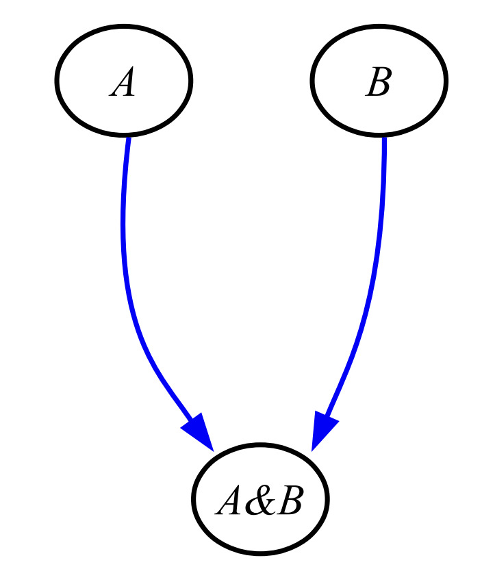

# TENNLab Network JSON Format

James S. Plank

TENNLab Networks are stored as JSON objects.  The format is straightforward, and a little spindly.
This document specifies the JSON keys and their vals.

There is flexibility in that nodes, edges and networks may each store an array of doubles,
called `"values"` (well, the network one is called `"Network_Values"`).  The identities of
these arrays is held in the `"Properties"`.   When EONS does optimization, it optimizes network
structure and all of the `"values"`.
Please see the [markdown on properties](framework_properties.md) for more detailed explanation.

----------------------------------------
# Required Keys

The following are required keys in the network JSON

----------------------------------------
## "Nodes"

The val here is an array of JSON objects, one for each neuron.  The specification of the
"Node" JSON is below.

### Required keys for nodes

- `"id"`: This is a 32-bit unsigned number.  Each node must have a different id.  They do not
  need to be consecutive.
- `"values": This is the vector of doubles that is defined by the node's Properties.

### Optional keys for nodes

- `"name"`: This is a string, so that you can give names to neurons.
- `"coords"`: This is a vector of doubles so that you can store viz coordinates of the nodes.
   There is no error checking on the size of this, so in theory, you can give two
   or three dimensional coordinates to nodes.  

----------------------------------------
## "Edges"

The val here is an array of JSON objects, one for each synapse.  The specification of the
"Edge" JSON is below.

### Required keys for edges

- `"from"`: This is a 32-bit unsigned number, which is the id of the synapse's pre-neuron.
- `"to"`: This is a 32-bit unsigned number, which is the id of the synapse's post-neuron.
- `"values": This is the vector of doubles that is defined by the edge's Properties.

### Optional keys for edges

- `"control_point"`: This is a vector of doubles so that you can store control points that
  define Bezier curves for edges.
   There is no error checking on the size of this, so in theory, you can give multiple
   control points (If I'm not mistaken, the viz uses a single control point, even though
   classic Bezier curves use two control points).

----------------------------------------
## "Inputs"

This is an array of 32-bit unsigned numbers.  It specifies the id's of the input neurons.
This can be empty if you want.  

----------------------------------------
## "Outputs"

This is an array of 32-bit unsigned numbers.  It specifies the id's of the output neurons.
It is fine for a neuron to be both an input or an output.
This can be empty if you want.  

----------------------------------------
## "Network_Values"

This is an array of doubles, which stores values that correspond to the network's properties.

----------------------------------------
## "Properties"

This is the "PropertyPack" that defines the `values` arrays in nodes, edges and networks.
This has its own [markdown page](framework_properties.md).

----------------------------------------
## "Associated_Data"

This is a catch-all JSON object for storing application-specific information in the network.
I'll give more detail below.

----------------------------------------
# An empty network

Here is the JSON for an empty network:

```
{ "Properties":
  { "node_properties": [],
    "edge_properties": [],
    "network_properties": [] },
 "Nodes": [],
 "Edges": [],
 "Inputs": [],
 "Outputs": [],
 "Network_Values": [],
 "Associated_Data": {}
}
```

----------------------------------------
# More information on Associated_Data

The Associated_Data JSON is there so that applications may store application-specific information
inside the network.  Here are some popular keys and vals that are stored here:

- `"proc_params"`: These are the parameters for the neuroprocessor.  It is very common for an
  application (for example, the `processor_tool`) to read a network, use the `proc_params` to
  create an instance of the neuroprocessor for the network, and then load the network onto the
  neuroprocessor.  This is super-convenient, as you don't need to carry any additional metadata
  about the neuroprocessor.

- `"app_params"`: This contains the JSON for the application.  It is similar to the `"proc_params"`
  as it allows the network to store the parameters of the application for which it has been
  trained.

- `"other"`: This is some additional catch-all information that various applications use.
   Its val is JSON with the following keys:

     - `"proc_name"`: The name of the neuroprocessor (string)
     - `"app_name"`: The name of the application (string)
     - `"sim_time"`: What you should use as the parameter of `run()` calls (integer)
     - `"timeseries"`: This is `"none"`, `"sparse"`, or `"dense"` in case your input encoder
                       does timeseries encoding.

- `"eons_params"`: If EONS was used to train the network, this stores the parameter 
   setting for EONS.

- `"encoder_array"`: The JSON of the encoder array that turns application inputs into spikes.
    This is documented with spike encoders.

- `"decoder_array"`: The JSON of the decoder array that turns spikes into values for the
   application.  This is documented with spike decoders.


----------------------------------------
# Examples

Here are a few simple examples.  First, here's a binary AND network, from the
paper (https://neuromorphic.eecs.utk.edu/publications/2021-07-29-spiking-neuromorphic-networks-for-binary-tasks).  Here's a picture of the network:


