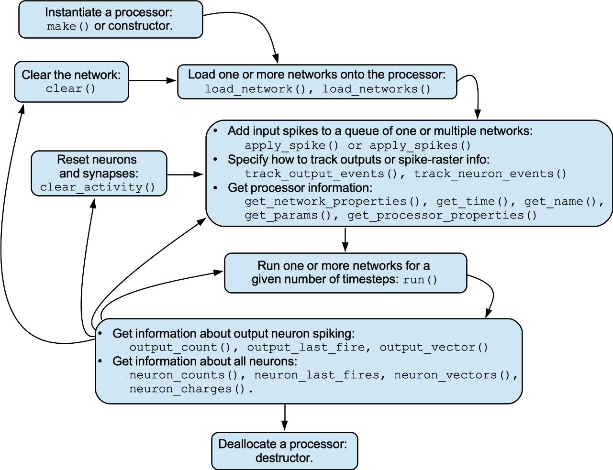

# TENNLab Framework: The Processor Interface

James S. Plank

The intent of the TENNLab Software Framework is to work with a variety of
neuromorphic processors, mainly through simulation, but also with software
modules that drive hardware.  These may be written in C++ or Python.  

As such, in [`../include/framework.hpp`](../include/framework.hpp), 
there is a definition of a `Processor`
class, which contains only virtual methods.  To implement a new processor,
you must define a subclass of the `Processor` class that implements all
of the methods.  Then the processor may be used with all of the TENNLab 
software.

This description is for implementing the processor in C++.  Hopefully,
at some point, someone will document the specifics for Python-based
implementations.

----
## The Big Picture

Below is a flow chart of how one uses a processor.  (Thanks for ChaoHui Zheng for
writing the first version of this).  Included are all of the methods in the `Processor`
interface.  If you want to test these out on processor simulators that have already
been written, please check out the [cpp_apps_processor_tool.md](`processor_tool` application).



You can view the PDF of the flowchart [here](images/processor_flowchart.pdf).

----
## Parameterization and customization of processors, and the Property_Pack.

When you create an instance of a processor, you will very likely want to set
some parameters.  For example, when you create an instance of the GNP processor,
you may want to set up how neurons leak.  You do that by passing a JSON string
to the processor's constructor or to the processor's `make()` method (C++ only).

In most of our applications, when they store a network, they store the JSON used
to create the processor that runs the network.  This is stored in "Associated_Data"
of the network, under the key `proc_params`.  Then when you want to use that 
network/processor combination in the application, you do the following:

- Create an instance of the network from the network file.
- Create an instance of the processor using the JSON stored in the network file.
- Load the network onto the processor.
- Go into the apply-spikes / run / read-output loop.

Please see [`framework_network_json_format.md`](framework_network_json_format.md) 
for more information on this.

When a processor instance is created, it internally stores a `Property_Pack`.
This defines the settable parameters used by neurons (nodes), synapses (edges) and networks.
In a network, each node, each edge, and the entire network contains a vector
of doubles called `values`, which is the setting of the parameters defined in the
`Property_Pack`.  These settings are stored in the network file.

So there's a real chicken-and-egg issue with networks and processors:

- Often you create an instance of a processor by reading its parameters from a network.
- You can't build a network until you have the processor define its `Property_Pack`.

To help disambuiguate this process, here's how it works:

- The training algorithm sets the initial parameters of the processor and creates an
  instance of the processor.
- It then creates networks, using the `Property_Pack` from the processor.  That
  `Property_Pack` is stored in the network, along with the parameters that were used
  to create the processor.
- When the network is used, a new processor will be created using the parameters from
  the network.

To read more about `Property_Packs`, please see
Please see [`framework_properties_format.md`](framework_properties_format.md).

  

----
## Description of the methods

In the description below, I am deliberately not putting method prototypes here.  The
reason is that if we change methods, I don't want this text to get mismatched.  Therefore,
if you want to see the methods, either read 
[`../include/framework.hpp`](../include/framework.hpp), or generate the Doxygen and
read 
[`../docs/html/classneuro_1_1_processor.html`](../docs/html/classneuro_1_1_processor.html)

----
### Creating a new instance of a processor -- constructor and make()

A processor will have its own constructor.  Typically, this has the following prototype:

```
namespace::Processor(nlohmann::json &_settings)
```

When you're using python, you'll call the constructor.  In most of our C++ apps, you'll
call the processor's `make()` method, which you'll implement in a subdirectory of `../cpp-apps/processors`.  Please see [placeholder](placeholder) for more information.

----
### Loading a network and clearing the current network.

- `load_network()`: This loads a network onto the processor.  One argument is a pointer
  to a network, and there is an optional argument which is a network id (which defaults
  to zero).  Processors are allowed to support multiple networks, so the network id allows
  you to identify the different networks.  You should assume that the caller maintains
  ownership of the network (so the processor shouldn't delete it).

- `load_networks()` allows you to load multiple networks at the same time.  The networks
  are specified by a vector of pointers to networks.  The network at index *i* will be
  loaded to network id *i*.

- clear() takes an optional network id (default 0).  It clears that network from the
  processor.  It should not delete the network pointer.

----
### Queuing input spikes

- `apply_spike()` queues the given spike onto the the given network or networks.
  If no network is specified, the spike goes to network 0.  If multiple networks are
  specified, then the spike is replicated on all of the networks specified. 

  The `Spike` data structure
  contains a neuron id, time and value.  The id is the input number of the neuron (not
  the neuron's id, but the input number).  The time is relative to the current time.

  The spike's value should be between 0 and 1. It is up to the processor implementation
  to convert this value to the proper value for the neuroprocessor.  For example, Caspian
  converts this value to a number between 0 and 127.

- `apply_spikes()` allows you to specify a vector of spikes rather than a single spike.

----
### Output and Neuron Events and Event Tracking

A processor is required to keep track of two quantities for each output neuron:

1. The number of times that it has fired since the last `run()` statement.
2. The time of last time that it fired since the last `run()` statement.

Accordingly, processors need to implement the following methods:

- `output_last_fire()` returns the timestep of the last fire from a given output neuron.
  If the neuron hasn't fired since the last `run()` call, then it should return -1.
- `output_last_fires()` returns a vector of the last fire times from all output neurons.
  The size of the vector is the number of output neurons, and if a neuron hasn't fired
  since the last `run()` call, then its entry in the vector should be -1.
- `output_count()` returns the number of spikes in the given output neuron since the last
  `run()` call.
- `output_counts()` returns a vector of the the number of spikes in all of the output
  neurons since the last `run()` call.

There are other quantities that we encourage processor implementors to maintain, especially
in simulation.  These are:

- The total number of fire events for all neurons
- The total number of accumulate events for all neurons
- The number of times that a neuron (any neuron, not just an output neuron) has fired
  since the last `run()` statement.
- The time of the last time that a neuron has fired since the last `run()` statement.
- The current charge value in each neuron.
- The current weight value of each synapse.
- The exact firing times of the output neurons since the last `run()` statement.
- The exact firing times of a neuron has fired since the last `run()` statement.

Let's deal with the first two of these.

- `total_neuron_counts()` returns the total number of fire events for all neurons since
  the last time `total_neuron_counts()` was called.  If a processor doesn't implement this
  feature, then it should return -1.
- `total_neuron_accumulates()` returns the total number of accumulate events for all neurons since
  the last time `total_neuron_accumulates()` was called.  If a processor doesn't implement this
  feature, then it should return -1.

Let's deal with the next four.

- `neuron_counts()` returns a vector of the number of times each neuron has fired since
  the last `run()` call.  The vector's size should be the number of neurons in the
  network.  The element in index *i* of this vector shoud be the *i-th* neuron when the
  neuron id's are sorted.  The `make_sorted_node_vector()` method, and
  `sorted_node_vector` field of the `Network` allow you to access neurons by this value.
- `neuron_last_fires()` returns a vector of timesteps of each neuron's last fire since
  the last `run()` call.  The indices of this vector are the same as `neuron_counts()`.
- `neuron_charges()` returns a vector of the current charge values for each of the neurons.
  The indices of this vector are the same as `neuron_counts()`.
- `synapse_weights()` returns three vectors, `pres`, `posts` and `vals`.  Each entry represents
  a synapse weight -- `pres[i]` is the id of the pre-neuron, `posts[i]` is the id of the 
  post-neuron, and `vas[i]` is the weight of the synapse.

If a processor doesn't keep track of these values, then it should return empty vectors.
Applications should be ready to handle these semantics.  Fortunately, applications
are more likely to use the Helper functions below, which handle those semantics
gracefully.

Keeping track of all output events and all neuron events can consume quite a bit of
memory, so we add the ability to "track" a neuron or an output.  By default, when a
processor is created, tracking should be off for all neurons.  Tracking may then be turned
on and off with the following methods:

- `track_output_events()`: Turn tracking on or off for an individual output neuron.  The
  neuron is specified by its output id.  This returns a boolean which is `false` if
  event recording is not implemented and `true` otherwise.
- `track_neuron_events()`: Turn tracking on or off for an individual neuron.  The neuron
  is specified by its id.  This returns This returns a boolean which is `false` if
  event recording is not implemented and `true` otherwise.

If tracking is implemented, then the following methods allow one to get event information:

- `output_vector()` returns a vector of the firing times of the given output neuron since
    the last `run()` call.  If tracking is turned off, or not implemented, then this should
    return an empty vector.
- `output_vectors()` returns vectors of the firing times of all output neurons since
    the last `run()` call.  If an output neuron has tracking turned off, then its entry
    of this vector should be empty.  If output event
    tracking is not implemented by the processor, or if all output neurons have tracking turned
    off, then a vector of empty vectors should be returned.  Its size should be the number of
    output neurons.
- `neuron_vector()` returns a vector of vectors of timesteps of each neuron's firing times.
    The indices of this vector are like `neuron_counts()` and `neuron_last_fires()` above.
    Any neuron whose tracking is unset should simply have an empty vector in its entry of
    the return value.  If neuron event tracking is not implemented, then this should return
    an empty vector.

There are "Helper" procedures, described in their own section below, that aid applications
in using the methods in this section.  Please read that section if you are making these method
calls and/or need some better functionality.

----
### Getting processor information

- `get_time()` returns the current timestep of the processor running the given network.
   When you `clear()` a network or `clear_activity()` for a network, 
   time is reset to zero.  Each `run()` call increments the time by the amount specified
   by the `run()` call's parameter.

- `get_name()` - this returns the name of the processor.

- `get_params()` - this returns JSON of parameters that one can use to make a processor
   that is equivalent to the current one.

- `get_network_properties()` - this returns the property pack defined by the processor (see
  the discussion of property packs above).

- `get_processor_properties()` - this returns JSON that describes properties of the processor.
  It is so that applications can reason about what the processor does.  For example, some processors
  have neurons fire when their threshold is achieved, and others fire when their threshold is
  exceeded.  This information is returned in this JSON.   Here are the JSON keys, values
  and explanation:

| Key        | Values        | Explanation  |
|------------|---------------|--------------|
| "threshold_inclusive" | boolean | true means that the neuron spikes when a threshold is met or exceeded.  false means only when it is exceeded. |
| "input_scaling_value" | double (default 1.0) | what is the scaling factor to convert inputs in the range of 0-1 into spike weights that go into input neurons. |
| "binary_input" | boolean | true means that inputs are only 0 and 1.
| "spike_raster_info" | boolean | true means that `neuron_vector()` works, and therefore you can get spike raster information (see `neuron_vectors_to_json`)
| "plasticity" | "none"/"permanent"/"resettable" | what kind of plasticity is implemented
| "run_time_inclusive" | boolean | if true, then `run(run_time)` does `run_time+1` timesteps
| "integration_delay" | boolean | if true, then neurons fire on the next cycle.

----
### Running and resetting

- `run()` tells the processor to run the given network for a given time.
- `clear()` clears the given network from the processor.
- `clear_activity()` retains the network, but resets neuron thresholds to their base values,
   and clears any spikes from synapses.

---
## Framework Helper Procedures

These are procedures that are not part of any classes and they are implemented by
the framework.  Their goal is to reduce the implementation
burden on processor implementors, but to still give convenience to application implementors.

### Applying a spike-raster stream rather than individual spikes.

- `apply_spike_raster()` takes a processor, a neuron id, and a vector of 0's and 1's
   (as a vector of chars), and then makes the appropriate `apply_spikes()` calls.

### Pulling the network that is on the processor

- `pull_network()` takes a processor and a network, and returns a new network
  copied from the network, but with synapse weights pulled from the processor.
  This lets you create networks from processors that have used STDP to change
  synapse weights.

### Tracking events for all outputs or neurons

By default, processors don't keep track of individual firing events for neurons.
These procedures let you turn on this tracking either for all output neurons or for
all neurons.

- `track_all_output_events()` - This calls `track_output_events()` for every output.
- `track_all_neuron_events()` - This calls `track_neuron_events()` for every neuron.

### Turning neuron_counts(), neuron_last_fires() or neuron_vectors() into JSON; Getting Spike Raster Information

- `neuron_counts_to_json()` This returns JSON with two keys: "Neuron Alias" has a vector
  of node id's, and "Event Counts" has a vector of the corresponding counts.  The node
  id's are sorted in the vector.

- `neuron_last_fires_to_json()` - This is just like
  `neuron_counts_to_json()` except that it uses the last fire information.  The JSON
   key is "Last Fires" instead of "Event Counts".

- `neuron_vectors_to_json()` - This is just like `neuron_counts_to_json()` except that it
  uses the vector of spiking events.  This takes a type argument as well, which specifies
  the format of the JSON. If the type is "V", then the JSON has a key "Event Times" whose
  val is a vector of vectors of spike times.  If the type is "S", then the result will be
  spike raster information: The JSON has a key "Spikes" whose val is a vector of strings,
  where the spike times are truncated to the nearest integer, and then the string has a
  '1' during timeslots that have a spike.  The size of all of the strings are the same:
  just big enough to hold the last '1' in any string.

- `run_and_track()` - You give this a duration and a processor that has a network loaded.
   It will call `p->run(1)` duration times, and keep track of spike raster information for
   each neuron, and the charge of each neuron at each timestep.  It returns these in a
   json object with two keys: "spike_raster" is a vector of vectors -- one entry for 
   each timestep, and then 0 or 1 for whether the neuron spiked on that timestep. 
   "charges" is a vector of vectors -- one entry for each timestep, and then the charge
   of each neuron at the end of the timestep.  Obviously, this is a pretty heavyweight
   procedure.  `RUN_SR_CH` in the `processor_tool` prints this out nicely.
   
