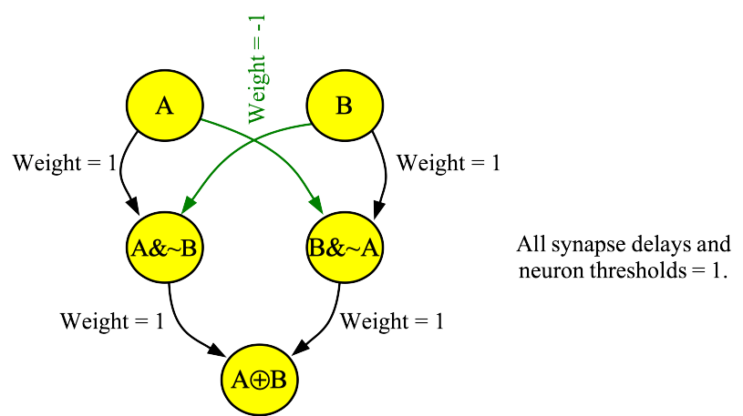
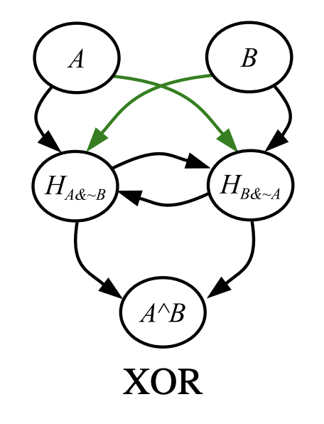

# Getting Started with the TENNLab Open-Source Framework for Neuromorphic Computing

James S. Plank

This is a walk-through for getting started with our open-source software.
You may find it useful to watch [this video](XXX) and type along as 
you do so, to help you learn what we go over in this markdown file.

------------------------------
## The Intended Environment

I will go through the activities of this markdown by typing into a Unix shell.  My machine
is a Macbook, but all flavors of Unix work.  We have tested on MacOS, Ubuntu, Red-Hat, 
Debian and Raspbian.  You should be able to use all of these tools without having to download
or install any external software packages.

In these example, I will by typing into a Unix shell.  I'm using `bash`, but you may use
what you want.  My shell prompt is `UNIX>`.

------------------------------
## Getting the software and compiling

This is a simple clone-and-make exercise.  First clone:

```
UNIX> git clone git@github.com:TENNLab-UTK/framework-open.git
Cloning into 'framework-open'...
remote: Enumerating objects: 295, done.
remote: Counting objects: 100% (295/295), done.
remote: Compressing objects: 100% (189/189), done.
remote: Total 295 (delta 76), reused 275 (delta 59), pack-reused 0 (from 0)
Receiving objects: 100% (295/295), 747.43 KiB | 6.18 MiB/s, done.
Resolving deltas: 100% (76/76), done.
UNIX> 
```

That took about three seconds.  Now `cd` into the framework directory and `make`:

```
UNIX> cd framework-open
UNIX> make
c++ -c -std=c++11 -Wall -Wextra -Iinclude -Iinclude/utils  -o obj/framework.o src/framework.cpp
c++ -c -std=c++11 -Wall -Wextra -Iinclude -Iinclude/utils  -o obj/processor_help.o src/processor_help.cpp
c++ -c -std=c++11 -Wall -Wextra -Iinclude -Iinclude/utils  -o obj/properties.o src/properties.cpp
ar r lib/libframework.a obj/framework.o obj/processor_help.o obj/properties.o
ar: creating archive lib/libframework.a
ranlib lib/libframework.a
c++ -std=c++11 -Wall -Wextra -Iinclude -Iinclude/utils  -o bin/network_tool src/network_tool.cpp lib/libframework.a
c++ -c -std=c++11 -Wall -Wextra -Iinclude -Iinclude/utils  -o obj/risp.o src/risp.cpp
c++ -c -std=c++11 -Wall -Wextra -Iinclude -Iinclude/utils  -o obj/risp_static.o src/risp_static.cpp
c++ -std=c++11 -Wall -Wextra -Iinclude -Iinclude/utils  -o bin/processor_tool_risp src/processor_tool.cpp obj/risp.o obj/risp_static.o lib/libframework.a
UNIX> ls bin
network_tool		processor_tool_risp
UNIX> 

```

Ten seconds on my Mac (96 seconds on my Pi-4, and 28 seconds on my Pi-5).
You shouldn't get any warnings, so if you do, please let me know -- I like having
no warnings.

Can't hurt to run the test script, just to make sure that everything's ok:

```
UNIX> sh scripts/test_risp.sh - no
Passed Test 01 - AND network from [Plank2021], Figure 3.
Passed Test 02 - OR network from [Plank2021], Figure 3.
Passed Test 03 - XOR network from [Plank2021], Figure 3.
Passed Test 04 - AND network from [Plank2021], Figure 5.
Passed Test 05 - XOR network from [Plank2021], Figure 5.
...
Passed Test 30 - Test 13 from the RISP README.
Passed Test 31 - Test 14 from the RISP README.
Passed Test 32 - Test 15 from the RISP README.
Passed Test 33 - The dbscan_flat_full network example from the dbscan README.
Passed Test 34 - The dbscan_systolic_full network example from the dbscan README.
UNIX> 
```

You're good to go.

------------------------------
## RISP

RISP is a very simple neuroprocessor that implements integrate and fire neurons that feature arbitrary thresholds and unit integration cycles. Synapses have arbitrary delays and weights. The neuroprocessor may be configured so that neurons leak their charge to zero at the end of every timestep (`"leak_mode": "all"`)  or they retain their charge until they fire (`"leak_mode": "none"`, which is the
default).

"Unit integration cycle" means that neurons accumulate charge throughout each timestep, and the comparison to the threshold is only done at the end of each timestep. At the end of the timestep, if a neuron's potential meets or exceeds the neuron's threshold, then it fires and resets its potential to zero. If it is configured to leak, then any non-zero potential is reset to zero.

There are resources for RISP on the [main README for this repo](https://github.com/TENNLab-UTK/framework-open).

----------------
## A RISP neural network to implement the XOR operation

Pictured below is a neural network that computes the XOR operation on RISP with `"leak_mode":"all"`.



Specifically, it calculates the exclusive-or of two binary numbers *A* and *B*.  To provide input to
the network, you apply a spike to the *A* neuron at time zero if and only if *A's* value is one.
Same with *B*.  You then run the network for three timesteps, and observe the *(A XOR B)* neuron
at the end of timestep two (timesteps are zero-indexed).  If it fires, then *(A XOR B) = 1*.  If not, then it is zero.

The video below shows the network in action for *(A,B) = (0,0), (0,1)* and *(1,1)*.
You'll note that the only situation in which the output neuron fires is the middle network,
when *A=0* and *B=1*:

[](https://youtu.be/M3YV6avxUPw)

When you watch the video, pay attention to a few things:

- In the middle network, the *(A&~B)* neuron gets a spike whose value is -1 at the end
  of timestep 1.  That potential leaks away at the end of the timestep.
- In the middle network, the *(B&~A)* neuron spikes at the end of timestep 1.
  That's why the *A XOR B* neuron spikes at the end of timestep 2.
- In the rightmost network, both the *(A&~B)* and *(B&~A)* neurons receive spikes of 1 and -1
  at timestep 1.  That's why nothing fires.

(You may read about this network and more networks like it in [this paper](http://neuromorphic.eecs.utk.edu/publications/2021-07-29-spiking-neuromorphic-networks-for-binary-tasks/).)

Now, to create the neural network for this example, run the testing script, give it test 3,
and specify to keep the temporary files rather than erase them:

```
UNIX> sh scripts/test_risp.sh
usage: sh scripts/test_risp.sh number(- for all) yes|no(keep temporary files)
UNIX> sh scripts/test_risp.sh 3 yes
Passed Test 03 - XOR network from [Plank2021], Figure 3.
UNIX> 
```

The network file is `tmp_network.txt`.  It's only 38 lines, and it's formatted, so take a look:

```
UNIX> cat tmp_network.txt
{ "Properties":
  { "node_properties": [
      { "name":"Threshold", "type":73, "index":0, "size":1, "min_value":0.0, "max_value":1.0 }],
    "edge_properties": [
      { "name":"Delay", "type":73, "index":1, "size":1, "min_value":1.0, "max_value":15.0 },
      { "name":"Weight", "type":73, "index":0, "size":1, "min_value":-1.0, "max_value":1.0 }],
    "network_properties": [] },
 "Nodes":
  [ {"id":0,"name":"A","values":[1.0]},
    {"id":4,"name":"A^B","values":[1.0]},
    {"id":1,"name":"B","values":[1.0]},
    {"id":2,"name":"H_A&~B","values":[1.0]},
    {"id":3,"name":"H_B&~A","values":[1.0]} ],
 "Edges":
  [ {"from":1,"to":3,"values":[1.0,1.0]},
    {"from":1,"to":2,"values":[-1.0,1.0]},
    {"from":0,"to":2,"values":[1.0,1.0]},
    {"from":2,"to":4,"values":[1.0,1.0]},
    {"from":0,"to":3,"values":[-1.0,1.0]},
    {"from":3,"to":4,"values":[1.0,1.0]} ],
 "Inputs": [0,1],
 "Outputs": [4],
 "Network_Values": [],
 "Associated_Data":
   { "other": {"proc_name":"risp"},
     "proc_params": 
      { "discrete": true,
        "fire_like_ravens": false,
        "leak_mode": "all",
        "max_delay": 15,
        "max_threshold": 1.0,
        "max_weight": 1.0,
        "min_potential": -1.0,
        "min_threshold": 0.0,
        "min_weight": -1.0,
        "run_time_inclusive": false,
        "spike_value_factor": 1.0,
        "threshold_inclusive": true}}}
UNIX> 
```

This is pretty straightforward JSON, and hopefully you can see the neuron/synapse specification
and how it matches the picture.  A few things of note -- the `"proc_params"` specify how to set
up the RISP neuroprocessor, and you can see that `"leak_mode"` is set to `"all"`, which is what
we want.

Now, let's run the `processor_tool` on it so we can see the RISP neuroprocessor in action.
I have comments inline:

```
UNIX> bin/processor_tool_risp -
- ML tmp_network.txt                 # This reads the processor configuration from the network file,
                                     # creates an instance of the processor, and loads the network
                                     # onto the processor

- AS                                 # AS is how we apply input spikes:
usage: AS node_id spike_time spike_value node_id1 spike_time1 spike_value1 ...
- AS 1 0 1                           # We apply a spike to neuron 1(B) at time 0,
- RUN 4                              # and run for four timesteps.
- GSR                                # The spike raster matches the middle network in the video above
0(A)      INPUT  : 000               # You should double-check it to make sure you understand.
1(B)      INPUT  : 100
2(H_A&~B) HIDDEN : 000
3(H_B&~A) HIDDEN : 010
4(A^B)    OUTPUT : 001
- OC                                 # OC tells you how many times the output neuron spiked.
node 4(A^B) spike counts: 1
- OLF                                # OLF tells you the timestep of the last fire.
node 4(A^B) last fire time: 2.0
- OT                                 # OT tells you the times of all of the fires.  Here there is only one.
node 4(A^B) spike times: 2.0
- NC T                               # NC, NLF and NT give you the same information for all neurons.
Node      0(A) fire count: 0
Node      1(B) fire count: 1
Node 2(H_A&~B) fire count: 0
Node 3(H_B&~A) fire count: 1
Node    4(A^B) fire count: 1
- NLF T
Node      0(A) last fire: -1.0
Node      1(B) last fire: 0.0
Node 2(H_A&~B) last fire: -1.0
Node 3(H_B&~A) last fire: 1.0
Node    4(A^B) last fire: 2.0
- NT T 
Node  0 fire times:
Node  1 fire times: 0.0
Node  2 fire times:
Node  3 fire times: 1.0
Node  4 fire times: 2.0
- Q
UNIX> 
```

When you run the testing script, it also creates the files `pt_input.txt` and `pt_output.txt`,
which show you the input to the `processor_tool` and the output from the `processor_tool`:

```
UNIX> cat tmp_pt_input.txt
ML tmp_network.txt
ASR 0 0101               # ASR stands for "apply spike raster"
ASR 1 0011
RUN 5
GSR
UNIX> cat tmp_pt_output.txt
0(A)      INPUT  : 01010
1(B)      INPUT  : 00110
2(H_A&~B) HIDDEN : 00100
3(H_B&~A) HIDDEN : 00010
4(A^B)    OUTPUT : 00011
UNIX> bin/processor_tool_risp < tmp_pt_input.txt      # You'll note this matches `tmp_pt_output.txt`
0(A)      INPUT  : 01010
1(B)      INPUT  : 00110
2(H_A&~B) HIDDEN : 00100
3(H_B&~A) HIDDEN : 00010
4(A^B)    OUTPUT : 00011
UNIX> 
```

Let's walk through the input and the output.  The paper [Spiking Neuromorphic Networks for Binary Tasks](https://neuromorphic.eecs.utk.edu/publications/2021-07-29-spiking-neuromorphic-networks-for-binary-tasks/) is the one that describes this network.  The paper specifies that the output neuron
fires two timesteps after its corresponding inputs, so input at timestep zero corresponds to output
at timestep two.  Moreover, the paper states that you can reuse the network every timestep
(These things are specified in Table I of the paper).

So the input of "0101" going to neuron 0 and "0011" going to neuron 1 corresponds to four calculations:

```
- At timestep 0, A=0 and B=0.  Their XOR is 0, which corresponds to no output at timestep 2.
- At timestep 1, A=1 and B=0.  Their XOR is 1, which corresponds to an output spike at timestep 3.
- At timestep 2, A=0 and B=1.  Their XOR is 1, which corresponds to an output spike at timestep 4.
- At timestep 3, A=1 and B=1.  Their XOR is 0, which corresponds to no output at timestep 5.
```

The spike raster output above shows all of the neurons, but you'll note that the output neuron
fires at timesteps 3 and 4.  The `GSR` command stops showing spikes when the neurons all stop
spiking -- that's why no output is shown on timestep 5.

----------------
## A second XOR network

Here's an XOR network that works when the neuroprocessor does not leak away its charge.  It is
similar to the previous one, but since there is no leak, those hidden neurons can accumulate
negative charge that doesn't leak away.  The two extra synapses take care of the accumulated
negative charge.  



Test script #5 generates and tests this network:

```
UNIX> sh scripts/test_risp.sh 5 yes
Passed Test 05 - XOR network from [Plank2021], Figure 5.
UNIX> 
```

I won't show the whole network here, but you'll note that there are 8 synapses instead of 6,
and the `"leak_mode"` of RISP is set to `"none"`:

```
UNIX> ( echo FJ tmp_network.txt ; echo INFO ) | bin/network_tool
Nodes:          5
Edges:          8
Inputs:         2
Outputs:        1

Input nodes:  0(A) 1(B) 
Hidden nodes: 2(H_A&~B) 3(H_B&~A) 
Output nodes: 4(A^B) 
UNIX> grep leak tmp_network.txt
        "leak_mode": "none",
UNIX> 
```

Like the previous network, this network takes two timesteps to compute its value, and it can
be reused every timestep.  So the same input as before should yield the same outputs:

```
UNIX> bin/processor_tool_risp -
- ML tmp_network.txt
- ASR 0 0101
- ASR 1 0011
- RUN 5
- GSR 4
4(A^B)    OUTPUT : 00011
- Q
UNIX>
```

You can take a look at the potentials of the neurons at the end of a `RUN` call with `NCH`.
Let's apply a spike to neuron 'A' at time zero, run it for just two timesteps, and then
look at the spike raster and neuron charge values:

```
UNIX> bin/processor_tool_risp -
- ML tmp_network.txt
- AS 0 0 1
- RUN 2
- GSR
0(A)      INPUT  : 10          # After its spike, neuron 0 sends -1 to neuron 3
1(B)      INPUT  : 00
2(H_A&~B) HIDDEN : 01
3(H_B&~A) HIDDEN : 00
4(A^B)    OUTPUT : 00
- NCH
Node      0(A) charge: 0
Node      1(B) charge: 0
Node 2(H_A&~B) charge: 0
Node 3(H_B&~A) charge: -1      # You can see that here.
Node    4(A^B) charge: 0
- RUN 1                        # If we run it for one more timestep, the spike from 2 to 3 resets
- NCH                          # neuron three's value to zero:
Node      0(A) charge: 0
Node      1(B) charge: 0
Node 2(H_A&~B) charge: 0
Node 3(H_B&~A) charge: 0
Node    4(A^B) charge: 0
- Q
UNIX> 
```

The `RSC` command calls `RUN 1` multiple times, and then shows you both the spikes and the neuron
charge values after every call.  This can be very handy for sanity-checking yourself:

```
UNIX> bin/processor_tool_risp -
- ML tmp_network.txt
- AS 0 0 1
- RSC 5
Time      0(A)      1(B) 2(H_A&~B) 3(H_B&~A)    4(A^B) |      0(A)      1(B) 2(H_A&~B) 3(H_B&~A)    4(A^B)
   0         *         -         -         -         - |         0         0         0         0         0
   1         -         -         *         -         - |         0         0         0        -1         0
   2         -         -         -         -         * |         0         0         0         0         0
   3         -         -         -         -         - |         0         0         0         0         0
   4         -         -         -         -         - |         0         0         0         0         0
- Q
UNIX> 
```

------------------------------------------------------------
# Next steps

Your next steps should be to go through the
[network tool markdown](network_tool.md), and the
[RISP markdown](risp.md).  At that point, you should be fluent in these tools and can
start working on your own networks and projects!
