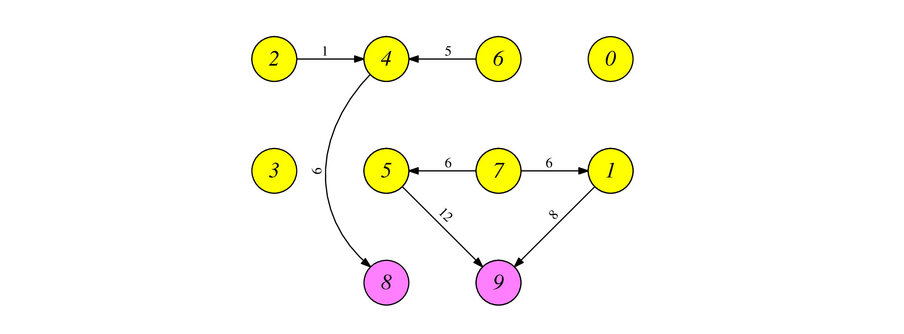
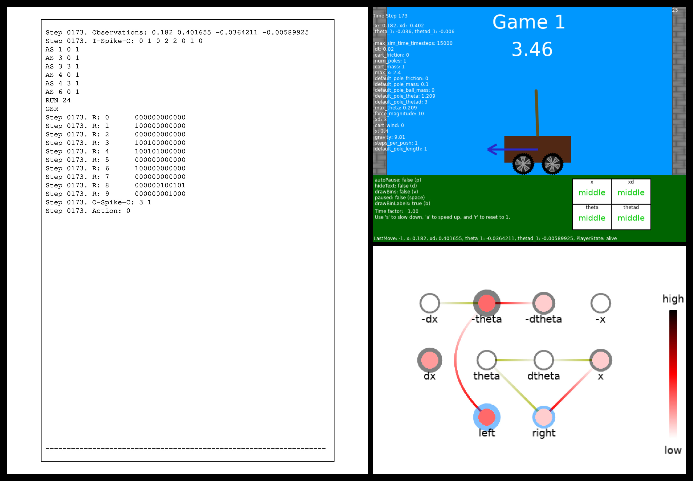
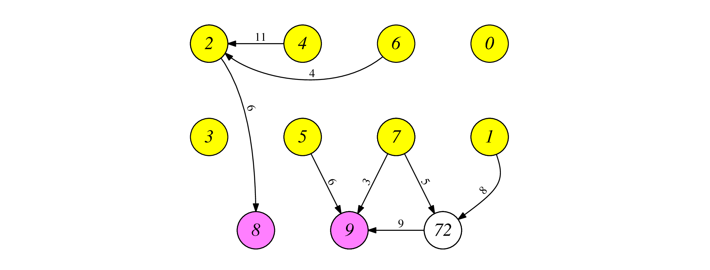
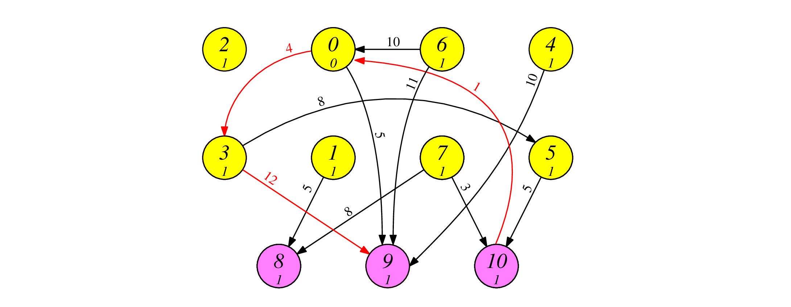
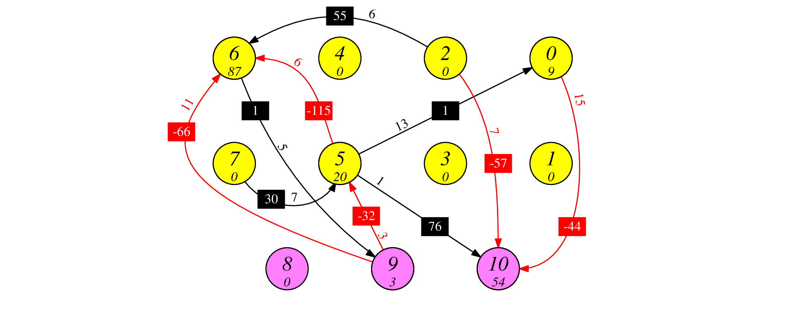
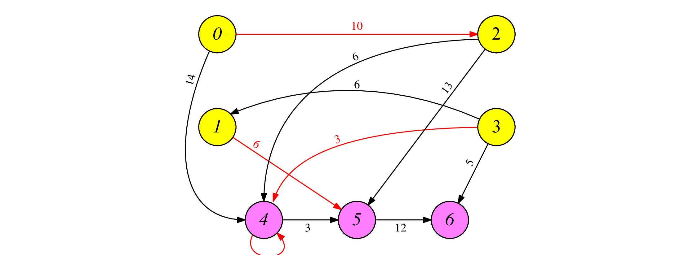

# More Examples of the Cart-Pole Application

These come from the paper, 
"The Cart-Pole Application as a Benchmark for Neuromorphic Computing", by Plank,
Rizzo, White and Schuman.  I'll put a link to the paper when I have it, and when
I refer to it in this markdown file, I'll refer to it as [PRWS2024].

To walk through these examples, or to have instructions on how to use them on
Gymnasium, please see [the main cart-pole example](cartpole_example.md).
Examples 1, 2, 7 and 8 work with Gymnasium pretty much out of the box.  The other
four examples have an addition action, "Do-Nothing," so they require some glue to
work with Gymnasium.

Regardless, for each example, we provide `processor_tool` commands so that
you can see it in action without Gynmasium or any cart-pole application for that
matter.  We also include videos so that you can see it working, along with the
`processor_tool` commands.

---------
## Example 1 - Figure 7(a).  A RISP-1+ network for the *Easy* benchmark

This is Figure 7(a) from [PRWS2024].  It is a RISP-1+ network, so all synapse
weights are one, and all neuron thresholds are one.  The delays are shown on
the figure.  The mapping of neuron number to identity is as follows:

- 0 is *x-*
- 1 is *x+*
- 2 is *dx-*
- 3 is *dx+*
- 4 is *theta-*
- 5 is *theta+*
- 6 is *d-theta-*
- 7 is *d-theta+*
- 8 is Action-Left
- 9 is Action-right



You can create this network with the testing script, which puts it into the
file `tmp_network.txt`:

```
UNIX> sh scripts/test_risp.sh 42 yes
Passed Test 42 - Cart-pole example from [PRWS2024], Figure 7a.
UNIX> ( echo FJ tmp_network.txt ; echo INFO ) | bin/network_tool
Nodes:         10
Edges:          7
Inputs:         8
Outputs:        2

Input nodes:  0 1 2 3 4 5 6 7 
Hidden nodes: 
Output nodes: 8 9 
UNIX> 
```

In the following video, we show our cart-pole application running with this
network as the agent.  Values are encoded and decoded as explained in
[the first cart-pole example](cartpole_example.md).  In the video, you can 
also see on the terminal screen: the observations, actions, input spikes,
spike raster output, and processor tool commands for each timestep.  It
is slowed by 50%, but you can pause and step through the video to see
individual values.

[Example-7a-video](https://youtu.be/0jozLerSaxI)

When you run test script 42, the file
`tmp_pt_input.txt` gives you the processor tool commands that are being
used in the video.  Along with them are the outputs from the teriminal in 
the video, included as comments.  So, for example, take a look at 
the first 27 lines of `tmp_pt_input.txt`:

```
UNIX> head -n 27 tmp_pt_input.txt
ML tmp_network.txt
# Step 0000. Observations: -1.17261 0.201336 -0.0686158 0.40251
# Step 0000. I-Spike-C: 4 0 0 1 3 0 0 2
AS 0 0 1
AS 0 3 1
AS 0 6 1
AS 0 9 1
AS 3 0 1
AS 4 0 1
AS 4 3 1
AS 4 6 1
AS 7 0 1
AS 7 3 1
RUN 24
GSR
# Step 0000. R: 0      1001001001000000000000
# Step 0000. R: 1      0000001001000000000000
# Step 0000. R: 2      0000000000000000000000
# Step 0000. R: 3      1000000000000000000000
# Step 0000. R: 4      1001001000000000000000
# Step 0000. R: 5      0000001001000000000000
# Step 0000. R: 6      0000000000000000000000
# Step 0000. R: 7      1001000000000000000000
# Step 0000. R: 8      0000001001001000000000
# Step 0000. R: 9      0000000000000010011001
# Step 0000. O-Spike-C: 3 4
# Step 0000. Action: 1
UNIX> 
```

If we run these lines in the processor_tool, the spike raster matches:

```
UNIX> head -n 27 tmp_pt_input.txt | bin/processor_tool_risp 
0 INPUT  : 1001001001000000000000
1 INPUT  : 0000001001000000000000
2 INPUT  : 0000000000000000000000
3 INPUT  : 1000000000000000000000
4 INPUT  : 1001001000000000000000
5 INPUT  : 0000001001000000000000
6 INPUT  : 0000000000000000000000
7 INPUT  : 1001000000000000000000
8 OUTPUT : 0000001001001000000000
9 OUTPUT : 0000000000000010011001
UNIX> 
```

You can map this to the video if you want.  For example, here's a screenshot
of the video, paused at the 3.48 second mark:



Now, let's take a look at the output of the `processor_tool` for those
steps.  Each time-raster has 10 neurons, so if we want timestep 173, 
we'll want lines 1731 to 1740 of the output:

```
UNIX> bin/processor_tool_risp < tmp_pt_input.txt | cat -n | sed -n 1731,1740p
  1731	0 INPUT  : 000000000000
  1732	1 INPUT  : 100000000000
  1733	2 INPUT  : 000000000000
  1734	3 INPUT  : 100100000000
  1735	4 INPUT  : 100101000000
  1736	5 INPUT  : 000000000000
  1737	6 INPUT  : 100000000000
  1738	7 INPUT  : 000000000000
  1739	8 OUTPUT : 000000100101
  1740	9 OUTPUT : 000000001000
UNIX> 
```

See how that matches the spike raster for step 173 in the screenshot?  Cool, no?

Remember, you can also use this network in Gymnasium -- you'll need to
read through 
[the first cart-pole example](cartpole_example.md).

---------
## Example 2 - Figure 7(b).  A second RISP-1+ network for the *Easy* benchmark

This is Figure 7(b) from [PRWS2024].  It is a RISP-1+ network, so all synapse
weights are one, and all neuron thresholds are one.  The delays are shown on
the figure and the neuron id's are the same, except 72 is a hidden neuron.



This is testing example 43, so please follow the instructions above, but use
"43" instead of "42":

```
UNIX> sh scripts/test_risp.sh 43 yes
Passed Test 43 - Cart-pole example from [PRWS2024], Figure 7b.
UNIX> ( echo FJ tmp_network.txt ; echo INFO ; echo EDGES ) | bin/network_tool
Nodes:         11
Edges:          8
Inputs:         8
Outputs:        2

Input nodes:  0 1 2 3 4 5 6 7 
Hidden nodes: 72 
Output nodes: 8 9 
[ {"from":1,"to":72,"values":[1.0,14.0]},
  {"from":2,"to":8,"values":[1.0,6.0]},
  {"from":4,"to":2,"values":[1.0,11.0]},
  {"from":72,"to":9,"values":[1.0,3.0]},
  {"from":5,"to":9,"values":[1.0,6.0]},
  {"from":6,"to":2,"values":[1.0,4.0]},
  {"from":7,"to":72,"values":[1.0,11.0]},
  {"from":7,"to":9,"values":[1.0,3.0]} ]
UNIX> 
```

The 30-second video of this network is in [https://www.youtube.com/watch?v=8BpuA5y3eVE](https://www.youtube.com/watch?v=8BpuA5y3eVE).

---------
## Example 3 - Figure 9(a).  A RISP-1 network for the *Medium* benchmark

This is Figure 9(a) from [PRWS2024].  It is a RISP-1 network, so all synapse
weights are either -1 or 1, and all neuron thresholds are either 0 or 1.
The delays and threshold are shown in the picture.  Inhibitory synapses
are in red.  The output neurons are:

- 8: Do-Nothing
- 9: Left
- 10: Right



This is testing example 44.

```
UNIX> sh scripts/test_risp.sh 44 yes
Passed Test 44 - Cart-pole example from [PRWS2024], Figure 9a.
UNIX> ( echo FJ tmp_network.txt ; echo INFO ; echo NODES ; echo EDGES ) | bin/network_tool
Nodes:         11
Edges:         13
Inputs:         8
Outputs:        3

Input nodes:  0 1 2 3 4 5 6 7 
Hidden nodes: 
Output nodes: 8 9 10 
[ {"id":0,"values":[0.0]},
  {"id":6,"values":[1.0]},
  {"id":8,"values":[1.0]},
  {"id":7,"values":[1.0]},
  {"id":2,"values":[1.0]},
  {"id":3,"values":[1.0]},
  {"id":9,"values":[1.0]},
  {"id":4,"values":[1.0]},
  {"id":1,"values":[1.0]},
  {"id":10,"values":[1.0]},
  {"id":5,"values":[1.0]} ]
[ {"from":7,"to":8,"values":[1.0,8.0]},
  {"from":1,"to":8,"values":[1.0,5.0]},
  {"from":3,"to":5,"values":[1.0,8.0]},
  {"from":0,"to":2,"values":[1.0,8.0]},
  {"from":10,"to":0,"values":[-1.0,1.0]},
  {"from":0,"to":3,"values":[-1.0,4.0]},
  {"from":0,"to":9,"values":[1.0,5.0]},
  {"from":6,"to":9,"values":[1.0,11.0]},
  {"from":5,"to":10,"values":[1.0,5.0]},
  {"from":3,"to":9,"values":[-1.0,12.0]},
  {"from":7,"to":10,"values":[1.0,3.0]},
  {"from":6,"to":0,"values":[1.0,10.0]},
  {"from":4,"to":9,"values":[1.0,10.0]} ]
UNIX> 
```

The 30-second video of this network is in [https://youtu.be/7Dx9tiSEaeE](https://youtu.be/7Dx9tiSEaeE).  Note how often the agent uses the "Do-Nothing" action.


---------
## Example 4 - Figure 9(b).  A RISP-127 network for the *Medium* benchmark

Here's the network:



It's example 45.  By now, you know the drill.

The 30-second video of this network is in [https://youtu.be/6q5wbJFKCSk](https://youtu.be/6q5wbJFKCSk).


---------
## Example 5 - Figure 11(b).  A RISP-1 network for the *Hard* benchmark

Here's the network:



It's example 46.  By now, you know the drill.

The 30-second video of this network is in [https://youtu.be/1ag5gQOU2LI](https://youtu.be/1ag5gQOU2LI).

