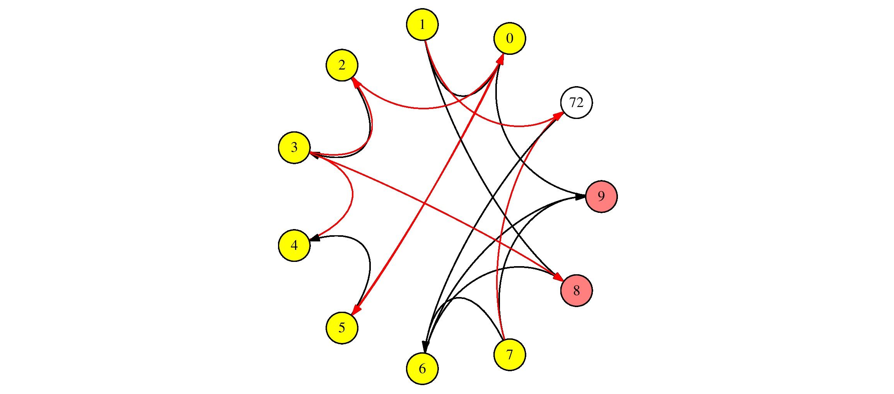
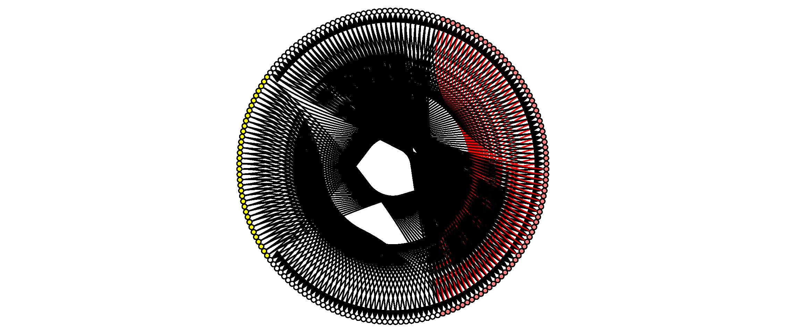
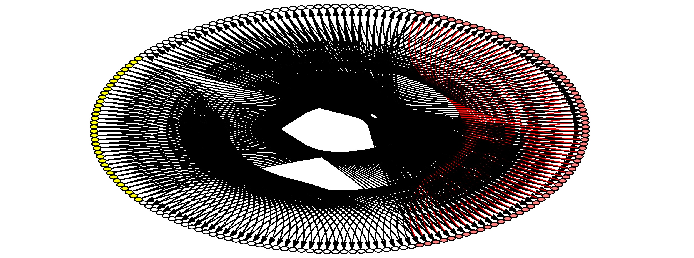

---------
# src/network_to_jgraph.cpp

James S. Plank

This reads a network on standard input, and emits jgraph of the network, where the nodes
are plotted on a unit circle, and the edges are bezier curves between nodes.  It only
takes one argument -- either `tb` or `lr`, which specifies whether inputs/outputs are top/bottom
or left/right.

I've kept this simple -- you can change things like colors, graph size, or labels by
post-processing the jgraph. I'll give very simple examples.

If you don't have jgraph on your system, get it from 
[https://web.eecs.utk.edu/~jplank/plank/jgraph/jgraph.html](https://web.eecs.utk.edu/~jplank/plank/jgraph/jgraph.html), or, if that doesn't work, [https://web.eecs.utk.edu/~jplank/plank/classes/cs494/494/notes/Jgraph/lecture.html](https://web.eecs.utk.edu/~jplank/plank/classes/cs494/494/notes/Jgraph/lecture.html).

------------------------------------------------------------
## Examples 

We'll use examples from the testing code.  First, make sure all of the tests work:

```
UNIX> pwd
/Users/plank/src/repos/framework
UNIX> sh scripts/test_risp.sh 
usage: sh scripts/test_risp.sh number(- for all) yes|no(keep temporary files)
UNIX> sh scripts/test_risp.sh - no
Passed Test 01 - AND network from [Plank2021], Figure 3.
Passed Test 02 - OR network from [Plank2021], Figure 3.
Passed Test 03 - XOR network from [Plank2021], Figure 3.
...
UNIX> 
```

Now, let's run test 49, but keep the files, so we have the network:

```
UNIX> sh scripts/test_risp.sh 49 yes
Passed Test 49 - Cart-pole example from [PRWS2024], Figure 13b.
UNIX> ls -l tmp_network.txt
-rw-r--r--  1 plank  staff  2076 Mar 12 09:29 tmp_network.txt
UNIX> 
```

Let's use the network tool to look at the network info (remember to `make` so you have
all of the tools):

```
UNIX> ( echo FJ tmp_network.txt ; echo INFO ) | bin/network_tool
Please use "VIZ" option to visually see network if you have love installed

Nodes:         11
Edges:         18
Inputs:         8
Outputs:        2

Input nodes:  0 1 2 3 4 5 6 7 
Hidden nodes: 72 
Output nodes: 8 9 
UNIX> 
```

Now, let's create a jgraph representation and turn it into jpg:

```
UNIX> bin/network_to_jgraph lr < tmp_network.txt > tmp_network.jgr
UNIX> jgraph -P tmp_network.jgr | ps2pdf - | convert -density 300 - -quality 100 tmp_network.jpg
UNIX> 
```

Here it is:



If you look at `tmp_network.jgr`, the first few lines define some things that you can change
if you want:

```
UNIX> head tmp_network.jgr
newgraph
xaxis min -1.11 max 1.11 size 3 nodraw
yaxis min -1.11 max 1.11 size 3 nodraw

(* NODE AND LABEL DEFINITIONS *)

(* HIDDEN_NODE_DEF *) curve 0 marktype ellipse fill 1 marksize 0.2 0.2
(* INPUT_NODE_DEF  *) copycurve cfill 1 1 0
(* OUTPUT_NODE_DEF *) copycurve cfill 1 .5 .5
(* NODE_LABEL_DEF  *) newstring hjc vjc fontsize 9
UNIX> 
```

So -- for example, let's change hidden nodes to light blue, and increase the font size on
the labels to 12:

```
UNIX> sed -e '/HIDDEN_NODE_DEF/s/fill 1/cfill .8 .8 1/' -e '/NODE_LABEL_DEF/s/9/15/' tmp_network.jgr |
jgraph -P | ps2pdf - | convert -density 300 - -quality 100 tmp_network.jpg
UNIX> 
```


There's not much more to it than that.  If you want to get rid of the labels, use `sed
to delete lines with `LABEL` surrounded by a space.  Here's a fun one with a DBSCAN network:

```
UNIX> sh scripts/test_risp.sh 33 yes
Passed Test 33 - The dbscan_flat_full network example from the dbscan README.
UNIX> bin/network_to_jgraph lr < tmp_network.txt | sed '/ LABEL /d' |
      jgraph -P | ps2pdf - | convert -density 300 - -quality 100 tmp_network.jpg
UNIX> 
```



If you change the axis sizes, even having them not match, everything should still work:

```
UNIX> bin/network_to_jgraph lr < tmp_network.txt | sed '/ LABEL /d' |
      sed '/xaxis/s/size 3/size 6/'  |
      jgraph -P | ps2pdf - | convert -density 300 - -quality 100 tmp_network.jpg
UNIX> 
```



