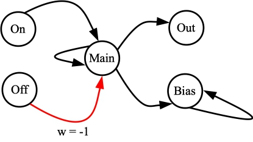
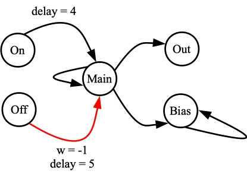
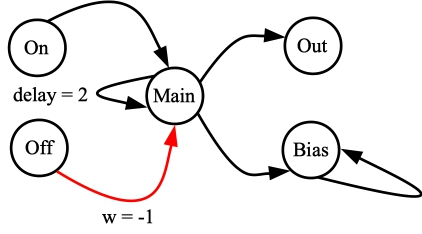
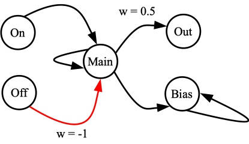
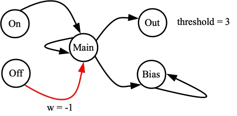
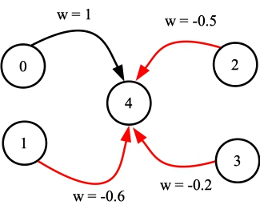
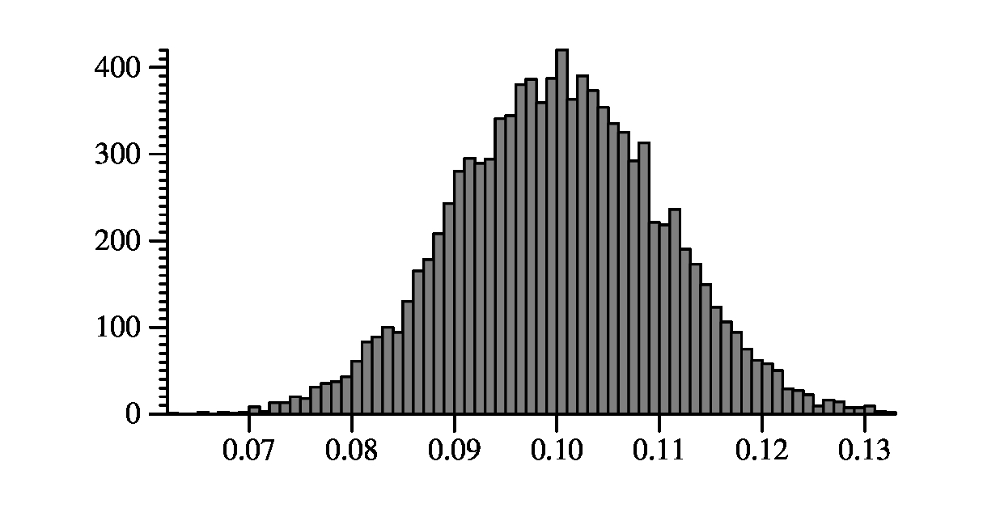
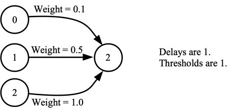
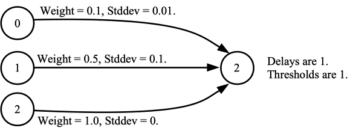

# RISP - Reduced Instruction Spiking Processor

Point of contact: James S. Plank

------

[TOC]

------

# Introduction

RISP is a lightweight neuroprocessor. It has the following features. 

  1. It implements a standard integrate-and-fire neuron with discrete integration
     timesteps.  In other words, neurons accumulate their action potentials during a
     timestep, and at the end of the timestep, they check the potential and fire if it
     meets or exceeds the threshold.  For that reason, when we define RISP networks, the
     synapses have discrete, integer delays.
  2. Weights, thresholds and activation potentials may be set to integer values
     (`"discrete" = true`), or floating point values (`"discrete" = false`).
  3. Neurons have two leak modes: `"none"`, where the neurons do not leak, and `"all"`,
     where the neurons leak all of their potential at the end of every timestep.  The
     RISP neuroprocessor may be set so that all neurons have the same leak value, or so
     that each neuron may set its value individually.
  4. There's no plasticity on the synapse.
  5. There are no refractory periods or learning rules.  RISP is simple.
  6. However, it does have a few "features" which have been very helpuful in research.  The
     first is that you may affix specific weight values for the synapses.  This is independent
     of whether `"discrete"` is `true` or `false`.
  7. You may also random noise to every synapse fire.
  8. There are parameter settings that allow RISP to emulate specific parameter settings of
     the RAVENs neuroprocessor.  

Please read ["The Case for RISP: A Reduced Instruction Spiking Processor"](http://neuromorphic.eecs.utk.edu/publications/2022-06-29-the-case-for-risp-a-reduced-instruction-spiking-processor/) for a precise description of RISP.

# Implementations

This directory contains the implementation of the RISP simulator.

There is an open-source FPGA implementation of RISP at
[https://github.com/TENNLab-UTK/fpga](https://github.com/TENNLab-UTK/fpga).

There is a version of RISP that compiles networks onto a RP2040 Pico microcontroller.
You can find that in 
[The Embedded Neuromorphic Repository](https://bitbucket.org/neuromorphic-utk/embedded-neuromorphic), but you'll need bitbucket access from TENNLab, because this implementation is not open-source.
It may be someday, but not yet.

------------------------------------------------------------
# Default RISP Parameter Settings

There are three main classes of RISP:

1. Floating point: `RISP-F` and `RISP-F+`.
2. Discrete with positive and negative weights: `RISP-n`
3. Discrete with positive weights only: `RISP-n+`

In the `params` directory, there are parameter files for many of these RISP defaults:

```
UNIX> ls params | cat
risp_1.txt
risp_127.txt
risp_15_plus.txt
risp_1_plus.txt
risp_255_plus.txt
risp_7.txt
risp_f.txt
risp_f_plus.txt
UNIX> 
```

All of these parameter settings have `"leak_mode"` set to `"none"`.  If you want to enable leak,
then copy the file you want, edit it so that `"leak_mode"` is `"all"` or `"configurable"`, and
you're ready to go.

`RISP-F` and `RISP-F+` are straightforward.  You can just look at the JSON to see the settings.

Our RISP FPGA and microcontrollers do not implement floating point, 
so RISP-F and RISP-F+ networks cannot run on the FPGA or microcontroller.  For those, you should
use a `RISP-n` or `RISP-n+` setting.
`RISP-n` means that:

- Maximum synapse weight is *n*.
- Minimun synapse weight is *-n*.
- Maximum neuron threshold is *n*.
- Minimum neuron threshold is *0*.
- Minimum neuron potential is *-n*.
- Maximum synapse delay is *max(n,15)*.

`RISP-n+1` means that:

- Maximum synapse weight is *n*.
- Minimun synapse weight is *1*.
- Maximum neuron threshold is *n*.
- Minimum neuron threshold is *1*.
- Minimum neuron potential is *0*.
- Maximum synapse delay is *max(n,15)*.

Now you should understand all of the files in the `params` directory, and you can select the one
to use for your task.  The smaller values of *n* are more efficiently implemented on FPGA.


------------------------------------------------------------
# Params

You can specify the following parameters:


| Key                 | Type   | Default      | Description |
|-------------------- |------- | ------------ |------------ |
| discrete            | bool   | Necessary    | If `true`, weights, thresholds and activation potentials are integers.  Otherwise they are floating point. (Default param file: `false`) |
| min_weight          | double | Necessary*   | The minimum synapse weight (Default param file: -1).  Not required when `weights` are specified. |
| max_weight          | double | Necessary*   | The maximum synapse weight (Default param file: 1).  Not required when `weights` are specified. |
| min_threshold       | double | Necessary    | The minimum neuron threshold (Default param file: -1) |
| max_threshold       | double | Necessary    | The maximum neuron threshold (Default param file: 1) |
| max_delay           | int    | Necessary    | The maximum synapse delay (Default param file: 5) |
| min_potential       | double | Necessary    | At the end of integration, the potential cannot go lower than this value. (Default param file: -1) |
| leak_mode           | string | `"none"`     | Leak: `"all"`, `"none"`, `"configurable"` |
| run_time_inclusive  | bool   | `false`      | If `true`, `run(duration)` calls run for `duration+1` timesteps. |
| threshold_inclusive | bool   | `true`       | If `true` neurons spike when the potential is >= the threshold.  If `false`, then it has to exceed the threshold. |
| fire_like_ravens    | bool   | `false`      | If `true` neurons fire on the timestep after they normally fire.  The synapses work as normal. |
| spike_value_factor  | double | `max_weight` | Framework applications call `apply_spikes()` with input spike values between 0 and 1.  RISP multiplies these values by this factor. |
| weights             | vector | []           | If this is specified, then synapse weights are restricted to these values.  If `discrete` is true, these must be integers. |
| inputs_from_weights | bool   | Necessary*   | Must specify if you use `weights`.  If `true`, then input spikes map to the `weights` array.  Otherwise, `spike_value_factor` is used. |
| noisy_seed          | int    | 0            | If noise is used (either `noisy_stddev` or `stds` is specified), then this is the RNG seed. 0 uses the current time in microseconds. |
| noisy_stddev        | double | 0            | A random normal with this standard deviation is added to the weight on each synapse fire. ||
| stds                | vector | []           | Each time a synapse with `weights[i]` fires, a random normal with `stds[i]` is added to/subtracted from the weight. |
| log                 | JSON   | {}           | IO_Stream to log events (for debugging) | 

------------------------------------------------------------
# Examples of Use

You can go through each of these examples with `scripts/test_risp.sh`.  

----------------------------------------
## Test 1 (Script 17): RISP with defaults.

For this test, we use RISP-F and the network pictured below:
In this and later pictures, all weights, delays and thresholds are one unless otherwise
specified.  



Let's create the network with `scripts/test_risp.sh`, and then look at it with the
`network_tool`:

```
UNIX> sh scripts/test_risp.sh 17 yes
Passed Test 17 - Test 1 from the RISP README.
UNIX> bin/network_tool -
- FJ tmp_network.txt
- NODES  
[ {"id":0,"name":"Main","values":[1.0]},           # Main is neuron 0
  {"id":4,"name":"Bias","values":[1.0]},           # Bias is neuron 4
  {"id":1,"name":"On","values":[1.0]},             # On is neuron 1
  {"id":2,"name":"Off","values":[1.0]},            # Off is neuron 2
  {"id":3,"name":"Out","values":[1.0]} ]           # Out is neuron 3
- Q
UNIX> 
```

Now, we'll run the processor tool to make sure we understand what is happening when this
network runs.  Please read the commentary that is inline:

```
UNIX> bin/processor_tool_risp -                     # Our prompt will be a single dash.
- ML tmp_network.txt                                        # Create the processor and load our network.
- AS 0 0 1                                          # Send an input spike at time zero to the Main neuron
- RUN 10                                            # Run for ten timesteps.
- GSR
                                   # Here's the spike raster.  The input spike causes the Main
                                   # neuron to fire every timestep.  That in turn causes the 
                                   # Out and Bias neurons to spike every timestep:
0(Main) INPUT  : 1111111111
1(On)   INPUT  : 0000000000
2(Off)  INPUT  : 0000000000
3(Out)  OUTPUT : 0111111111
4(Bias) OUTPUT : 0111111111

- RUN 5                            # When we run for another five timesteps, we see that the
- GSR                            # Main, Out and Bias neurons continue their spiking.
0(Main) INPUT  : 11111
1(On)   INPUT  : 00000
2(Off)  INPUT  : 00000
3(Out)  OUTPUT : 11111
4(Bias) OUTPUT : 11111
- GT                               # This says how many timesteps the neuroprocessor has run,
time: 15.0                         # since it was created (or cleared).

- AS 2 0 1                         # We send input spikes to the Off neuron at timestep 0 (relative
- AS 1 5 1                         # to the current timestep), and to the On neuron at timestep 5.
- RUN 10 
- GSR
  
                                   # The Off neuron fires at timestep 0, canceling the spike on
                                   # synapse C at tiemstep 1.  Accordingly, the Out neuron
                                   # stops firing at timestep 2.  
                                   # 
                                   # At timestep 5, the "On" neuron fires, causing the Main neuron 
                                   # to start firing at timestep 6.  This in turn causes the Out
                                   # neuron to start firing at timestep 7.
0(Main) INPUT  : 1000001111
1(On)   INPUT  : 0000010000
2(Off)  INPUT  : 1000000000
3(Out)  OUTPUT : 1100000111
4(Bias) OUTPUT : 1111111111
- GT                               # The processor has been running for 25 timesteps.
time: 25.0

- AS 1 0 1   2 0 1                 # We have the On and Off neurons both spike at timestep 0.
- RUN 5
- GSR

                                   # Since they both spike at timestep 0, their spikes arrive at
                                   # the Main neuron at timestep 1.  They cancel each other out,
                                   # So the Main neuron continues to fire.
0(Main) INPUT  : 11111
1(On)   INPUT  : 10000
2(Off)  INPUT  : 10000
3(Out)  OUTPUT : 11111
4(Bias) OUTPUT : 11111
- Q
```


----------------------------------------
## Test 2 (Script 18): Setting some different delays to see neurons "in flight"

This is a trivial test, but I want you to see that spikes can be "in flight" when
the *RUN* call terminates, and they'll be delivered at the proper timestep in a 
subsequent *RUN* call.  We use the following network:



Again, please read the commentary inline:
```
UNIX> sh scripts/test_risp.sh 18 yes
Passed Test 18 - Test 2 from the RISP README.
UNIX> bin/processor_tool_risp -
- ML tmp_network.txt
- AS 0 0 1   2 0 1               # We apply spikes to the Main and Off neurons at time zero.
- RUN 10                         # This "turns on" the Main and Bias neurons, and then turns the
- GSR                            # Main neuron off at timestep 5.  One quirk of the "GSR" command
0(Main) INPUT  : 1111100000      # is that if no neurons spike in the last timesteps, then it won't
1(On)   INPUT  : 0000000000      # show those timesteps.  That's why I have the Bias neuron, so that
2(Off)  INPUT  : 1000000000      # you can see all of the timesteps, even when there's no activity
3(Out)  OUTPUT : 0111110000      # in the other neurons.
4(Bias) OUTPUT : 0111111111

- AS 1 0 1   2 0 1               # We apply spikes to the On and Off neurons simultaneously.
- RUN 3                          # The "On" spike will arrive in 4 timesteps, and the "Off" spike
- GSR                          # will arrive in 5 timesteps.  However, we only run for three
0(Main) INPUT  : 000             # timesteps.  When the *RUN* call completes, those two spikes
1(On)   INPUT  : 100             # are in flight on synapses A and B.
2(Off)  INPUT  : 100
3(Out)  OUTPUT : 000
4(Bias) OUTPUT : 111
- RUN 5                          # When we run again, the spikes are delivered properly.
- GSR
0(Main) INPUT  : 01000
1(On)   INPUT  : 00000
2(Off)  INPUT  : 00000
3(Out)  OUTPUT : 00100
4(Bias) OUTPUT : 11111
- Q
```

----------------------------------------
## Test 3 (Script 19): Putting an extra delay on Main's self-loop synapse

We next set all parameters to 1, except we put a delay of two on the synapse from
*Main* to itself:



The end result here is to have the *Main* neuron fire every other cycle, which in turn has
the *Out* neuron fire every other cycle:

```
UNIX> sh scripts/test_risp.sh 19 yes
Passed Test 19 - Test 3 from the RISP README.
UNIX> bin/processor_tool_risp -
- ML tmp_network.txt
- AS 0 0 1
- RUN 10
- GSR
0(Main) INPUT  : 1010101010
1(On)   INPUT  : 0000000000
2(Off)  INPUT  : 0000000000
3(Out)  OUTPUT : 0101010101
4(Bias) OUTPUT : 0111111111
- 
```

Here's something fun -- we apply a spike to the *On* neuron at timestep zero, which spikes
the *Main* neuron at time 1.  Now, the *Main* neuron starts firing at every timestep, because
at each timestep it has a spike in flight on Synapse C.

```
- AS 1 0 1 
- RUN 10
- GSR
0(Main) INPUT  : 1111111111
1(On)   INPUT  : 1000000000
2(Off)  INPUT  : 0000000000
3(Out)  OUTPUT : 0111111111
4(Bias) OUTPUT : 1111111111
-    
```
We can use the *Off* neuron to cancel one of the spikes, and now the *Main* neuron goes
back to spiking every other timestep:

```
- AS 2 0 1
- RUN 10
- GSR
0(Main) INPUT  : 1010101010
1(On)   INPUT  : 0000000000
2(Off)  INPUT  : 1000000000
3(Out)  OUTPUT : 1101010101
4(Bias) OUTPUT : 1111111111
- Q
UNIX> 
```

----------------------------------------
## Test 4 (Script 20): Setting The Weight of the Synapse to the Out neuron to 0.5

Now we put all of the delays back to 1, and set the weight of the synapse from *Main*
to *Out* to 0.5:



Now, it takes two spikes from *Main* to cause *Out* to spike.  Thus, it spikes every
other timestep:

```
UNIX> sh scripts/test_risp.sh 20 yes
Passed Test 20 - Test 4 from the RISP README.
UNIX> bin/processor_tool_risp -
- ML tmp_network.txt
- AS 0 0 1
- RUN 10
- GSR
0(Main) INPUT  : 1111111111
1(On)   INPUT  : 0000000000
2(Off)  INPUT  : 0000000000
3(Out)  OUTPUT : 0010101010
4(Bias) OUTPUT : 0111111111
- 
```

Lets spike the *Off* neuron.  This stops the *Main* neuron from spiking.  However, there is a spike
sent from *Main* to *Out* at timestep zero, which arrives at the *Out* neuron at timestep 1.  This
means that at the end of the *RUN* call, the *Out* neuron's activation potential is 0.5.
We can confirm that with the *NCH* call, that shows each neuron's action potential:

```
- AS 2 0 1
- RUN 10
- GSR
0(Main) INPUT  : 1000000000
1(On)   INPUT  : 0000000000
2(Off)  INPUT  : 1000000000
3(Out)  OUTPUT : 1000000000   # At timestep 1, the Out neuron receives 0.5 charge from Main
4(Bias) OUTPUT : 1111111111
- NCH
Node 0(Main) charge: 0
Node   1(On) charge: 0
Node  2(Off) charge: 0
Node  3(Out) charge: 0.5      # This is confirmed here.
Node 4(Bias) charge: 0
- 
```

We'll use the *On* and *Off* neurons to have Main send one more spike -- that causes
the *Out* neuron to fire:

```
- AS 1 0 1   2 1 1             # Apply a spike to On at time 0, and to Off at time 1
- RUN 10
- GSR
0(Main) INPUT  : 0100000000    # That causes Main to spike exactly once.
1(On)   INPUT  : 1000000000
2(Off)  INPUT  : 0100000000
3(Out)  OUTPUT : 0010000000    # And the one spike gives Out its final 0.5 of charge, so it fires
4(Bias) OUTPUT : 1111111111
- Q
UNIX> 
```

----------------------------------------
## Test 5 (Script 21): Turning On Leak

RISP has a parameter setting called `leak_mode`.  It can have three values:

1. `"none"` - No leak (this is the default, and what I've used above).
2. `"all"` - Every neuron leaks its potential to zero at the end of every timestep.
3. `"configurable"` - You can set each neuron's leak to `true', meaning it leaks its
    potential every timestep, or `false`, meaning it doesn't leak.


When we run test script 21, it creates the same network as in the last test, but now
leak is turned on:

```
UNIX> sh scripts/test_risp.sh 21 yes
Passed Test 21 - Test 5 from the RISP README.
UNIX> grep leak tmp_network.txt
        "leak_mode": "all",
UNIX> 
```

In these scripts, the RISP parameter files are stored in the file `tmp_proc_params.txt`, so
you can see that here, where the `"leak_mode"` is set to `"all"`:

```
UNIX> cat tmp_proc_params.txt
{ 
  "min_weight": -1,
  "max_weight": 1,
  "leak_mode": "all",
  "min_threshold": -1,
  "max_threshold": 1,
  "min_potential": -1,
  "max_delay": 15,
  "discrete": false
}
UNIX> 
```

Again, this is the same network as in the last test, but
now our neurons leak their charge at the end of each timestep.  As such, the *Out* neuron
never gets enough charge, and it never fires:

```
UNIX> bin/processor_tool_risp -
- ML tmp_network.txt
- AS 0 0 1
- RUN 10
- GSR
0(Main) INPUT  : 1111111111
1(On)   INPUT  : 0000000000
2(Off)  INPUT  : 0000000000
3(Out)  OUTPUT : 0000000000     # Out never fires, because it leaks its charge at every timestep.
4(Bias) OUTPUT : 0111111111
- Q
UNIX> 
```

With `leak_mode` set to `"all"`, all of the neurons leak their charge.  
So, for example, if we don't
put the full amount of charge into the input neurons, they won't fire:

```
UNIX> bin/processor_tool_risp -
- ML tmp_network.txt
- AS 0 0 1  2 0 1          # Start up the Bias, and turn the Main neuron off:
- RUN 5
- GSR
0(Main) INPUT  : 10000
1(On)   INPUT  : 00000
2(Off)  INPUT  : 10000
3(Out)  OUTPUT : 00000
4(Bias) OUTPUT : 01111
- AS 0 0 .5   0 1 .5   1 0 .99  1 1 .99    # Put partial charge into Main and On at timesteps
- RUN 5                                    # 0 and 1.  Nothing will happen
- GSR
0(Main) INPUT  : 00000
1(On)   INPUT  : 00000
2(Off)  INPUT  : 00000
3(Out)  OUTPUT : 00000
4(Bias) OUTPUT : 11111
- NCH
Node 0(Main) charge: 0                     # As you can see, they have no charge.
Node   1(On) charge: 0
Node  2(Off) charge: 0
Node  3(Out) charge: 0
Node 4(Bias) charge: 0
- Q
UNIX> 
```

----------------------------------------
## Test 6 (Script 22): Using Configurable Leak in RISP

RISP allows you to set leak on individual neurons.  To do that, you set the `leak_mode`
to `"configurable"`.  Script 22 creates such a network -- it looks the same as the previous
network, but you can configure each neuron's leak individually:


```
UNIX> sh scripts/test_risp.sh 22 yes
Passed Test 22 - Test 6 from the RISP README.
UNIX> grep leak tmp_proc_params.txt
  "leak_mode": "configurable",
UNIX> grep leak tmp_network.txt
        "leak_mode": "configurable",
UNIX> 
```

Let's look at the neurons:

```
UNIX> ( echo FJ tmp_network.txt ; echo NODES ) | bin/network_tool
[ {"id":0,"name":"Main","values":[1.0,1.0]},
  {"id":4,"name":"Bias","values":[1.0,1.0]},
  {"id":1,"name":"On","values":[1.0,1.0]},
  {"id":2,"name":"Off","values":[1.0,1.0]},
  {"id":3,"name":"Out","values":[1.0,0.0]} ]
UNIX> 
```

You'll see that each neuron now has two values -- Threshold and Leak.  How do we know that?
Look at the "Properties" in the network file:

```
UNIX> ( echo FJ tmp_network.txt ; echo PROPERTIES ) | bin/network_tool
{ "node_properties": [
    { "name":"Leak", "type":66, "index":1, "size":1, "min_value":0.0, "max_value":1.0 },
    { "name":"Threshold", "type":68, "index":0, "size":1, "min_value":-1.0, "max_value":1.0 }],
  "edge_properties": [
    { "name":"Delay", "type":73, "index":1, "size":1, "min_value":1.0, "max_value":15.0 },
    { "name":"Weight", "type":68, "index":0, "size":1, "min_value":-1.0, "max_value":1.0 }],
  "network_properties": [] }
UNIX> 
```

You can see that "Threshold" is index 0, and "Leak" is index 1.  You can also see that the "Out"
neuron has leak set to 0 (don't leak), while the others all have it set to 1 (leak).
For that reason, when we run this network, *Out* fires every other timestep.  

```
UNIX> bin/processor_tool_risp -
- ML tmp_network.txt
- AS 0 0 1
- RUN 10
- GSR
0(Main) INPUT  : 1111111111
1(On)   INPUT  : 0000000000
2(Off)  INPUT  : 0000000000
3(Out)  OUTPUT : 0010101010
4(Bias) OUTPUT : 0111111111
- Q
UNIX> 
```

Let's set the "Leak" for the *Out* neuron to 1 with the network tool.  Now *Out* never fires:

```
UNIX> bin/network_tool -
- FJ tmp_network.txt
- SNP 3 Leak 1
- TJ tmp_network.txt
- Q
UNIX> bin/processor_tool_risp -
- ML tmp_network.txt
- AS 0 0 1
- RUN 10
- GSR
0(Main) INPUT  : 1111111111
1(On)   INPUT  : 0000000000
2(Off)  INPUT  : 0000000000
3(Out)  OUTPUT : 0000000000
4(Bias) OUTPUT : 0111111111
- Q
UNIX> 
```

--------------------------------------------------
## Test 7 (Script 23): Run_time_inclusive

RISP has a parameter `run_time_inclusive`.  By default, it is set to `false`.  If you
set it to `true`, then each `RUN` call goes for an extra timestep.  Why do we have this?
Well, some processors (e.g. RAVENS) do this in hardware, 
so we thought it would be a good thing to match it.

Test script 23 creates the following network, but sets `run_time_inclusive` to `true`:


```
UNIX> sh scripts/test_risp.sh 23 yes
Passed Test 23 - Test 7 from the RISP README.
UNIX> grep run_time_inclusive tmp_network.txt
        "run_time_inclusive": true,
UNIX> 
```

When we call `RUN 5`, you'll see that it actually runs for 6 timesteps:

```
UNIX> bin/processor_tool_risp -
- ML tmp_network.txt
- AS 0 0 1
- RUN 5
- GSR
0(Main) INPUT  : 111111           # There are six timesteps rather than five
1(On)   INPUT  : 000000
2(Off)  INPUT  : 000000
3(Out)  OUTPUT : 011111
4(Bias) OUTPUT : 011111
- GT                              # The processor's timer also says 6 rather than five.
time: 6.0
- RUN 5
- GT
time: 12.0
- Q
UNIX> 
```

--------------------------------------------------
## Test 8: threshold_inclusive

Another optional parameter is `threshold_inclusive`, which specifies whether neurons fire
when their potential meets/exceeds the threshold, or whether they only fire when their
potential exceeds the threshold.  The default is `true`, which means they fire when the
potential meets or exceeds the threshold.  You can see that pretty easily in the examples
above.  

Script 24 shows what happens when we set `threshold_inclusive` set to `false`.  It's the
same network as before:


```
UNIX> sh scripts/test_risp.sh 24 yes
Passed Test 24 - Test 8 from the RISP README.
UNIX> grep threshold_inclusive tmp_network.txt
        "threshold_inclusive": false}}}
UNIX> 
```

When we run it and apply a spike with a value of 1, the *Main* neuron doesn't fire:

```
UNIX> bin/processor_tool_risp -
- ML tmp_network.txt
- AS 0 0 1
- RUN 5
- GSR
0(Main) INPUT  :      # If there are no spikes, GSR doesn't print anything
1(On)   INPUT  : 
2(Off)  INPUT  : 
3(Out)  OUTPUT : 
4(Bias) OUTPUT : 
- 
```

If we spike in a small value, that will cause the *Main* neuron to fire, 
but since all of the synapse weights are 1, none of the spikes will cause
the other neurons to fire:

```
- AS 0 0 0.01
- RUN 5
- GSR
0(Main) INPUT  : 1
1(On)   INPUT  : 0
2(Off)  INPUT  : 0
3(Out)  OUTPUT : 0
4(Bias) OUTPUT : 0
-
```

If we want our network to work like it did before, we can change all of the neuron 
potentials to 0.99:

```
UNIX> bin/network_tool -
- FJ tmp_network.txt
- SNP 0 1 2 3 4 Threshold 0.99               # This sets all thresholds to 0.99
- NODES
[ {"id":0,"name":"Main","values":[0.99]},
  {"id":4,"name":"Bias","values":[0.99]},
  {"id":1,"name":"On","values":[0.99]},
  {"id":2,"name":"Off","values":[0.99]},
  {"id":3,"name":"Out","values":[0.99]} ]
- TJ tmp_network.txt
- Q
UNIX> bin/processor_tool_risp -
- ML tmp_network.txt
- AS 0 0 1
- RUN 5
- GSR
0(Main) INPUT  : 11111           # Now it runs like before.
1(On)   INPUT  : 00000
2(Off)  INPUT  : 00000
3(Out)  OUTPUT : 01111
4(Bias) OUTPUT : 01111
- Q
UNIX> 
```


--------------------------------------------------
## Test 9 (Script 25): Discrete = true, a RISP-n network

The RISP parameter `discrete` is a necessary parameter.  If `true`, then all parameters -- 
thresholds, delays and weights -- must be integers.  As described above the `RISP-n`
and `RISP-n+` settings are discrete, where `RISP-n` sets minimum and maximum parameters to
*n* and *-n*, and `RISP-n+` sets minimum parameters to 0/1, and maximum parameters to *n*.

Script 25 creates the following network for `RISP-7`:



```
UNIX> sh scripts/test_risp.sh 25 yes
Passed Test 25 - Test 9 from the RISP README.
UNIX> cat tmp_proc_params.txt 
{ 
  "min_weight": -7,
  "max_weight": 7,
  "leak_mode": "none",
  "min_threshold": 0,
  "max_threshold": 7,
  "min_potential": -7,
  "max_delay": 15,
  "discrete": true
}
UNIX> diff tmp_proc_params.txt params/risp_7.txt         # It's the same as params/risp_7.txt
UNIX> 
```

When we put a spike into the main neuron, as expected, the *Out* neuron fires every third
timestep:

```
UNIX> bin/processor_tool_risp -
- ML tmp_network.txt
- AS 0 0 1
- RUN 12
- GSR
0(Main) INPUT  : 111111111111
1(On)   INPUT  : 000000000000
2(Off)  INPUT  : 000000000000
3(Out)  OUTPUT : 000100100100        # The *Out* neuron fires every third cycle
4(Bias) OUTPUT : 011111111111
- NCH
Node 0(Main) charge: 0
Node   1(On) charge: 0
Node  2(Off) charge: 0
Node  3(Out) charge: 2               # Its potential is 2 at this point.
Node 4(Bias) charge: 0
- Q
UNIX> 
```

--------------------------------------------------
## Test 10 (Scripts 26 and 27): spike_value_factor

As mentioned several times already in this README, the framework's `apply_spikes()` method
typically specifies spike values between 0 and 1.  It is up to each neuroprocessor to convert these
values correctly.  What RISP does is use the parameter `spike_value_factor`, which it
multiplies by the spike value from `apply_spikes()`.  If `discrete` is `true`, then the
floor of this value is taken, and that is the value of the spike.

If `spike_value_factor` is not specified, then it is set to the maximum synapse
weight (the parameter `max_weight`).  Let's explore this a little.  We'll use the
same network as above, but we'll use RISP-10, just because it makes the math a little
clearer:

```
UNIX> sh scripts/test_risp.sh 26 yes
Passed Test 26 - Test 10 (first part) from the RISP README.
UNIX> cat tmp_proc_params.txt 
{ 
  "min_weight": -10,
  "max_weight": 10,
  "leak_mode": "none",
  "min_threshold": 0,
  "max_threshold": 10,
  "min_potential": -10,
  "max_delay": 15,
  "discrete": true
}
UNIX> 

To remind you, here is the network.


When I call 
`AS 0 0 1` in the `processor_tool`, it really puts a value of 10 into the input neuron.  
Of course, that will cause the neuron to spike.  
However, if we call `AS 0 0 0.1`, it will still spike, because the `spike_value_factor` is 10:

```
UNIX> bin/processor_tool_risp -
- ML tmp_network.txt
- AS 0 0 0.1
- RUN 12
- GSR
0(Main) INPUT  : 111111111111
1(On)   INPUT  : 000000000000
2(Off)  INPUT  : 000000000000
3(Out)  OUTPUT : 000100100100
4(Bias) OUTPUT : 011111111111
- Q
UNIX> 
```
If we call `AS 0 0 0.09`, then `floor(10*0.09) = 0` and the input neuron won't spike:

```
UNIX> bin/processor_tool_risp -
- ML tmp_network.txt
- AS 0 0 0.09
- RUN 12
- GSR
0(Main) INPUT  :                  # No spikes
1(On)   INPUT  : 
2(Off)  INPUT  : 
3(Out)  OUTPUT : 
4(Bias) OUTPUT : 
- NCH
Node 0(Main) charge: 0            # No charge in the Main neuron, because floor(0.09*10) = 0
Node   1(On) charge: 0
Node  2(Off) charge: 0
Node  3(Out) charge: 0
Node 4(Bias) charge: 0
- Q
UNIX> 
```

Let's go back to the RISP default, where `discrete` is `false`, but set `spike_value_factor`
to 0.5:

```
UNIX> sh scripts/test_risp.sh 27 yes
Passed Test 27 - Test 10 (second part) from the RISP README.
UNIX> cat tmp_proc_params.txt 
{ 
  "min_weight": -1, "spike_value_factor": 0.5,
  "max_weight": 1,
  "leak_mode": "none",
  "min_threshold": -1,
  "max_threshold": 1,
  "min_potential": -1,
  "max_delay": 15,
  "discrete": false
}
UNIX> 
```

The test has set up a network where all of the synapse weights are 1 or -1:


And now when we apply a spike whose value is one, it really spikes with a value of 0.5:

```
UNIX> bin/processor_tool_risp -
- ML tmp_network.txt
- AS 0 0 1
- RUN 10
- GSR
0(Main) INPUT  :         # No spikes, because the spike value was 0.5
1(On)   INPUT  : 
2(Off)  INPUT  : 
3(Out)  OUTPUT : 
4(Bias) OUTPUT : 
- NCH
Node 0(Main) charge: 0.5         # There it is.
Node   1(On) charge: 0
Node  2(Off) charge: 0
Node  3(Out) charge: 0
Node 4(Bias) charge: 0
- Q
UNIX>
```

--------------------------------------------------
## Test 11 (Script 28):  min_potential

This parameter specifies the minimum potential value that a neuron may store.  You'll note that
while integrating (processing spikes), the potential may go below this value, but at the end of 
integration, if the potential is less than this value, then it is set to the value.

I'm going to use RISP-F, where `min_potential` is equal to -1:

```
UNIX> sh scripts/test_risp.sh 28 yes
Passed Test 28 - Test 11 from the RISP README.
UNIX> cat tmp_proc_params.txt
{ 
  "min_weight": -1,
  "max_weight": 1,
  "leak_mode": "none",
  "min_threshold": -1,
  "max_threshold": 1,
  "min_potential": -1,
  "max_delay": 15,
  "discrete": false
}
UNIX> 
```

The script sets up the following network, where all delays and thresholds are one:




Now, let's run it in a variety of ways.  First, let's cause neuron 1 to spike twice.  Although
the two weights are -0.6, neuron 4's potential is set to its minimum value, -1, rather than
the sum of the weights, -1.2:

```
UNIX> bin/processor_tool_risp -
- ML tmp_network.txt
- AS 1 0 1   1 1 1   
- RUN 5
- NCH
Node 0 charge: 0
Node 1 charge: 0
Node 2 charge: 0
Node 3 charge: 0
Node 4 charge: -1               # The value is -1 rather than -1.2, because of min_potential.
- Q
UNIX> 
```

Let's instead have neurons 0, 1 and 2 spike at the same time.  The charge on neuron 4 will
be -0.1, because 1 - 0.6 - 0.5 = -0.1.  This is always the case -- we don't worry about
the order of the spikes or that (-0.6)+(-0.5) goes below `min_potential`.  The only thing
that matters is its value at the end of the integration cycle:

```
UNIX> bin/processor_tool_risp -
- ML tmp_network.txt
- AS 0 0 1   1 0 1   2 0 1
- RUN 3
- NCH
Node 0 charge: 0
Node 1 charge: 0
Node 2 charge: 0
Node 3 charge: 0
Node 4 charge: -0.1
- Q
UNIX> 
```

Just to hammer this point home further, I'm going to have neuron 3 spike four times, which will
set neuron 4's potential to -0.8.  Then I'll have 0, 1 and 2 spike, and you'll see that the value
becomes -0.9, because -0.8 + 1 - 0.6 - 0.5 = -0.9.  It doesn't matter in which order I integrate
the spikes.

```
UNIX> bin/processor_tool_risp -
- ML tmp_network.txt
- AS 3 0 1  3 1 1  3 2 1  3 3 1   
- AS 0 4 1  1 4 1  2 4 1
- RUN 6
- NCH
Node 0 charge: 0
Node 1 charge: 0
Node 2 charge: 0
Node 3 charge: 0
Node 4 charge: -0.9      # Here's value of -0.9.
- Q
UNIX> 
```

--------------------------------------------------
## Test 12 (Script 29): noisy_stddev

With `noisy_stddev`, you can add noise to every synapse fire.  To demonstrate this, I'm going
to set up the following network: 


I'll start neuron 0 firing at time 0 and neuron 1 firing at time 1.  That way, neuron 0 fires
on the even cycles and neuron 1 fires on the odd cycles.  The script
sets up RISP-F so that a random
number with standard deviation 0.01 gets added to the synapse weights:

```
UNIX> sed '/min_weight/s/$/ "noisy_stddev": 0.01,/' params/risp_f.txt > tmp_risp.txt
UNIX> cat tmp_risp.txt
{ 
  "min_weight": -1, "noisy_stddev": 0.01,
  "max_weight": 1,
  "leak_mode": "none",
  "min_threshold": -1,
  "max_threshold": 1,
  "min_potential": -1,
  "max_delay": 15,
  "discrete": false
}
UNIX>
```
And I'll create the network with the `processor_tool` and `network_tool`:

```
UNIX> bin/processor_tool_risp -
- M risp tmp_risp.txt
- EMPTYNET tmp_network.txt
- Q
UNIX> bin/network_tool -
- FJ tmp_network.txt
- AN 0 1 2
- AI 0 1
- AE 0 0   1 1   0 2   1 2
- SEP 0 0 1 1 Delay 2
- SEP 0 2 1 2 Delay 1  
- SNP 0 1 Threshold 0
- SNP 2 Threshold 0.5
- SEP 0 2 Weight 0.1              # The other weights default to one.
- NODES
[ {"id":0,"values":[0.0]},        # Confirm that the network is like the picture above.
  {"id":2,"values":[0.5]},
  {"id":1,"values":[0.0]} ]
- EDGES
[ {"from":0,"to":0,"values":[1.0,2.0]},
  {"from":1,"to":1,"values":[1.0,2.0]},
  {"from":1,"to":2,"values":[1.0,1.0]},
  {"from":0,"to":2,"values":[0.1,1.0]} ]
- TJ tmp_network.txt
- Q
UNIX> 
```

Now I run the processor tool and set nodes 0 and 1 spiking at alternating timesteps.  You'll
note that node 2 also starts firing at even timesteps.  That's because on odd timesteps, it gets
the spike from node 0, which has a weight of *0.1+r*, where *r* is a random normal with a standard
deviation of 0.1.  Whatever the spike's value is, it's too small to make node 2 spike.  However,
then the spike comes in from node 1, and again, regardless of its actual value, it *will* be big
enough to make node 2 spike.  Hence the alternation:

```
UNIX> bin/processor_tool_risp -
- ML tmp_network.txt
- AS 0 0 1   1 1 1
- RUN 20
- GSR
0 INPUT  : 10101010101010101010
1 INPUT  : 01010101010101010101
2 HIDDEN : 00101010101010101010
- Q  
UNIX> 
```

Now, let's see those random numbers.  What I'll do is print node 2's charge value at every timestep:

```
UNIX> bin/processor_tool_risp -
- ML tmp_network.txt
- AS 0 0 1   1 1 1
- RUN 1
- NCH 2
Node 2 charge: 0
- RUN 1
- NCH 2
Node 2 charge: 0.100533            # Here's the first spike from node 0
- RUN 1
- NCH 2
Node 2 charge: 0                   # The spike from node 1 causes node 2 to fire and reset.
- RUN 1
- NCH 2
Node 2 charge: 0.102426            # And here's the second spike from node 0
- Q
UNIX> 
```

Can we prove to ourselves that the random numbers are indeed normals with a standard deviation
of 0.01?  Sure -- the following shell command will record 10,000 spike values from node zero:

```
UNIX> ( echo ML tmp_network.txt ; echo AS 0 0 1 1 1 1; i=0; while [ $i -lt 10000 ]; do echo RUN 2; echo NCH 2; i=$(($i+1)); done ) | bin/processor_tool_risp > tmp-spikes.txt
UNIX> head tmp-spikes.txt
Node 2 charge: 0.0984676
Node 2 charge: 0.0872493
Node 2 charge: 0.0878994
Node 2 charge: 0.105179
Node 2 charge: 0.0935409
Node 2 charge: 0.107039
Node 2 charge: 0.106671
Node 2 charge: 0.0972982
Node 2 charge: 0.106364
Node 2 charge: 0.104167
UNIX> 
```

We'll graph a histogram -- looks good enough for me!



You'll note that during each run, the random charge values are different:

```
UNIX> ( echo ML tmp_network.txt ; echo AS 0 0 1 1 1 1; echo RUN 2 ; echo NCH 2) | bin/processor_tool_risp 
Node 2 charge: 0.103169
UNIX> ( echo ML tmp_network.txt ; echo AS 0 0 1 1 1 1; echo RUN 2 ; echo NCH 2) | bin/processor_tool_risp 
Node 2 charge: 0.0869593
UNIX> ( echo ML tmp_network.txt ; echo AS 0 0 1 1 1 1; echo RUN 2 ; echo NCH 2) | bin/processor_tool_risp 
Node 2 charge: 0.0963038
UNIX> 
```

That is because by default, the RNG seed is 0, which means to calculate it from the current time.
If we instead set the `noisy_seed`, we'll get consistent values.  I'm going to do that by setting
the `proc_params` in the network file, and then you'll see that the charge values are always
generated in the same way:

```
UNIX> ed tmp_network.txt                       # I'm adding "noisy_seed": 1 to the processor parameters in the network
1199
/noisy_std
        "noisy_stddev": 0.01,
s/$/ "noisy_seed": 1,
        "noisy_stddev": 0.01, "noisy_seed": 1,
w
1216
q
UNIX>      # Now you'll see the same random charge values generated:
UNIX>
UNIX> ( echo ML tmp_network.txt ; echo AS 0 0 1 1 1 1; echo RUN 2 ; echo NCH 2) | bin/processor_tool_risp 
Node 2 charge: 0.104594
UNIX> ( echo ML tmp_network.txt ; echo AS 0 0 1 1 1 1; echo RUN 2 ; echo NCH 2) | bin/processor_tool_risp 
Node 2 charge: 0.104594
UNIX> ( echo ML tmp_network.txt ; echo AS 0 0 1 1 1 1; echo RUN 2 ; echo NCH 2) | bin/processor_tool_risp 
Node 2 charge: 0.104594
UNIX> 
```

--------------------------------------------------
## Test 13 (Script 30): Weights, inputs_from_weights = false

Script 30 creates a RISP parameter file
that restricts the synapse weights to 0.1, 0.5 and 1.0:

```
UNIX> sh scripts/test_risp.sh 30 yes
Passed Test 30 - Test 13 from the RISP README.
UNIX> cat tmp_proc_params.txt 
{
  "weights": [ 0.1, 0.5, 1.0 ],
  "inputs_from_weights": false,
  "spike_value_factor": 1,
  "min_threshold": -1,
  "max_threshold": 1,
  "min_potential": -1,
  "max_delay": 5,
  "discrete": false
}
UNIX> 
```

You'll note that I have to specify `inputs_from_weights`, and since it is false, I also
have to specify `spike_value_factor`.  I'm going to create the following network:



Here are the commands to create the graph -- pay special attention to how the weights
are specified:

```
UNIX> bin/processor_tool_risp -
- M risp tmp_proc_params
- EMPTYNET tmp_network.txt
- Q
UNIX> bin/network_tool -
- FJ tmp_network.txt
- AN 0 1 2 3                     # Add neurons 0-3
- AI 0 1 2                       # Specify that neurons 0-2 are input neurons
- AE 0 3  1 3   2 3              # Add the three synapses
- SEP_ALL Delay 1                # Set all delays to one
- SEP 0 3 Weight 0               # Set the weights: 0 = 0.1, 1 = 0.5 and 2 = 1.0
- SEP 1 3 Weight 1
- SEP 2 3 Weight 2
- SORT
0 1 2 3
- NODES
[ {"id":0,"values":[1.0]},
  {"id":1,"values":[1.0]},
  {"id":2,"values":[1.0]},
  {"id":3,"values":[1.0]} ]
- EDGES
[ {"from":0,"to":3,"values":[0.0,1.0]},    # Again, you'll note that the weight values are indices to the weights array.
  {"from":1,"to":3,"values":[1.0,1.0]},
  {"from":2,"to":3,"values":[2.0,1.0]} ]
- TJ tmp_network.txt
- Q
UNIX>
```

When we run this, since we specified `inputs_from_weights` to be `false`, and `spike_value_factor`
to be one, we simply specify the spike values in the `apply_spikes()` calls.  Below, I'll make
neurons 0, 1, and 2 spike individually, and we'll look at neuron 3's potential:

```
UNIX> bin/processor_tool_risp -
- ML tmp_network.txt
- AS 0 0 1                  # Make neuron 0 spike
- RUN 2
- GSR
0 INPUT  : 1
1 INPUT  : 0
2 INPUT  : 0
3 HIDDEN : 0
- NCH
Node 0 charge: 0
Node 1 charge: 0
Node 2 charge: 0
Node 3 charge: 0.1          # This puts 0.1 of charge into neuron 3's potential.

- AS 1 0 1                  # Now make neuron 1 spike.
- RUN 2
- GSR
0 INPUT  : 0
1 INPUT  : 1
2 INPUT  : 0
3 HIDDEN : 0
- NCH
Node 0 charge: 0
Node 1 charge: 0
Node 2 charge: 0
Node 3 charge: 0.6          # This adds 0.5 to neuron 3's potential.

- AS 2 0 1                  # Finally, make neuron 2 spike.
- RUN 2
- GSR
0 INPUT  : 00
1 INPUT  : 00
2 INPUT  : 10
3 HIDDEN : 01               # This adds 1 to neuron 3's potential, so it spikes.
- NCH
Node 0 charge: 0
Node 1 charge: 0
Node 2 charge: 0
Node 3 charge: 0            # And of course its potential is reset to zero.
- Q
UNIX> 
```

--------------------------------------------------
## Test 14 (Script 31): Weights, inputs_from_weights = true

Let's modify the previous network so that the RISP parameter `inputs_from_weights` is `true`, and
`spike_value_factor` is deleted:

```
UNIX> ed tmp_network.txt
1174
/input
        "inputs_from_weights": false,
s/false/true/
/spike_value_factor/d
w
1138
q
UNIX> 
```

By default, when you call `apply_spikes()` (`AS` in the `processor_tool`), the values
are normalized between 0 and 1, and the neuroprocessor scales them.  There is a flag
to use non-normalized values, where you simply send the values you want sent to the
input neuron.  The processor tool command for that is `ASV`.  We're going to call that
so that:

- `ASV` with a value of 0 uses weight 0, which is 0.1.
- `ASV` with a value of 1 uses weight 0, which is 0.5.
- `ASV` with a value of 2 uses weight 0, which is 1.0.

Here we go:

```
UNIX> bin/processor_tool_risp -
- ML tmp_network.txt
- ASV 0 0 0               # This will put 0.1 into the neuron:
- RUN 1
- NCH 0
Node 0 charge: 0.1        # There it is.

- AS 0 0 1                # This will add 0.5 to the neuron:
- RUN 1
- NCH 0
Node 0 charge: 0.6        # There it is.
- Q
UNIX> 
```

--------------------------------------------------
## Test 15 (Script 32): Stds

Finally, you can specify a standard deviation for noise for each of the weights in `weights`.  
To demonstrate, script 32 sets up the following network:



With the following parameter file:

```
UNIX> sh scripts/test_risp.sh 32 yes
Passed Test 32 - Test 15 from the RISP README.
UNIX> cat tmp_proc_params.txt 
{
  "weights": [ 0.1, 0.5, 1.0 ],
  "stds": [ 0.01, 0.1, 0.0 ],
  "noisy_seed": 1,
  "inputs_from_weights": false,
  "spike_value_factor": 1,
  "min_threshold": -1,
  "max_threshold": 1,
  "min_potential": -1,
  "max_delay": 5,
  "discrete": false
}
UNIX> 
```

Now, when we run it and make neurons 0 and 1 spike, you can see the random values
applied to neuron 3.  I spike neuron 2 in the middle to force neuron 3 to spike, so 
you can see those random values better:

```
UNIX> bin/processor_tool_risp -
- ML tmp_network.txt
- AS 0 0 1                       # Make neuron 0 spike
- RUN 2
- NCH 3
Node 3 charge: 0.1028372         # You can see the random value applied.
- AS 2 0 1                       # This will force neuron 3 to spike.
- AS 1 1 1                       # And neuron 1 will spike one timestep later
- RUN 3
- NCH 3
Node 3 charge: 0.574937          # Here's the value from neuron 1.
- AS 2 0 1
- AS 1 1 1
- RUN 3
- NCH 3
Node 3 charge: 0.551412          # When we repeat the process, we get a different value.
- AS 2 0 1
- AS 0 1 1
- RUN 3
- NCH 3
Node 3 charge: 0.105962          # Ditto from neuron 0.
- Q
UNIX> 
```

---------------------
# Questions, Requests

If you have any questions about RISP or requests for this README, please let me know:
*jplank@utk.edu*.
