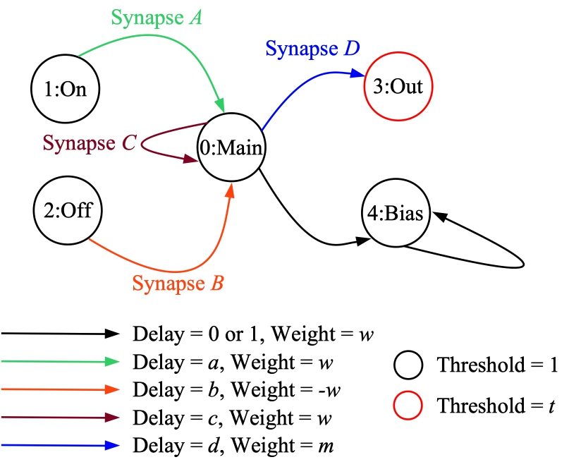

# scripts/jsp_test_network.sh - a script to generate testing networks

Point of contact: James S. Plank

The purpose of this shell script is to generate the following network:



This network lets you test a variety of properties of various neuroprocessors.
For example, it is used to demonstrate features of RISP in the
[RISP README](processors_risp.md).

Here are the functions of the various neurons:

- *Main*: This is an input neuron.  Once it fires, it will keep firing every
          *c* timesteps.  It also sends a spike to the *Out* and *Bias* neurons every *c*
          timesteps.  The synapse to *Out* has a weight of *m* and a delay of *d*.
- *On*: This is an input neuron.  When it fires, it sends a spike to the *Main* neuron,
        with a delay of *a*.  The function is to turn the main neuron "on", if it's currently "off".
- *Off*: This is an input neuron.  When it fires, it sends a spike with negative weight
        to the *Main* neuron,
        with a delay of *b*.  The function is to turn the main neuron "off", if it's currently "on".
- *Out*: This is an output neuron, which has a threshold of *t*.
- *Bias*: This is a neuron which is set to fire every timestep.  It is turned "on" by the *Main*
          neuron.

You'll note that the delays of the two synapses drawn in black are either 0 or 1,
depending on the minimum delay allowed by the neuroprocessor.  For example, RISP
has a minimum delay of 1, while RAVENS has a minimum delay of zero.
------------------------------------------------------------
# Example of use

The shell script takes 9 parameters.  Let's run it from the `cpp-apps` directory:


```
UNIX> pwd
/Users/plank/src/repos/framework
UNIX> cd cpp-apps
UNIX> sh ../scripts/jsp_test_network.sh
usage: sh scripts/jsp_test_network.sh a b c d w m t processor proc-params
UNIX>
```

The first seven parameters are from the picture above.
8th parameter is the name of the neuroprocessor
(typically all lower-case), and the 9th is the name of a file that holds the parameters
for the neuroprocessor.  You may typically find parameter files in the `cpp-apps/params`
directory of the framework, or in the directories for the various neuroprocessors.

When you run `scripts/jsp_test_network.sh`, you will need to have two programs compiled:

1. The `network_tool`.  This will be in the `bin` subdirectory of the main framework
   directory.  To make this, do `make bin/network_tool` in the main framework directory.
2. The `processor_tool` for the specific neuroprocessor.  To make this, do the following
   from the `cpp-apps` directory, and if you want a different neuroprocessor, 
   substitute it for "risp":

```
UNIX> make proc=risp app=processor_tool
```

Your processor tool will be in the directory `cpp-apps/bin/processor_tool_risp`.

What `scripts/jsp_test_network.sh`, does is the following:

- It uses the `processor_tool` to make an empty network specific to the processor.
- It then uses the `network_tool` to add neurons and synapses to the network, and to
  set their parameters.
- It prints the network on standard ouptut.

You can now use the `network_tool` or `processor_tool` to edit/view the network and to
run it on a neuroprocessor.  As an example, we'll make a network where all parameters are
1 except we'll set the weight on Synapse D (the one going from *Main* to *Out*) to 0.5:

```
UNIX> sh ../scripts/jsp_test_network.sh 1 1 1 1 1 0.5 1 risp params/risp.json > tmp-network.txt
UNIX> 
```

Let's look at it with the network tool:

```
UNIX> ../bin/network_tool -
- FJ tmp-network.txt
- INFO
Please use "VIZ" option to visually see network if you have love installed

Nodes:          5
Edges:          6
Inputs:         3
Outputs:        2

Input nodes:  0(Main) 1(On) 2(Off) 
Hidden nodes: 
Output nodes: 3(Out) 4(Bias) 
- EDGES
[ {"from":1,"to":0,"values":[1.0,1.0]},
  {"from":0,"to":3,"values":[0.5,1.0]},
  {"from":0,"to":0,"values":[1.0,1.0]},
  {"from":2,"to":0,"values":[-1.0,1.0]},
  {"from":0,"to":4,"values":[1.0,1.0]},
  {"from":4,"to":4,"values":[1.0,1.0]} ]
- Q
UNIX> 
```

And let's run it on RISP using the `processor_tool`.  When we apply a spike to the *On* neuron,
it starts the Main neuron spiking every timestep.  That in turn causes *Out* to spike
every other timestep, and *Bias* to spike every timestep:

```
UNIX> bin/processor_tool_risp -
- ML tmp-network.txt
- AS 1 0 1
- RUN 20
- GSR T
0(Main) INPUT  : 01111111111111111111
1(On)   INPUT  : 10000000000000000000
2(Off)  INPUT  : 00000000000000000000
3(Out)  OUTPUT : 00010101010101010101
4(Bias) OUTPUT : 00111111111111111111
- 
```

Next, we apply a spike to the *Off* neuron.  That causes *Main* to stop firing, which 
causes *Out* to stop firing:

```
- AS 2 0 1
- RUN 20
- GSR T
0(Main) INPUT  : 10000000000000000000
1(On)   INPUT  : 00000000000000000000
2(Off)  INPUT  : 10000000000000000000
3(Out)  OUTPUT : 01000000000000000000
4(Bias) OUTPUT : 11111111111111111111
- Q
UNIX> 
```

